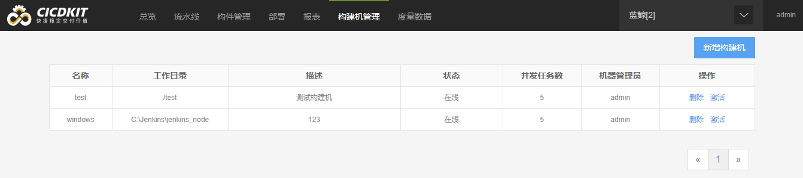
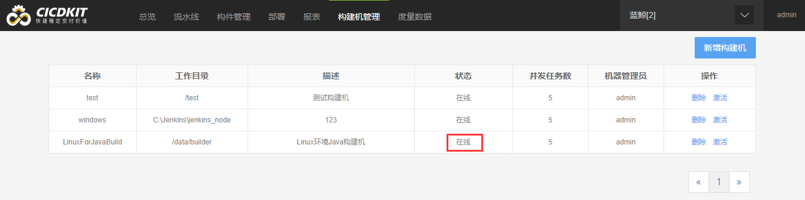

# 构建机管理

CICDKit 除了可以在容器中构建程序，还支持自定义构建机来执行构建任务。构建机指用户配置好的一台可以编译构建程序的物理机或虚拟机，通过安装一个 Agent 程序来加入 CICDKit 的调度，当流水线指定构建机构建时，具体的构建任务会转移到该构建机上来执行。

新建构建机，定义相关参数。

点击激活按钮，根据说明在构建机上进行相应的操作，构建机处于在线状态则准备就绪，可以在流水线的全局设置中采用构建机构建，并选择在线状态的构建机。

