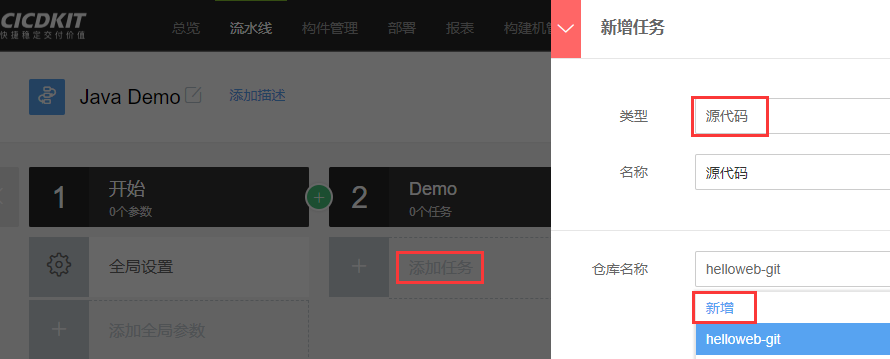
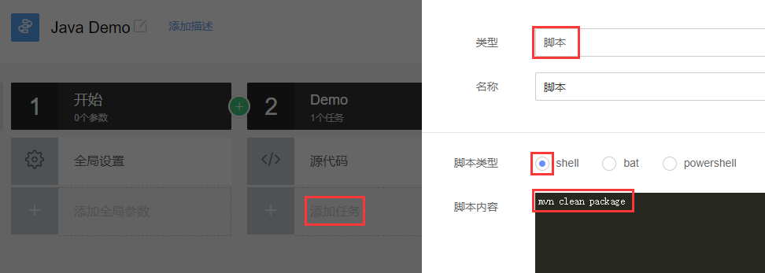
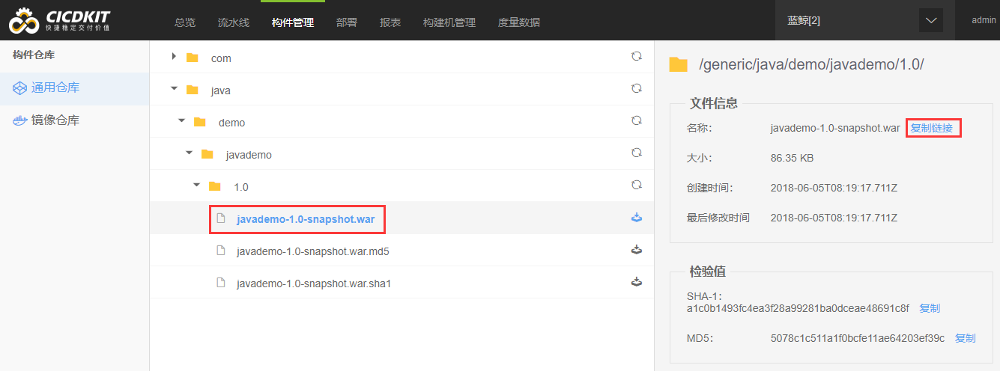
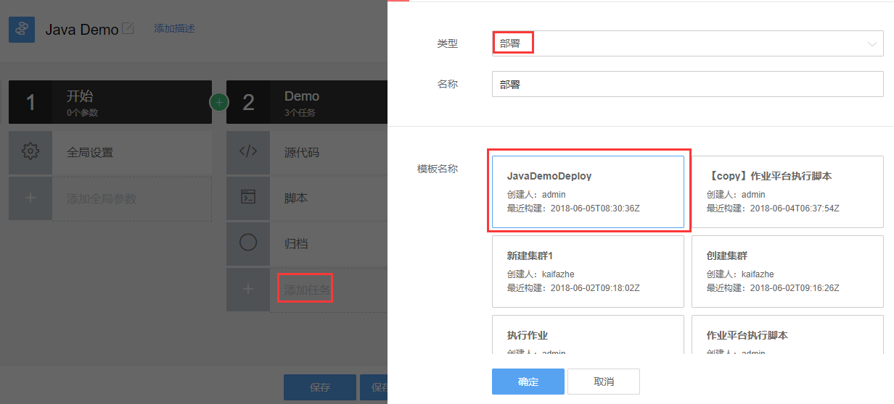

## 6.入门指南

新建流水线并修改流水线名称：

点击全局设置，选择容器构建，并选择Java构建镜像：

新增一个阶段，选择串行：

新增一个任务，选择源代码，并添加一个代码仓库：

填写代码仓库的配置信息（这里请填写一个Java Maven项目的真实信息）：

添加一个脚本节点，选择shell类型，并输入编译Java Maven项目的指令：mvn clean package

添加一个归档节点，填写归档路径（即构件仓库中的相对路径）、版本号、归档项目（项目名称）、归档文件类型（保持跟编译后的程序包类型一致）、归档分类（可自定义，比如snapshot、release等）、源文件路径（即编译产出的程序包路径，可用相对路径）：

保存并执行流水线，先检查测试一下是否正常。

若执行没有报错，到构件管理栏目中找一下刚才归档的文件，复制链接可以获取到该程序包的下载地址：

到部署栏目新增一个单节点快速执行脚本的简单的流程，脚本内容包括下载程序包（即wget代码仓库中的程序包下载地址）、启动程序（如果是SpringBoot项目可直接java -jar启动，如果是传统项目则需准备Tomcat之类的服务器）等步骤，并填写部署的目标服务器IP、用户等信息：（该步骤更多细节请参考标准运维相关产品介绍）

回到流水线编辑界面，增加一个部署节点，并选择刚刚创建的部署流程：

保存后再次执行流水线，即可完成一个项目的简单CI、CD过程，更多功能节点可按需进行配置和使用：

