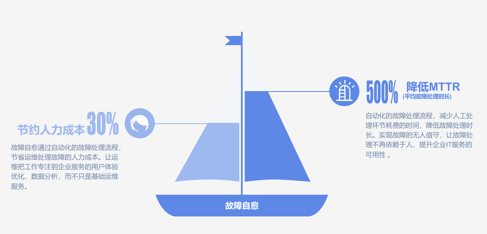

## 特点及优势

图 1. 故障自愈核心功能图

- 1.获取告警：告警源集成蓝鲸监控、4 款主流开源监控产品 Zabbix、OpenFalcon、Nagios、Icinga，及 AWS、邮件的告警接入，更能通过 REST API 拉取、推送告警。
- 2.告警处理：故障处理支持作业平台、标准运维流程
- 3.告警收敛和防御：系统预定收敛和防御规则，对异常告警事件进行收敛，更能通过收敛审批功能对异常的执行做审批。
- 4.支持组合套餐，把自定义自愈套餐通过 FTA（故障树分析）处理流程，组装成解决复杂场景的组合套餐。（即将推出）
- 5.健康诊断，根据系统内置的健康诊断策略，周期性回溯异常事件，并通过邮件方式推送出来。
- 6.预警自愈，是健康诊断功能的延伸，把健康诊断发现的问题通过自愈方案解决，完成异常事件的闭环。
- 7.操作审计，感知故障自愈的每一次改动，确保运营安全，问题可回溯
- 8.丰富的处理套餐：除支持作业平台、标准运维外，还支持快捷套餐类（磁盘清理、汇总、检测 CPU 使用率 TOP10 等）、组合套餐类（获取故障机备机、通知、审批等）
- 9.自愈小助手：分析告警和套餐关联，决策推荐自愈方案方案，降低配置成本 （即将推出）

## 1. 引领行业故障处理新潮流
故障自愈重新定义故障处理流程，在运维领域系较早提出故障自动化理念并落地为产品。

                        图 2. 人工告警处理与故障自愈自动处理的对比图

## 2. 事件处理流程引擎，实现无人值守自愈

获取监控告警发现异常，预诊断分析，调用预定义的处理流程，实现故障无干预自动处理

图 3. 故障自愈故障处理概要图

## 3. 为企业节省人力及降低 MTTR

故障自愈通过自动化的故障处理流程，节省运维处理故障的人力成本。让运维把工作专注到企业服务的用户体验优化、数据分析，而不只是基础运维服务。 

自动化的故障处理流程，减少人工处理环节耗费的时间，降低故障处理时长。实现故障的无人值守，让故障处理不再依赖于人，提升企业 IT 服务的可用性 。

图 4. 故障自愈核心价值

