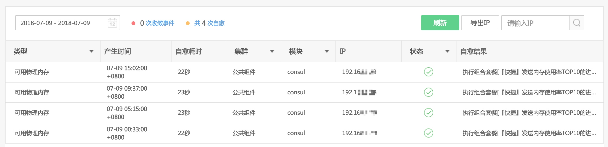
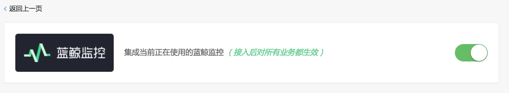

# 集成蓝鲸监控

故障自愈默认集成的监控产品有`蓝鲸监控`、`Zabbix`、`OpenFalcon`，`Nagios`、`Icinga`，如果你的监控产品不在上述之列，请使用`REST API推送`或`REST API拉取`的方式对接企业内部的监控系统.

> 注：对接监控产品的告警时，请先获取对应监控产品的运维权限。故障自愈本身不提供监控产品。

图 1. 故障自愈集成监控产品

## 1. 集成蓝鲸监控

故障自愈原生集成蓝鲸监控的告警源接入，每分钟从监控的告警拉取 API 中获取告警。

处理蓝鲸监控产生`已通知`和`通知失败`2 种状态的告警，`已屏蔽`和`已收敛`故障自愈不会处理。

图 1. 集成蓝鲸监控统计数据展示

以下是蓝鲸监控的`可用物理内存`告警的自愈历史.

图 2. 集成蓝鲸监控执行历史

如果不想处理蓝鲸监控的告警，可以在此处关闭.

图 3. 集成蓝鲸监控的开关

## 2. 刷新告警类型

蓝鲸监控的告警类型新增时（比如新增监控指标或使用自定义组件导入），刷新告警类型以同步最新的蓝鲸监控告警类型。

    图 4.  刷新告警类型
