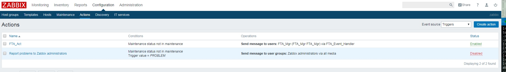
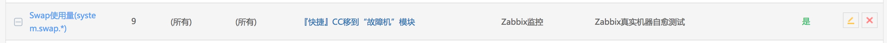
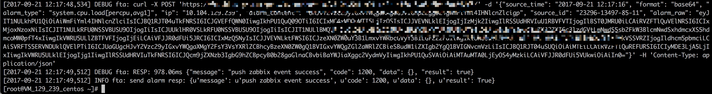

# 集成 Zabbix

Zabbix 通过推送的方式，将告警推动至故障自愈的告警接收 API 中。

图 1. 集成 Zabbix 统计数据展示

## 1. 运行初始化脚本

就这么简单！

## 2. Zabbix 是如何发送消息给故障自愈的
执行了初始化脚本后，自愈会自动创建如下操作。

自动创建名为 FTA_Act 的 Action

FTA_Act 这个 Action 的 Operation 会通知 FTA_Mgr 用户，FTA_Mgr 的通知媒介就是调用/usr/lib/zabbix/alertscripts/zabbix_fta_alarm.py

告警产生后在 Action log 中可以看到发给 FTA_Act 的 Message

## 3. 自愈集成 Zabbix 告警注意事项
自愈处理告警是把 {HOST.IP}作为故障主机 IP，{ITEM.KEY}作为告警类型，请确保 {HOST.IP}在配置平台中注册，同时 ITEM.KEY 能被你接入的告警类型所匹配。

上图的 ITEM.KEY 为 system.swap.size[,pfree]被下图的 Swap 使用量(system.swap.\*)的规则所匹配。

在/tmp/zabbix_fta_alarm.log 中可以查看到日志信息

## 4. Zabbix 告警自愈历史

