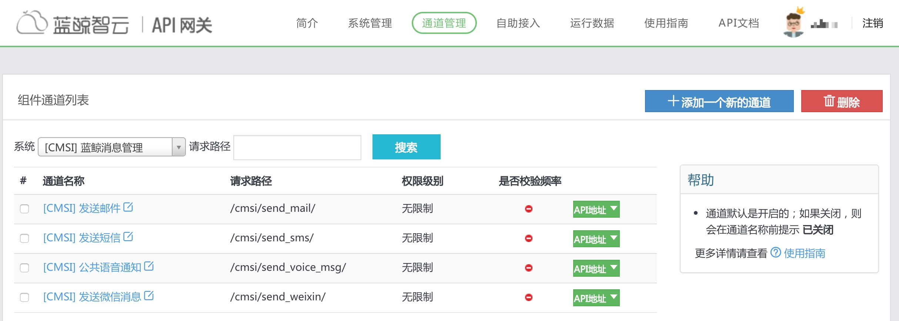

## 告警通知渠道

故障自愈是蓝鲸 PaaS 上一个 SaaS，通知渠道使用 PaaS 的通知 ESB 组件，在蓝鲸的独立部署版本（企业版、社区版）需要在开发者中心后台设置。

### 1. 在通知 ESB 组件中配置通知渠道

图 1. 蓝鲸集成平台（PaaS）的消息管理通知设置

详细设置请访问蓝鲸 PaaS 提供的设置文档

- [如何配置通知渠道，如邮件、微信、短信等?](http://docs.bk.tencent.com/product_white_paper/paas/CaseScenario.html#noticeWay)
- [经验分享] 测试邮件服务是否正常](http://bk.tencent.com/s-mart/community/question/95#/)


### 2. 告警通知效果 
通知渠道有 4 种：微信、电话、邮件、短信


图 2. 故障自愈使用邮件通知效果


图 3. 故障自愈使用微信通知效果


```plain
提示：腾讯云版本蓝鲸默认对接了常见的通知渠道
```

