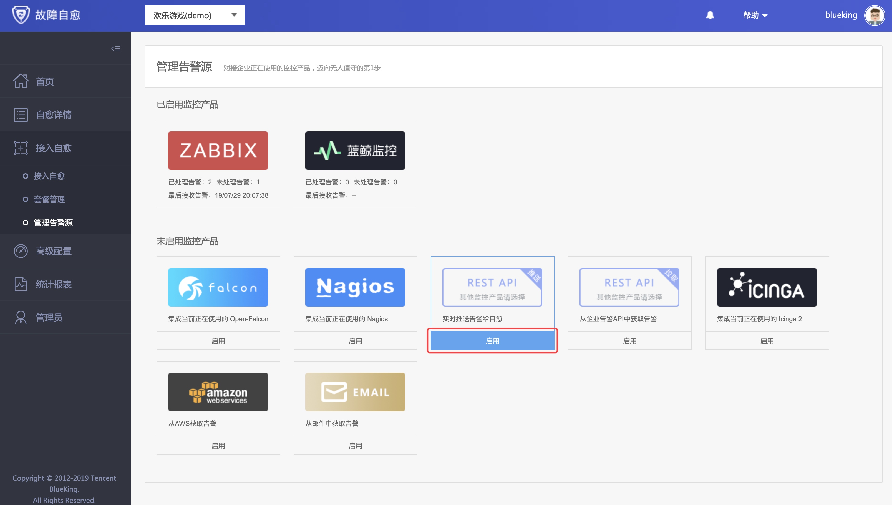
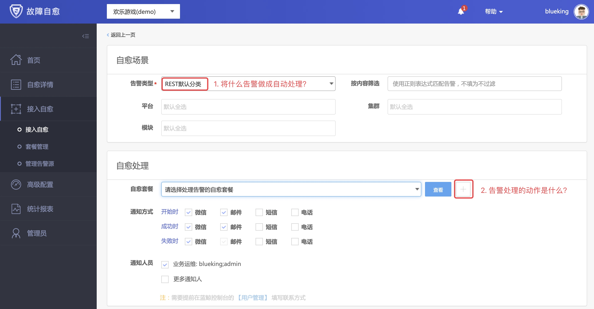
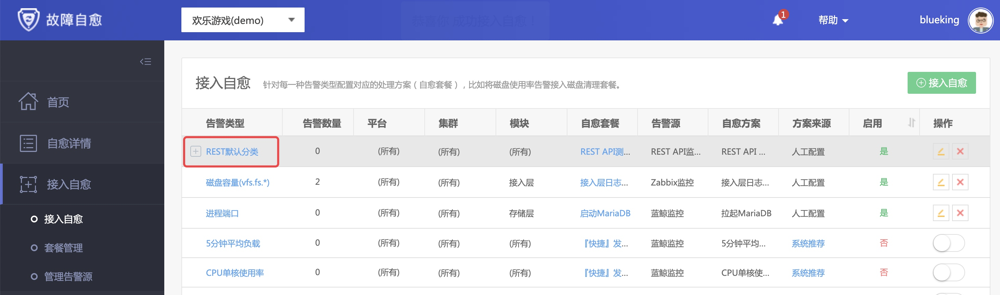

# 集成 REST API 推送

## 情景
故障处理是运维的职能之一，人工登录服务器处理告警，存在 2 个问题：`故障处理效率低` 和 `操作疏忽时可能影响生产环境`，例如删除文件输入绝对路径时，在根目录和日志目录间误敲空格，导致根目录删除。

前面介绍了 [蓝鲸监控](Bkmonitor_Alarm_processing_automation.md)、[Zabbix](Zabbix_Alarm_processing_automation.md) 告警的自动处理，接下来通过 “**REST API 告警接入故障自愈**”这个案例 ，来了解故障自愈如何集成第 3 方监控系统。

## 前提条件

- [蓝鲸配置平台纳管了主机](5.1/bk_solutions/CD/CMDB/CMDB_management_hosts.md)

- [作业平台新建一个作业](5.1/bk_solutions/CD/Automation/Massive_host_control.md)

**术语解释**
 - **自愈套餐** : 告警的处理动作，比如清理日志的作业
 - **自愈方案** : 关联 告警 和 处理动作的一个组合

## 操作步骤

1. 启用 REST API(推送)告警源
2. 接入自愈方案
3. 自愈测试

### 1. 启用 REST API(推送)告警源

第 3 方监控系统调用 REST API(推送)接口，故障自愈收到告警后立即做自动化处理。

首先，启用告警源。

在菜单 `[接入自愈]` -> `[管理告警源]`中，启用`REST API(推送)`。

### 2. 接入自愈方案
在菜单 [接入自愈] 中，点击 `接入自愈` , 告警类型选择 `REST默认分类`。

点击新建`自愈套餐`的按钮，准备一个告警的处理动作。

在自愈套餐页面，套餐类型选择`作业平台`，点击作业名称右侧的加号，新建一个测试的作业模板。

点击`新建作业的按钮`后，跳转至作业平台，在菜单 `[作业执行]` -> `[新建作业]` 中，新建一个默认的作业即可。

保存`REST API测试`的自愈套餐后，自动回到接入自愈的页面，保存自愈方案即可。

回到接入自愈列表，在列表中可以找到刚刚创建的自愈方案。

### 3. 自愈测试 

在 `REST API(推送)`的告警源管理页面，复制调用实例。

将示例中的 IP 替换给该业务下任意一个 IP，然后贴到终端下执行。

> 如果多次调试，请保证`source_id`唯一（重复会丢弃），`source_time`和服务器时间一致（过长会丢弃）。

在`自愈详情`页面可以找到自愈记录。

点开`状态`按钮，可以查看详情。

点击`详情`中的作业执行 ID，可查看执行的作业。

至此，一次模拟告警的故障自愈演示完毕。

REST API(推动) 的场景在于，如果你使用的监控系统故障自愈默认未集成，则可以通过回调 REST API 的方式，将告警推送至故障自愈，故障自愈执行对应的处理动作，完成告警的自动处理。

故障自愈，如此简单。
