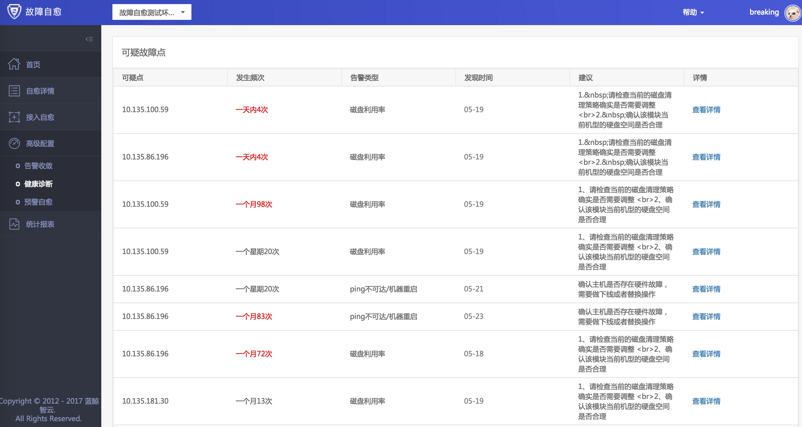
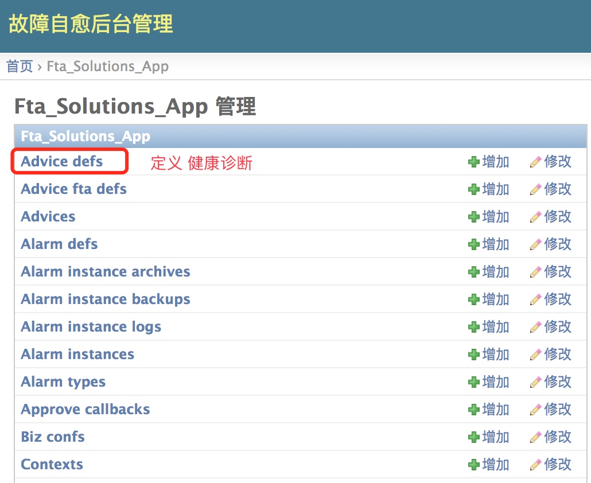
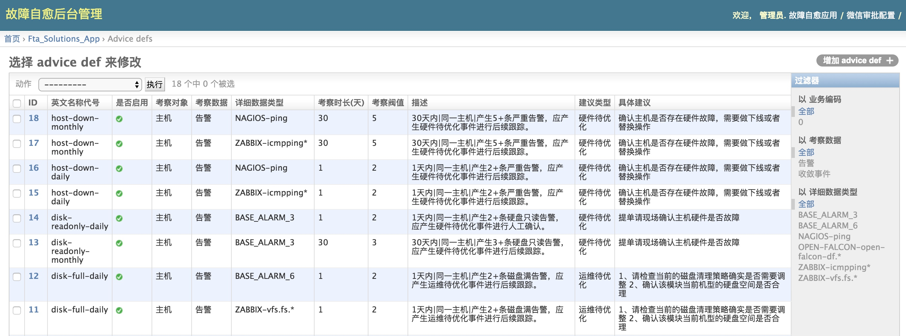

## 健康诊断
如果某一些服务器经常出现告警，故障自愈会自动回溯这些告警，并作出诊断，提前帮企业发现风险

> 健康诊断的规则基于腾讯处理告警的经验

图 1. 健康诊断

## 社区版可在 Django 后台调整健康诊断策略

用 PaaS 管理员访问${PaaS_URL}/o/bk_fta_solutions/admin/，进入后台

图 2. 故障自愈 Django 后台

点击`Advice_defs`进入健康诊断策略配置页面

图 3. 故障自愈 Django 后台设置健康诊断建议

