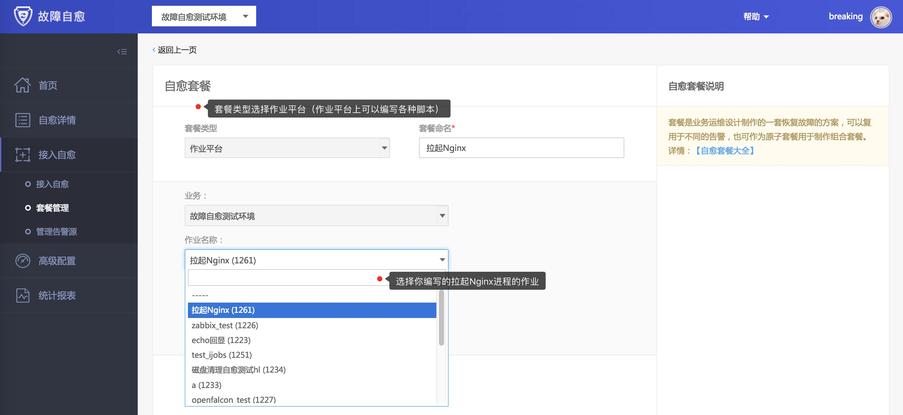
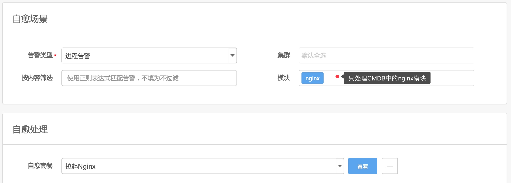

## 进程告警
故障自愈除了能处理单机性能告警外，还能处理服务类的告警，比如进程告警。

比如 nginx 进程挂掉了，你需要拉起 nginx 进程。

`（下面以Nginx进程告警接入自愈为例）`

### 1. 编写拉起 Nginx 进程的作业

在作业平台编写拉起 Nginx 进程的脚本
`(脚本中除了拉起进程，你还可以考虑增加进程检测的逻辑，保证拉起进程这个过程无误)`

### 2. 创建拉起 Nginx 的自愈套餐


### 3. 接入自愈

在`接入自愈`页面将`进程告警`关联`拉起Nginx`套餐，自愈范围选中`nginx`模块




```plain
（`集群`、`模块`筛选用于相同告警类型，不同模块的处理方式不一样。）

```

