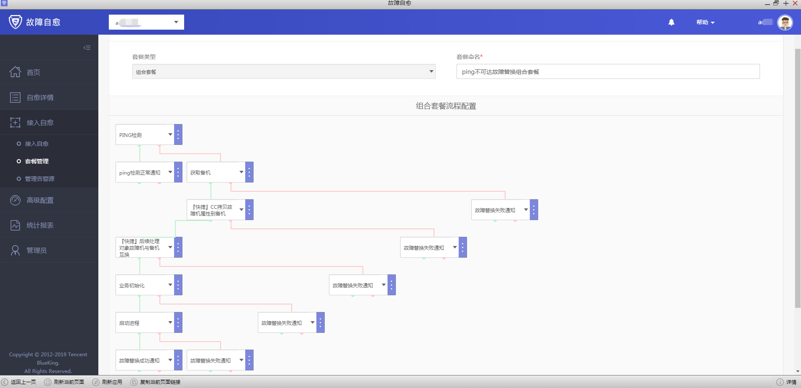
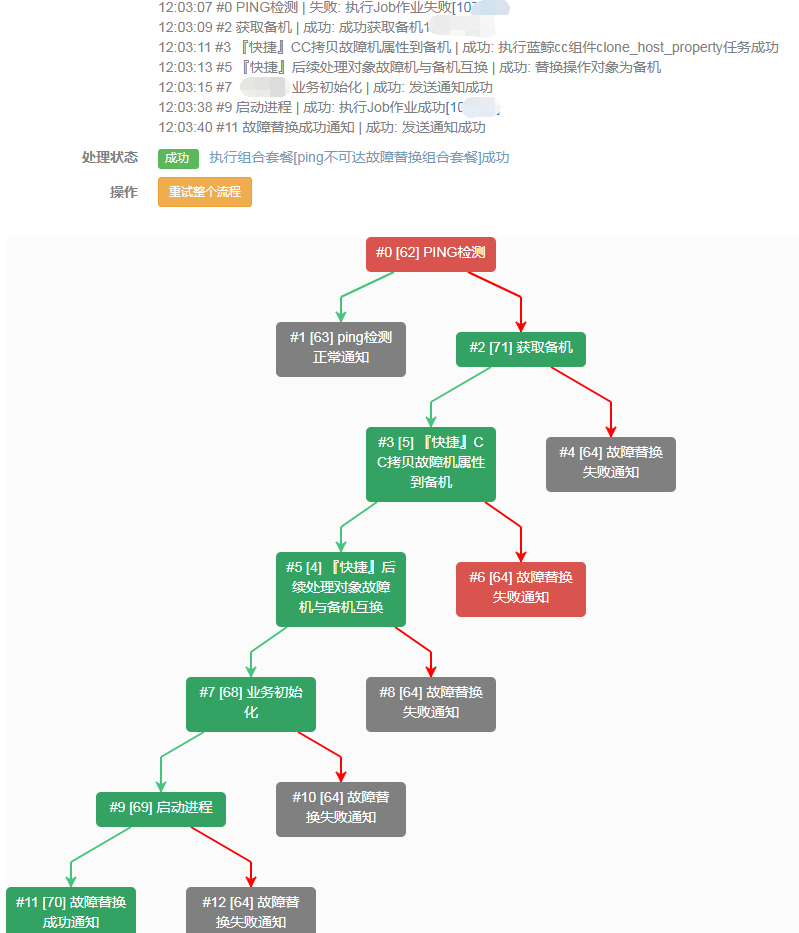

###ping 不可达故障替换组合套餐

场景：A 模块是重要模块，出现 PING 不可达告警，首先要校验 A 模块是否真的故障，如果真的故障，接下来是从资源池中获取备机 ... 故障替换等等，期间每个环节都有可能出错，那就要考虑异常分支的场景。

需要提前准备：

1. 需要先配置企业微信,注册链接：https://work.weixin.qq.com/ ，
注意：开启微信端口 80443
2. 蓝鲸故障自愈 APP 已经正常运行 创建故障自愈 APP 请参照[微信审批接入流程](https://docs.bk.tencent.com/product_white_paper/fta/Advanced_Features/WeChat_approval_access_process.html)。

第一步：准备好组合套餐中每个原子（节点）的套餐。
1.配置 ping 检测的原子套餐，可以在作业平台写个简单的 ping 检测脚本，再去故障自愈中配置 ping 检测的自愈套餐。

2.ping 检测没有异常，则发送正常通知。如 ping 检测异常，则使用获取备机套餐，自动获取备机，前提是空闲机池中有空闲机。

2.1 配置 ping 检测正常通知

2.2 配置自动获取备机套餐

3.成功获取备机后，拷贝故障机属性到备机，后续处理对象故障机与备机互换，然后初始化业务，启动进程通知故障替换成功，以上步骤失败都加一个失败通知

3.1 『快捷』CC 拷贝故障机属性到备机、『快捷』后续处理对象故障机与备机互换，都是快捷套餐，只要选择就好，这里就不展开了，后面初始化业务请根据企业的初始化流程来配置初始化套餐，启动进程也是一样，因为这里只是模拟所以仅用通知代替。

第二步：配置组合套餐，并接入故障自愈，接入故障自愈这里选择 REST 默认分类是为了方便触发告警，实际应用选择 ping 不可达告警类型。

第三步：触发告警，完成自愈

1.触发告警，由于这里是做测试，就不拿生产环境了，用 REST API 可以更方便的产生告警，完整流程请参照[REST API 推送](https://docs.bk.tencent.com/product_white_paper/fta/Getting_Started/Integrated_RestAPI_Push.html)。

2.回到故障自愈中，查看自愈详情，也可以点击状态，查看执行详情

