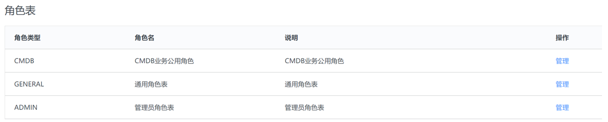
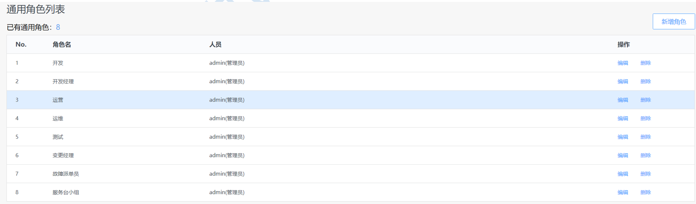
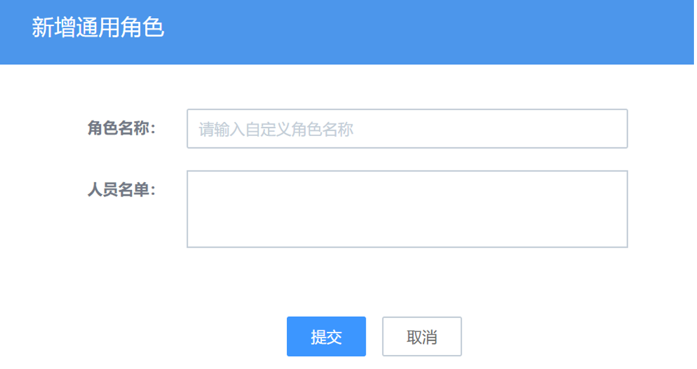
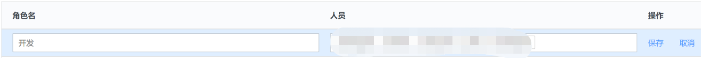
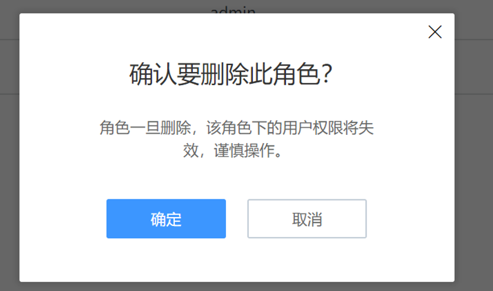

### 权限体系和角色管理

蓝鲸 ITSM 属于基于蓝鲸智云体系上开发的 SaaS 应用。所以其账号登录沿用蓝鲸 PaaS 平台为整个蓝鲸体系提供的“统一登录”模块，作为整个蓝鲸智云软件的统一入口。PaaS 负责账号管理，针对上层所有 SaaS 生效。

初始化账号为“**admin**”，对应 ITSM 中 “**系统管理员**”，是分配“**权限体系**”和管理“**角色体系**”的最高级账号。在权限体系下，其他的“**管理员**”账号，均不具备最高的“**角色**”权限。ITSM服务中涉及的角色以及管理员角色需由系统管理员来进行创建及维护。

#### ITSM 的权限体系 

权限体系主要表现在两方面：
- 访问控制：只有在蓝鲸体系内的账号/用户才能使用蓝鲸智云ITSM服务。
- 操作权限：通过ITSM中的角色管理对来访用户在ITSM中的操作权限进行管理。

ITSM中的角色及权限对应表如下：

| 角色 | 可见页面/菜单 | 操作权限 |
| ---- | ------------- | -------- |
|前台普通用户 （CMDB业务 角色，通用角色， 或一般来访用户）|	工作台 全局视图 变更管理：所有变更单，我的待办，我的申请单 事件管理：所有故障单，我的待办，我的申请单 请求申请：所有请求单，我的待办，我的申请单 问题管理：所有问题单，我的待办，我的申请单 知识库：知识录入，知识检索	|查看 处理 查询 提单|
|ITSM管理员— 变更管理员/事件管 理员/问题管理员/请 求管理员/服务分类管理员等|	前台所有页面，以及后台设置的可管理后台配置模块|	查看 处理 查询 提单 对应管理模块 的配置|
|ITSM超级管理员|	所有页面|	所有后台管理 权限，以及前台 单据的特殊处理权限|

#### ITSM 中的角色管理 

ITSM 根据不同服务场景中的参与角色，将角色分为 3 种类型。

1.与业务或者应用服务强关联的“**CMDB业务角色**”：例如变更某个应用服务或者业务系统下的配置信息，只能限定负责该业务下的服务团队来进行需求提单和处理跟进。如业务运维，业务产品接口人等。该类角色和名单ITSM直接从CMDB中同步，ITSM本身不对此类角色进行管理或维护。

2.**通用角色**：主要指承接通用性IT服务的角色。例如安全网络类的基础实施人员，审核账号开通的负责人，开通账号远程准入的实施人员等。此类角色及人员名单，均由系统管理员在ITSM的角色管理后台，根据实际场景来进行角色和人员的增删改日常管理。

- 新增/编辑/删除

删除会有二次确认提醒。

3.**管理员**：可以进行ITSM后台管理模块的管理人员。此类角色和人员，由系统管理员在ITSM的角色管理后台进行配置维护。

管理员建议通过按照后台的管理模块来进行管理员的划分和配置。用户可以按照实际需要进行管理。
- 新增

对角色名，角色说明，人员，以及权限操作页面进行设置。权限操作页可以多选。
- 编辑

- 删除

删除会有二次确认提示。

