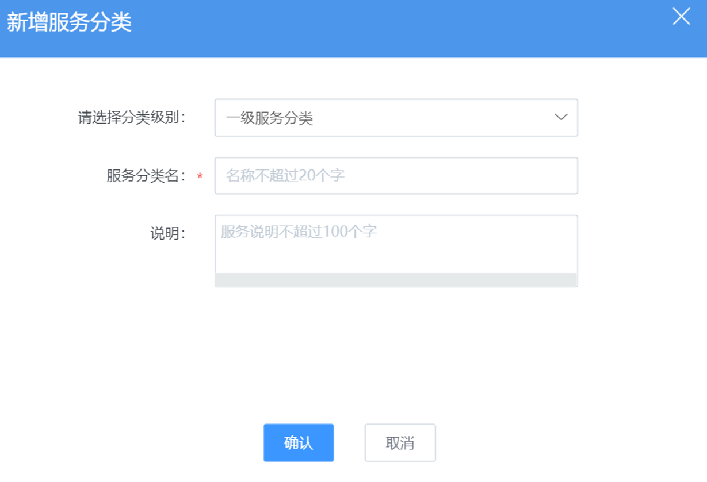

### 服务分类 

将整体 IT 的服务场景通过服务分类统一管理及更新，作为不同服务模块的流程设计基础。

服务分类最多分三级。可对服务分类进行新增，编辑，删除等日常操作。

**特别说明：当一级服务分类下无子级分类，需要新增子级分类并且在子分类下创建流程时，请手动将原一级服务分类下的流程下移至子级分类。否则，原一级服务分类下的将流程无法被后续提单使用。**

例如：一级服务分类“网络资源分配”下有一个匹配流程F1，在服务一段时间后，根据实际情况需要新增子分类A和B，分别来管理不同客户的资源分配受理流程。在完成A，B以及对应流程的创建后，如果原流程F1不移至到新的子分类A，或者B，或者另增一个子分类下，那么在客户提单的入口，F1流程将无法被选中及使用。
