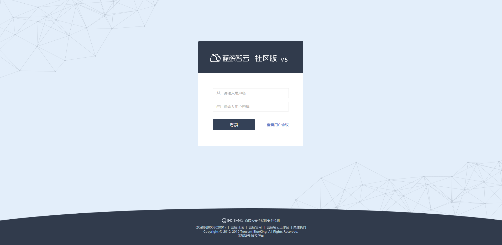

### 基本账号体系 {#AccountSystem}

为了保证使用蓝鲸产品的用户都是可信的，PaaS平台为整个蓝鲸体系提供了“统一登录”模块，该模块包含了基本账号体系。当搭建部署好蓝鲸体系的产品后，会提供一个 URL 给用户访问。

社区版提供了两种角色：

(1)管理员：拥有最高权限，可以对蓝鲸用户进行增删改查，可以整理蓝鲸体系的产品，（对工作台/桌面 SaaS 产品的管理，如：添加官方/第三方应用，删除某个应用，调整应用状态等）；

(2)用户：基本功能的使用，包括：工作台/桌面的普通 SaaS 产品，开发者中心自建 SaaS。

>注：社区版的管理员初始化用户名：admin  密码：blueking，请及时修改。
