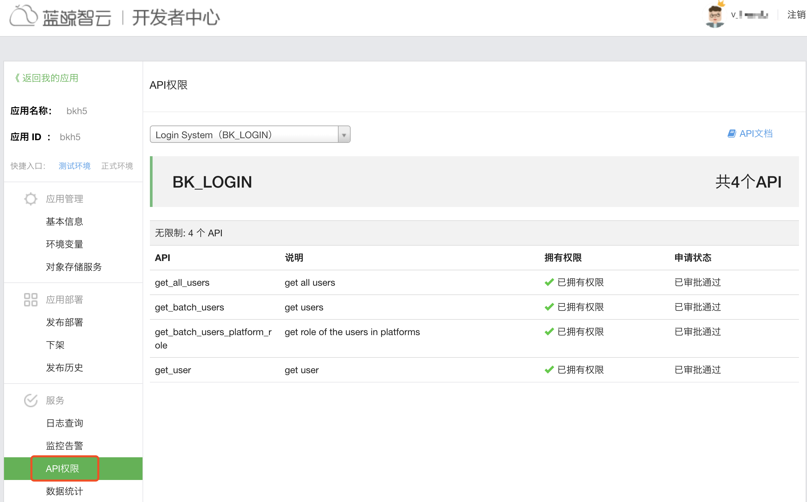
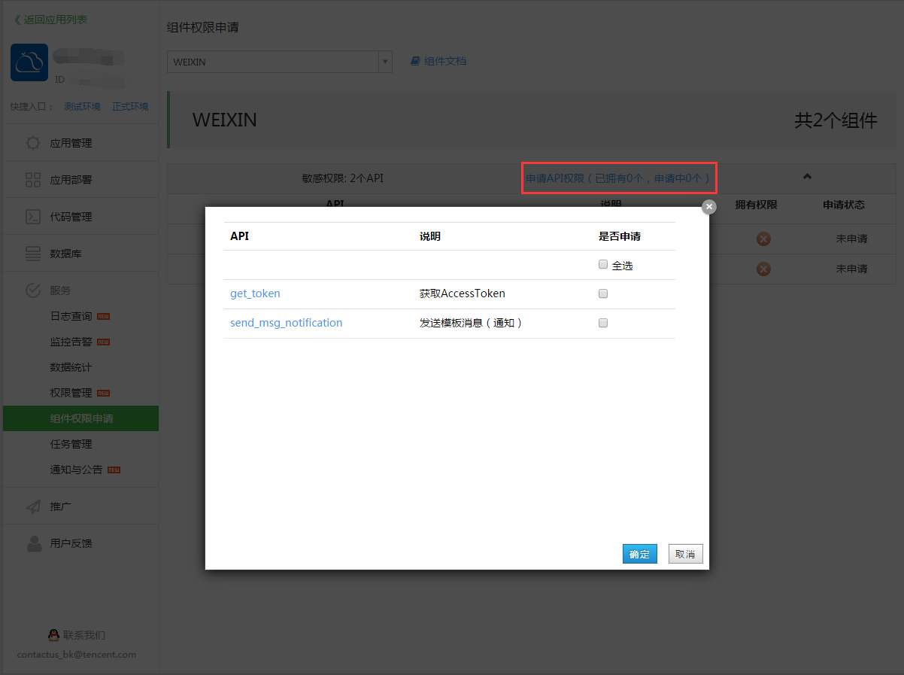

### 组件访问权限控制 {#ComponentAccessControl}

蓝鲸应用需要调用其他系统的接口，如 CC、WEIXIN，都需要通过蓝鲸的组件 API，默认应用并没有任何组件的权限，需要在蓝鲸 SaaS 的“服务”中申请组件权限。

点开 API 的名称，可以查看 API 的详细文档。

组件权限分普通权限和敏感权限，普通权限一般都是查询类等，敏感权限是创建，运行类 API，需要分别申请，如下：

申请后由 ESB 团队统一审批，通过后即可正常使用组件了。

