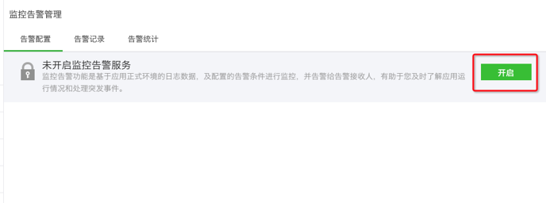

### 应用监控告警 {#MonitoringAlarm}

开发者可以主动通过蓝鲸 PaaS 平台的“日志查看”功能来查看应用日志记录，但是还需要一个实时推送告警的功能，这样可以帮助开发者在第一时间发现应用的问题，提高用户体验。所以，平台提供了日志监控告警服务。开发者可以自行配置相应的告警参数，告警接收人等信息，平台会实时监控日志数据，一旦命中规则，即向开发者推送告警信息。应用注册后，告警服务默认为开启状态，建议重要的应用不要手动关闭该服务。开启后可以关闭，如果关闭，应用告警将不会发送给告警接收人，所以建议不关闭。

开启后，可以配置告警接收人/告警接收类型/具体类型告警参数。

(1)告警接收：填写接收人账号并选择要接收的告警类型，系统将以邮件的形式发送告警给接收人，接收人默认为应用开发者。

(2)普通告警：针对开发者代码调试日志进行监控和告警，支持日志等级和关键字关联配置，建议开发者调整日志级别，调试日志用 INFO 级别，异常日志使用 ERROR 级别，以免造成不必要的干扰。

(3)HTTP告警：针对应用 UWSGI日志进行监控和告警，支持请求错误码和慢请求配置。

(4)组件告警：针对应用 组件调用日志进行监控和告警，支持日志等级配置。

(5)Celery 告警：针对应用 celery 日志进行监控和告警，支持日志等级和关键字关联配置（仅针对启用了 celery 服务的应用）。

监控告警服务同时提供了告警统计功能，以便开发者掌握应用的稳定情况，并做相应的优化处理。统计主要展示当日告警数，和指定时间段内的告警量趋势，支持按时间和告警类。

