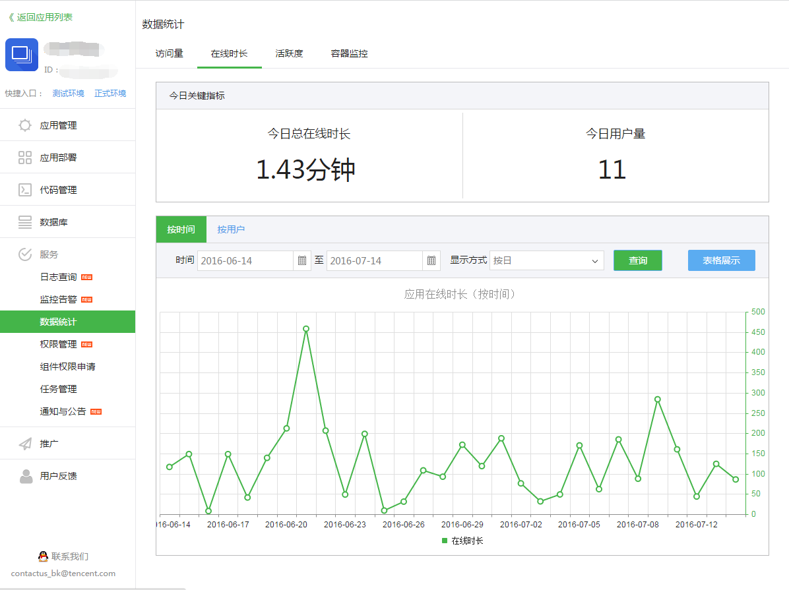
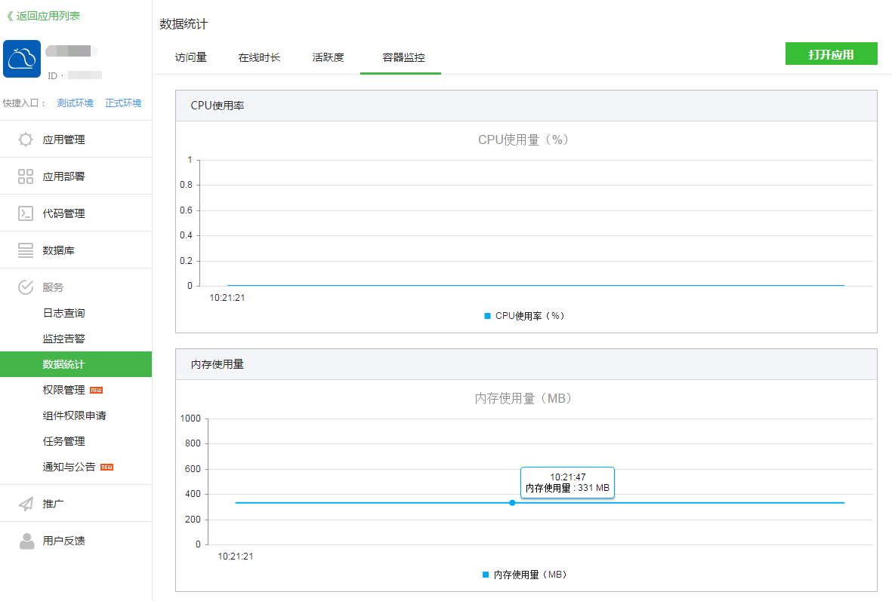

### 应用运营数据统计 {#OperatingStatistics}

对于应用产品经理，运营人员，比较关心的就是应用的数据，蓝鲸提供应用的访问量，在线时长，活跃度等三个指标，全方位展示应用的使用情况。

(1)访问量

主要针对应用在蓝鲸桌面、应用市场被打开次数进行统计。可以按时间或用户纬度查询访问量。

(2)在线时长

主要针对用户在应用页面上的停留时间进行统计。可以按时间或用户纬度查询访问量。

(3)活跃度

主要针对用户在应用页面上的点击量（页面上的链接、按钮等点击次数）进行统计。可以按时间或用户纬度查询访问量。

(4)容器资源实时统计

针对应用的 docker 容器所占用内存和 CPU 进行实时监控统计，供用户了解应用的 CPU 和内存使用情况。

