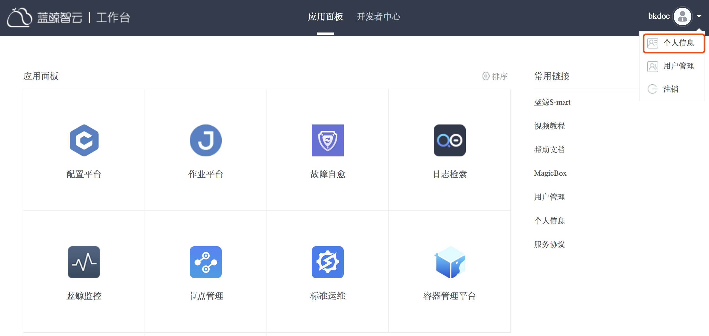
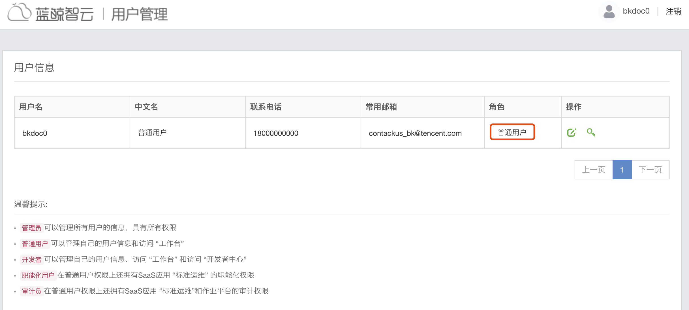
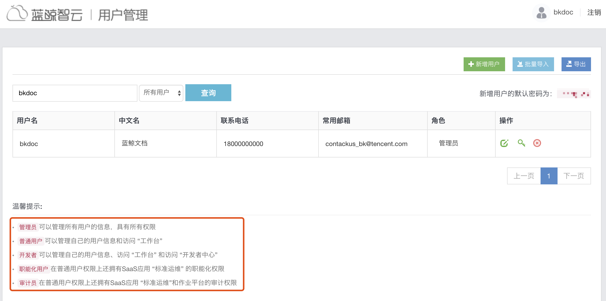

# 个人中心

“个人中心” 提供了个人信息修改、密码重置等基础功能，更多功能菜单根据用户的权限不同，展示不同的入口，并做了基础的权限控制。

管理员个人中心

普通用户个人中心

> 社区版 5.1（含 V5.1）之前的版本是通过 “用户管理” 中的 “角色” 来区分的，后续版本中将通过 “权限中心” 和 “用户管理” 两个基础服务的 SaaS 来进行更细粒度的权限管理，包括以个人、组织架构等维度进度权限申请、审批等功能。

