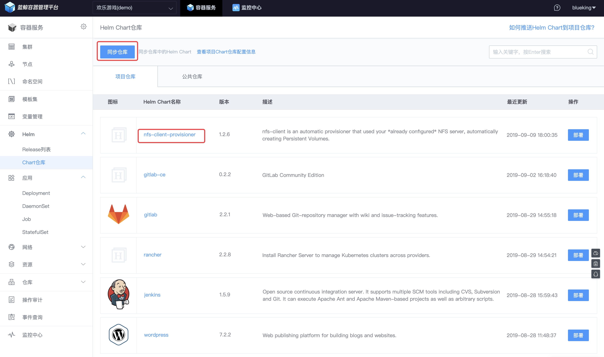

## 将 NFS 作为 K8S PV Provisioner

#### 情景 {#Situation}
互联网应用常见的三层架构：接入层、逻辑层、存储层，在操作系统中 **文件系统** 提供存储层的存储介质，在 K8S 中是 **Persistent Volumes**（持久卷，简称 PV），而 PV 背后需要对接存储介质，比如 NFS、CephFS 以及公有云的云硬盘[1]。

接下来以 NFS 作为 K8S PV 的存储介质（Provisioner）为例，介绍在 K8S 中如何申请以及使用存储空间。

#### 前提条件 {#Prerequisites}
- 了解 K8S 中 [存储](kubernetes.md) 的基础的概念。
- 了解 [K8S 的包管理工具 Helm](helm/ServiceAccess.md)

#### 操作步骤 {#Steps}

- [1. 部署 NFS Server](#install_NFS_Server)
- [2. 部署 NFS-Client-Provisioner](#deployNFS-Client-Provisioner)
- [3. 创建 PVC 测试](#createPVC)


## 1. 部署 NFS Server {#install_NFS_Server}

> 以下为测试环境在 CentOS 7 下搭建 NFS 的示例，生产环境请咨询公司系统管理员。

安装 NFS Server 端（ IP : 10.0.5.85），并启动以及设置开机自启动。

```bash
# yum -y install nfs-utils
systemctl enable rpcbind
systemctl enable nfs
systemctl start rpcbind
systemctl start nfs
```

设置 `/nfs` 目录为挂载目录，对 `10.0.0.0/16` 网段开放。

```bash
# mkdir /nfs

# vim /etc/exports
/nfs    10.0.0.0/16(rw,sync,no_root_squash,no_all_squash)

# systemctl restart nfs

# showmount -e localhost
Export list for localhost:
/nfs 10.0.0.0/16
```

本地挂载测试，验证 NFS 部署是否成功。

```bash
# mount -t nfs <NFS_SERVER_IP>:/nfs /mnt

# nfsstat -m  
/mnt from <NFS_SERVER_IP>:/nfs
 Flags: rw,relatime,vers=4.1,rsize=1048576,wsize=1048576,namlen=255,hard,proto=tcp,timeo=600,retrans=2,sec=sys,clientaddr=<NFS_SERVER_IP>,local_lock=none,addr=<NFS_SERVER_IP>
```

## 2. 部署 NFS-Client-Provisioner {#deployNFS-Client-Provisioner}

K8S 使用 NFS 资源，需要能挂载 NFS 以及配套的 K8S 资源（StorageClass、ServerAccout、PersistentVolume、PersistentVolumeClaim 等）。

为了简化部署，以及为了使用 K8S 中的包管理器 [Helm](helm/ServiceAccess.md)（类比 yum ） 来部署 [NFS-Client-Provisioner](https://github.com/kubernetes-incubator/external-storage/tree/master/nfs-client) 的 [Chart](https://github.com/helm/charts/tree/master/stable/nfs-client-provisioner)（类比 rpm）。

### 2.1 将 Chart 推到仓库

> 由于 Helm V2 需要在集群中部署 tiller，存在安全风险，无法直接使用 Helm install 部署应用，BCS 会将 Chart 通过  Helm template 解析为 K8S 的资源配置来部署。

下载  的 Charts。

```bash
git clone https://github.com/helm/charts/
```

```bash
# pwd
charts/stable/nfs-client-provisioner
# ll
总用量 28
-rw-r--r-- 1 root root  479 8月  27 17:00 Chart.yaml
drwxr-xr-x 2 root root 4096 8月  27 17:00 ci
-rw-r--r-- 1 root root   74 8月  27 17:00 OWNERS
-rw-r--r-- 1 root root 5193 8月  27 17:00 README.md
drwxr-xr-x 2 root root 4096 8月  27 17:00 templates
-rw-r--r-- 1 root root 1677 8月  27 17:00 values.yaml

# helm push . joyfulgame
Pushing nfs-client-provisioner-1.2.6.tgz to joyfulgame...
Done.
```

选择菜单 【Chart 仓库】，点击【同步仓库】可以看到刚刚推送上来的 Chart。




### 2.2 部署 Chart

点击 【部署】，准备部署 Chart


填写 Helm 参数： NFS Server 的 IP（nfs.server）、 开放挂载的目录（nfs.path）。

如果集群中没有 StorageClass ，建议将其设置为默认（StorageClass.defaultClass）。 

然后点击 【部署】。


完成部署后，接下来创建 PVC 测试。

## 3. 创建 PVC 测试 {#createPVC}

- 检查 StorageClass 是否设置成功

```bash
# kubectl get storageclass
NAME                   PROVISIONER   AGE
nfs-client (default)   nfs           12d
```

- 创建 PVC

```yaml
# cat auto-clain.yaml
kind: PersistentVolumeClaim
apiVersion: v1
metadata:
  name: auto-claim
  annotations:
spec:
  accessModes:
    - ReadWriteMany
  resources:
    requests:
      storage: 1Gi
```

```bash
# kubectl apply -f auto-clain.yaml
persistentvolumeclaim/auto-claim created


# kubectl get pvc
NAME         STATUS   VOLUME                                     CAPACITY   ACCESS MODES   STORAGECLASS   AGE
auto-claim   Bound    pvc-9803c5c5-d2f8-11e9-86f7-525400673e62   1Gi        RWX            nfs-client     13s
```

可以看到  PVC 创建成功。


- 在 NFS 的挂载目录中，可以看到自动创建对应的目录。

```bash
# ll
总用量 32
drwxrwxrwx 2 root root 4096 9月   9 19:54 default-auto-claim-pvc-9803c5c5-d2f8-11e9-86f7-525400673e62
```
