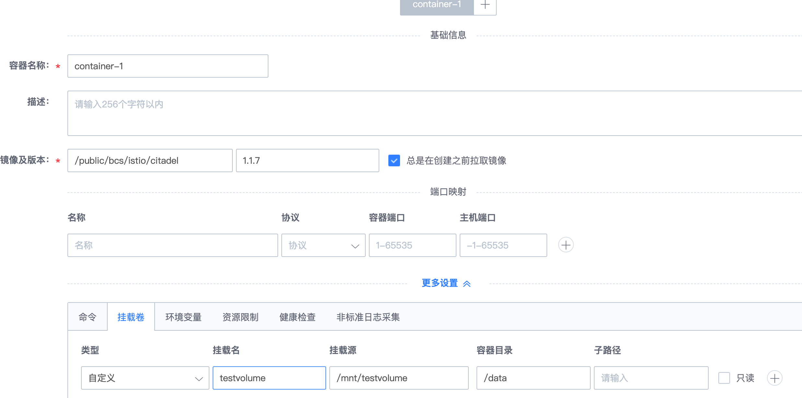

# mesos 存储
目前，BCS mesos 解决方案中，在存储支持上使用 docker 的 volume 存储方案，使用 docker volume 的 bind mount 方式，把宿主机 host 上的一个目录挂载进容器当中。如果要使用 ceph rbd 等分布式块存储，可由 BCS 管理员将 rbd 块存储挂载至集群 node 的某个目录上，然后在创建 mesos 应用时，再把该目录挂载进容器当中。  

以 Ceph rbd 为使用示例来说明：

## 1. 准备存储卷

管理员创建 ceph rbd 块，把 rbd 块设备 map 到集群 node 节点上，格式化并挂载至某个目录中，如 /mnt/testvolume

## 2. 挂载进容器

用户在模板集中创建 mesos 应用，在容器配置中指定挂载源为 /mnt/testvolume  

