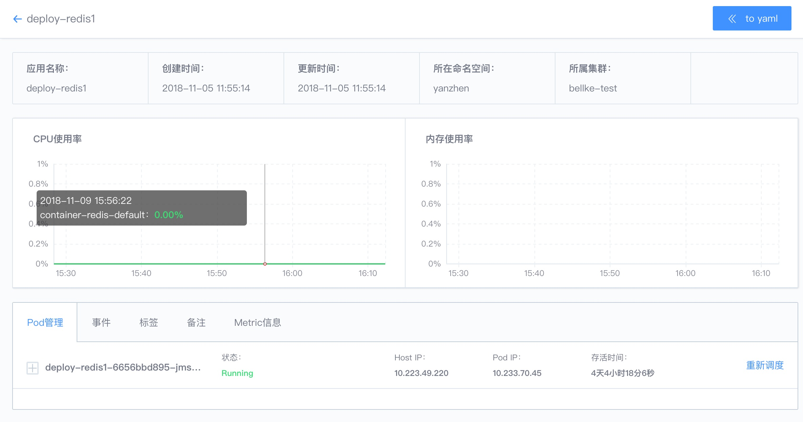
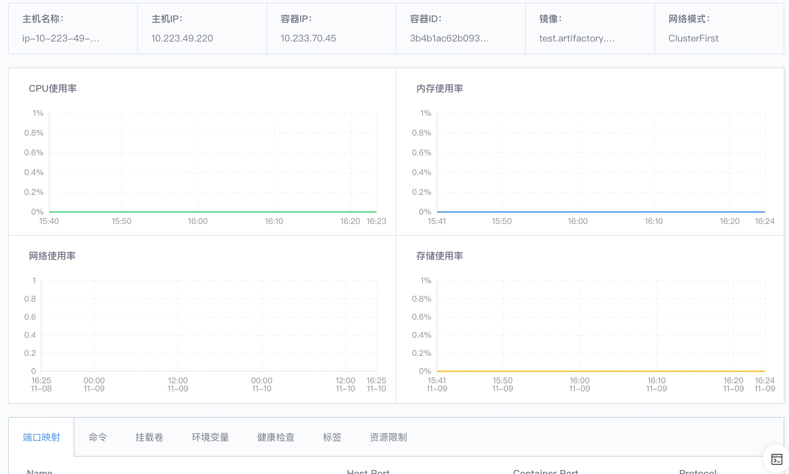
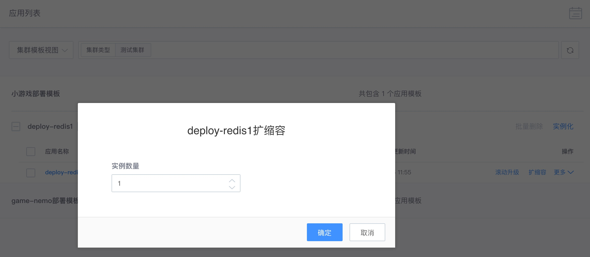
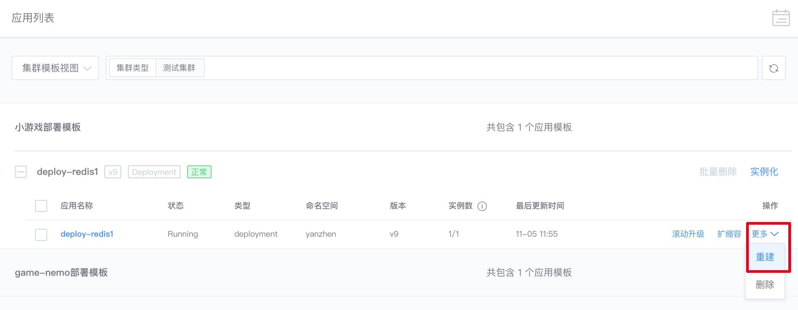

# 应用列表说明文档

蓝鲸容器服务应用列表分两个维度展示：模板集维度和命名空间维度；其中，模板集维度主要展示由【模板集】实例化的应用；命名空间维度展示了集群下所有所有命名空间下的所有应用，来源包含模板集、Helm、Client 实例化的应用；以便用户查看和操作应用及查看应用下容器运行详情及资源使用详情。

- 应用类型
deployment/daemonset/job/statefuleset

## 1. 查询展示

- 模板及应用展示

- 应用详情

- 容器详情

## 2. 操作相关
- 滚动升级

`注: 允许应用类型包含 deployment/daemonset/job/statefulset`

- 扩缩容

实例数量增加或减少

- 重建应用

重建包含两个步骤: 删除当前应用，然后以现有配置再创建应用(类似进程重启)

- 删除应用

- 重新调度

