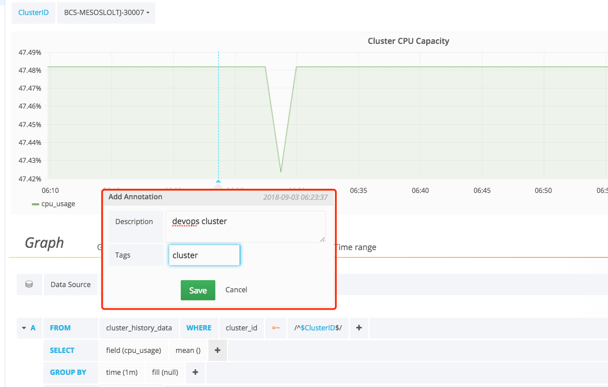

## Dashboard - Metric 数据查看和配置
容器的基础性能数据、容器的日志（标准输出日志采集、非标准输出日志采集）、容器内运行的应用程序的自定义 Metric 在采集，清洗完成，且在数据平台生成相应结果表后，即可在 Dashboard 中查询到

入口地址：
> 监控中心 -> Dashboard

## 1. 选择 Dashboard(数据仪表盘)

Dashboard 含默认和自定义 2 种


注意： `请勿修改默认dashboard，默认视图下次升级会覆盖您修改的配置`

默认 Dashboard 有
- `BCS Cluster`, 集群视图
- `BCS Node`, 集群节点视图
- `BCS Pods`, 容器 Pod 视图

点击`New Dashboard`可以添加自定义数据仪表盘，点击`Import Dashboard`可以导入自定义数据仪表盘


## 2. 最小时间间隔
按时间间隔的分组的下限。建议设置为写入频率，例如，1m 如果您的数据每分钟写入一次。也可以在数据源选项下的仪表板面板中覆盖/配置此选项。重要的是要注意，该值需要格式化为数字，后跟有效的时间标识符，例如 1m（1 分钟）或 30s（30 秒）。支持以下时间标识符：

识别码 | 描述
------------ | -------------
`y`   | 年
`M`   | 月
`w`   | 周
`d`   | 天
`h`   | 小时
`m`   | 分钟


## 3. 过滤数据（WHERE）
要添加标记过滤器，请单击`WHERE`条件右侧的加号图标。您可以通过单击标记键删除标记过滤器并选择--remove tag filter--。

正则表达式匹配

您可以为度量标准名称或标记过滤器值键入正则表达式模式，请确保将正则表达式模式包装在正斜杠（/）中。Grafana 将自动调整过滤器标签条件以使用 InfluxDB 正则表达式匹配条件运算符（=~）。

## 4. 字段和聚合功能

在该 SELECT 行中，您可以指定要使用的字段和函数。如果您有一个按时间分组，则需要聚合功能。像衍生物这样的函数需要聚合函数。编辑器尝试简化和统一查询的这一部分。例如：

以上将生成以下 InfluxDB SELECT 子句：
```plain
SELECT mean("value") AS "REQ/s" FROM ....
```

选择多个字段
使用加号按钮并选择字段>字段以添加另一个 SELECT 子句。

## 5. 分组
要按标签分组，请单击 GROUP BY 行末尾的加号图标。从显示的下拉列表中选择一个标记。您可以通过单击 tag，然后单击 x 图标来删除该组。

## 6. 文本编辑器模式（RAW）
您可以通过单击汉堡图标然后切换到原始查询模式 Switch editor mode。

> 如果您使用 Raw Query，请确保您的查询至少有。WHERE $timeFilter 还请始终按时间分组和聚合函数，否则 InfluxDB 可以轻松返回数十万个将挂起浏览器的数据点。

## 7. 别名模式

- $m = 替换为测量名称
- $measurement = 替换为测量名称
- $col = 替换为列名
- `$tag_exampletag` = 替换为`exampletag`标记的值。语法是`$tag_yourTagName`（必须以$tag_）开头。要在 ALIAS BY 字段中将标记用作别名，则必须使用标记在查询中进行分组。
- 您还可以使用`[[tag_hostname]]`模式替换语法。例如，在使用此文本的 ALIAS BY 字段中，`Host: [[tag_hostname]]`将替换 hostname 每个图例值的标记值，示例图例值将为：`Host: server1`。

## 8. 表查询/原始数据

## 9. 模板 {#Tempalte}

您可以在度量标准查询中使用变量代替如 cluster_id，namespace 和 container_id 名称等内容。变量显示为仪表板顶部的下拉选择框。这些下拉菜单可以轻松更改仪表板中显示的数据。

查看模板文档，了解模板功能和不同类型模板变量的介绍。

## 查询变量
如果添加该类型的模板变量，则 Query 可以编写 InfluxDB 探索（元数据）查询。这些查询可以返回测量名称，键名或键值等内容。

例如，hostname 如果在模板化变量“ 查询”设置中指定此类查询，则可以包含一个包含标记所有值的变量。

```plain
SHOW TAG VALUES WITH KEY = "hostname"
```

您还可以创建嵌套变量。例如，如果您有另一个变量，例如 region。然后，您可以让 hosts 变量仅显示当前所选区域中的主机，并使用如下查询：

```plain
SHOW TAG VALUES WITH KEY = "hostname"  WHERE region =~ /$region/
```

您可以获取给定测量的关键名称。

```plain
SHOW TAG KEYS [FROM <measurement_name>]
```

如果您有一个带有键名的变量，则可以在 group by 子句中使用此变量。这将允许您使用仪表板顶部的变量下拉列表更改组。


## 在查询中使用变量

有两种语法：

$<varname> 例：
```plain
SELECT mean("value") FROM "logins" WHERE "hostname" =~ /^$host$/ AND $timeFilter GROUP BY time($__interval), "hostname"
```

`[[varname]]` 例：
```plain
SELECT mean("value") FROM "logins" WHERE "hostname" =~ /^[[host]]$/ AND $timeFilter GROUP BY time($__interval), "hostname"
```

为什么两种方式？第一种语法更易于读写，但不允许您在单词的中间使用变量。启用“ 多值”或“ 包括所有值”选项后，Grafana 会将标签从纯文本转换为正则表达式兼容字符串。这意味着您必须使用=~而不是=。

## 备注(Annotations)

备注允许您在图表上添加丰富的信息。您可以通过仪表板菜单/注释视图添加，查询备注信息。

### 添加备注
按住 CTRL 或 CMD +单击。向备注添加标签将使其可以从其他仪表板进行搜索。



## 最小时间间隔
按时间间隔的自动组的下限。建议设置为写入频率，例如，1m，如果您的数据每分钟写入一次。也可以在数据源选项下的仪表板面板中覆盖/配置此选项。重要的是要注意，该值需要格式化为数字，后跟有效的时间标识符，例如 1m（1 分钟）或 30s（30 秒）。支持以下时间标识符：

识别码 | 述
------------ | -------------
`y`   | 年
`M`   | 月
`w`   | 周
`d`   | 天
`h`   | 小时
`m`   | 分钟
`s`   | 秒
`ms`  | 毫秒


## 度量标准查询编辑器

## 系列命名和别名模式
您可以通过 Alias 输入字段控制时间序列的名称。

模式 | 描述
------------ | -------------
*\{\{term fieldname\}\}* |  替换为术语组的值
*\{\{metric\}\}* | 替换为度量标准名称（例如，平均值，最小值，最大值)
*\{\{field\}\}* | 替换为度量标准字段名称


## 管道指标
某些度量标准聚合称为管道聚合，例如，Moving Average and Derivative。Elasticsearch 管道指标需要另一个指标。使用指标旁边的眼睛图标可隐藏指标显示在图表中。这对于您在查询中仅用于管道指标的指标非常有用。

## ES 模板 {#EsTempalte}
您可以在度量标准查询中使用变量代替如 cluster_id，namespace 和 container_id 名称等内容。变量显示为仪表板顶部的下拉选择框。这些下拉菜单可以轻松更改仪表板中显示的数据。

[查看模板文档](/monitor/Dashboard/DashboardTemplate.md)，了解模板功能和不同类型模板变量的介绍。

## 查询变量
以 BK-Data-ES 开头的数据是 ES 数据，语法规则和上面的不一样，

Elasticsearch 数据源支持两种类型的查询，您可以在 Query 变量的 Query 字段中使用这两种类型的查询。查询是使用自定义 JSON 字符串编写的。

查询语法 | 描述
------------ | -------------
*{"find": "fields", "type": "keyword"}* | 返回索引类型的字段名称列表 keyword。
*{"find": "terms", "field": "@hostname", "size": 1000}* | 使用术语聚合返回字段的值列表。查询将用户当前仪表板时间范围作为查询的时间范围。
*{"find": "terms", "field": "@hostname", "query": '<lucene query>'}* | 使用 term aggregation＆和指定的 lucene 查询过滤器返回字段的值列表。查询将使用当前仪表板时间范围作为查询的时间范围。

术语查询的默认大小限制为 500。在查询中设置 size 属性以设置自定义限制。您可以在查询中使用其他变量。名为变量的示例查询定义$host。

```plain
{"find": "terms", "field": "@hostname", "query": "@source:$source"}
```

在上面的示例中，我们使用`$source`在查询定义中命名的另一个变量。每当您通过下拉列表更改`$source`变量的当前值时，它将触发$host 变量的更新，因此它现在只包含在本例中过滤的@source 文档属性的主机名。

## 在查询中使用变量
有两个语法：
- `$<varname>` 例如: @hostname:$hostname
- `[[varname]]` 例如: `@hostname:[[hostname]]`

为什么是是两种语法？第一种语法更容易读和写，但不允许在单词中间使用变量。当启用多值或包含所有值选项时，Grafana 将标签从纯文本转换为 Lucene 兼容条件。

在上面的示例中，我们有一个 Lucene 查询，它使用一个名为$host name 的变量来基于@host name 属性过滤文档。它还在术语 GROUPBY 字段输入框中使用一个变量。这允许您使用一个变量来快速更改数据分组的方式。


## 注释

备注允许您在图表上添加丰富的信息。您可以通过仪表板菜单/注释视图添加注释查询。Grafana 可以查询任何 Elasticsearch 索引以获取注释事件。

名称 | 描述
------------ | -------------
Query | 您可以将搜索查询留空或指定 lucene 查询
Time | 时间字段的名称，需要是日期字段。
Text | 事件描述字段。
Tags | 用于事件标记的可选字段名称（可以是数组或 CSV 字符串）。