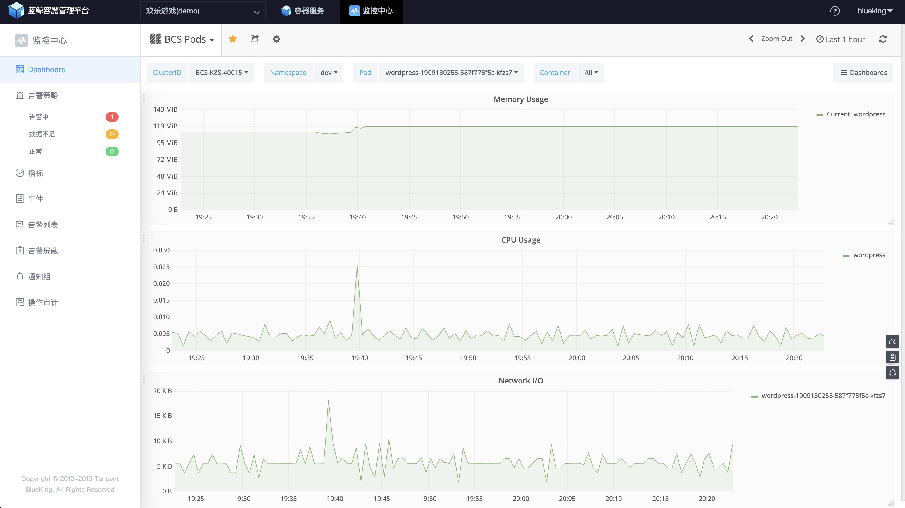
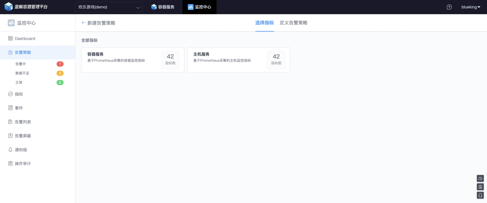
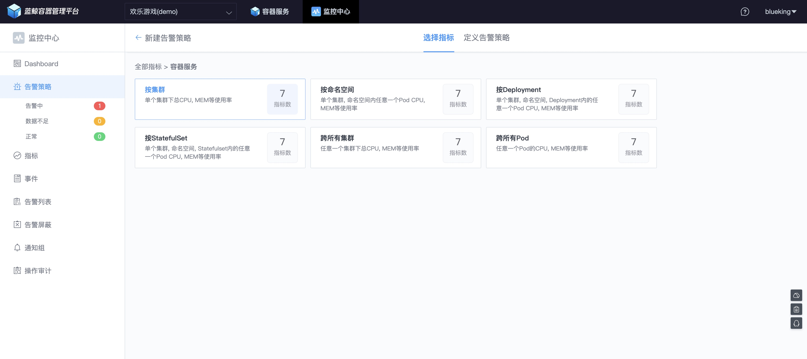
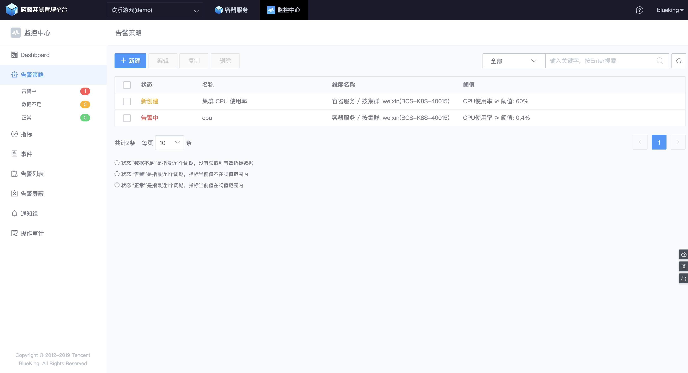

# Dashboard - Metric 数据查看和配置

容器的基础性能数据、容器的日志（标准输出日志采集、非标准输出日志采集）、容器内运行的应用程序的自定义 Metric 在采集，清洗完成，且在数据平台生成相应结果表后，即可在 Dashboard 中查询。

入口地址： 【监控中心】 -> 【Dashboard】

Dashboard 含默认 和 自定义 2 种。

注意： `请勿修改默认 Dashboard，默认视图下次升级会覆盖您修改的配置`

点击 `New Dashboard` 可以添加自定义数据仪表盘，点击 `Import Dashboard` 可以导入自定义数据仪表盘。

## 1. 视图

默认 Dashboard 包含

- `BCS Cluster`, 集群视图

- `BCS Node`, 集群节点视图

- `BCS Pods`, 容器 Pod 视图

### 1.1 BCS Cluster

呈现集群的 CPU、内存资源的容量以及使用率。

### 1.2 BCS Node

呈现节点的平均负载以及 CPU、内存使用率。

### 1.3 BCS Pods

呈现 Pod 的 CPU、内存、网络资源的使用情况。

## 2. 告警策略配置

选择 【告警策略】菜单，可以容器、主机等维度的告警策略，如下图：

如选择容器维度后，还可以继续选择集群、命名空间、Deployment、StatefulSet 等维度。

例如选择 **集群** 维度，接下来选择  **CPU 使用率**

设置对应的告警检测策略。

上图是生产环境设置的策略，为了测试告警也可以降低阈值，可以看到阈值在下图的右侧以红线呈现，以直观的视角辅助阈值设置。

【保存】后告警策略设置成功。

