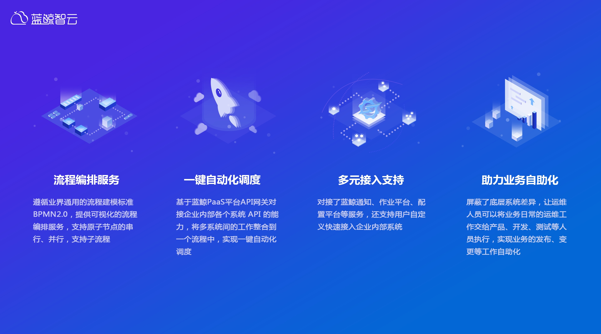
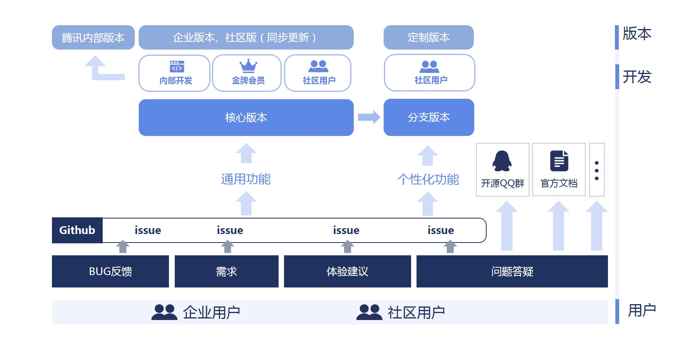

# 应用交付，从人工到自动化的转变

> 在提升企业应用交付效率的同时，输出运维价值

[配置管理标准化](5.1/bk_solutions/CD/CMDB/Configuration_management_standardization.md) 提到，运维服务“四化建设”的标准化是如何规范运维在配置管理、发布、变更、故障处理、监控告警等场景的运维能力，重点阐述企业如何建设 **配置管理标准化**。

接下来，我们通过理论配合实践（以 [蓝鲸标准运维](5.1/标准运维/产品简介/README.md)为例），分析"四化建设"第 2 个阶段 : **自动化** ，如何 **让应用交付从人工到自动化的转变，在提升企业应用交付效率的同时，输出运维价值**。

首先，我们看下应用交付遇到的痛点。

## 应用交付痛点
管理者觉得在 **质量、效率、成本、安全上你做得都很差**，而作为执行者的你，**心累、身体累的同时还担心哪天不小心背锅而走**。

- 应用部署至生产环境周期长，无法快速迭代
- 部署过程中跨越多个运维系统，操作较为繁琐，容易出错
- 部署到生产环境后，可能面临回滚
- 无法直观查看部署进展,心里没底
- 每周大部分时间投入到发布、变更、故障处理，谈什么运维价值
- 运维操作零散，不可审计，无法满足合规性要求
- ...

## 1. 项目目标

### 1.1 术语解释
- **资源编排** : (Resource Orchestration)，用户定义资源的编排流程，工具执行编排流程，执行时只关注输入，提升重复性应用/资源交付的运维效率。
- **持续集成**[1] : (Continues Integration)，Code -> 自动化测试 -> 合入主分支 -> 归档构建（最好是捕获 commit 事件自动触发 CI ）
- **持续交付** : (Continues Delivery)，归档构建 -> 测试环境自动交付（ CI 成功后，会自动触发持续交付，在同一个 pipeline 中）
- **持续部署** : (Continues Deployment)，归档构建 -> 生产环境自动部署（灰度发布、全量发布等）

### 1.2 项目目标

在运维"四化建设"基石" **标准化** "的基础上，从 **运维四要素** ：`质量`、`效率`、`成本`、`安全`的角度出发，以实现应用交付自动化的目标。

- 标准化：通过流程模板固化在标准化阶段沉淀的发布、变更、故障处理流程
- 运维四要素
    - 质量：减少人工实施导致的人为错误
    - 效率：应用交付提速，从多天 1 发到 1 天多发
    - 成本：认领工单后，只需关注交付结果，让运维更聚焦增值服务
    - 安全：满足安全合规要求，实现应用交付过程可视化，交付历史归档可查

## 2. 技术选型

需要一套资源编排工具，**串接应用交付过程中的各个原子节点**。如执行类：文件分发、命令执行、DB 提单等，周边类：告警屏蔽、任务通知、审批等，流程类：认领 ITSM 单据，结单等）。

放眼行业，资源编排在公有云中早有对应的成熟工具[2]

| 行业应用 | AWS | Azure | 谷歌云 | 阿里云 | 青云 |
| --- | --- | --- | --- | --- | --- |
| 对应产品 | [Cloud Formation](https://docs.aws.amazon.com/zh_cn/AWSCloudFormation/latest/UserGuide/Welcome.html) | [Azure-RM](https://docs.microsoft.com/zh-cn/azure/azure-resource-manager/resource-group-overview)  | [Cloud Deployment Manager](https://cloud.google.com/deployment-manager/docs/quickstart) | [ROS](https://help.aliyun.com/document_detail/28852.html) | [RO](https://docs.qingcloud.com/product/operation/topology) |

（青云的资源编排工具）

然而，行业慢慢关注混合云，从信通院发布的《混合云白皮书（2019 年）》[3]中获悉，2018 年国内混合云的占有率为 8.1% ，同期全球占比 58%，以至于 Terraform[4]慢慢成长起来了。

然而，这些资源编排工具只能满足企业在云端（公有云、私有云、混合云）资源的编排，包括 Ansible 在内的自动化工具 **无法满足应用交付过程中与企业 IT 系统的交互** ，比如发布工单、CMDB、审批流程等等，更多仍然还是偏执行。

蓝鲸标准运维，正是解决上述行业痛点。

标准运维在蓝鲸体系中位于 SaaS 场景层，通过 PaaS 层的 ESB 或 API Gateway 与原子平台层的 CMDB、作业平台等平台交互。

确立了技术方案后，接下来介绍如何在企业内部实施标准运维，实现应用交付自动化。

如何实施标准运维，请参考场景案例：[应用如何自动化部署至生产环境](5.1/bk_solutions/CD/CMDB/CMDB_integration.md)、[应用交付人力转移，让运维更专注业务优化](ops_half_automation.md)。

## 3. 技术发展方向

蓝鲸体系内覆盖更多的场景，如告警屏蔽、解屏蔽，关联 ITSM 工单等，**单一来源使其自成体系**，体验更流畅。

**丰富持续部署领域所依赖资源的标准插件**，如各大公有云和私有云（ Openstack 等）的资源（云主机、数据库、中间件等），向 Terraform 看齐。

支持**模板语法**（如 YAML、JSON、Python、Jinja 等），增强复杂场景的编排能力。

**开放基于 BPMN 的画布设计器**，不止与底层编排服务，让更多的场景 SaaS（如运营活动逻辑的自助配置）可以低成本的构建。

标准运维负责 DevOps 流程的 CD（持续部署）部分，将版本部署至生产环境，而 [蓝盾 CI 平台](https://github.com/Tencent/bk-ci) 负责之前的 CI（持续集成）+ CD（持续交付）, 二者间的联动，让整个 DevOps 流程更加流畅。

现在你还在通过二进制的方式部署你的业务，但再过 2 年可能就不是这样了，已有不少行业已在使用容器编排服务，部署模式已经发生了革新的转变。所以在蓝鲸体系内，[蓝鲸容器管理平台](https://github.com/Tencent/bk-bcs)将补上这块能力的空缺。

万丈高楼平地起，标准化、自动化需要依次建设，技术没有弯道超车。

最后希望，企业的 IT 系统建设能够逐步演进、完善，让广大运维兄弟真正能交付运维价值，体会运维这个岗位给企业带来的价值。

来吧，一起共建属于大家的开源自动化运维项目：[标准运维](https://github.com/Tencent/bk-sops)！

（开源共建标准运维）

## 扩展阅读
- [1] 阮一峰. [持续集成是什么？](http://www.ruanyifeng.com/blog/2015/09/continuous-integration.html) [EB/OL]，2015-9-23
- [2] 唐盛军. [全球公有云编排服务大比拼](https://bbs.huaweicloud.com/blogs/50719c3767c411e89fc57ca23e93a89f) [EB/OL]，2018-6-4
- [3] 中国信息通信研究院. [《混合云白皮书（2019 年）》](https://mp.weixin.qq.com/s/efqSLdrKu0OtWiUsCullyg) [EB/OL]，2019-6-17
- [4] Terraform. [Terraform vs. CloudFormation, Heat, etc.](https://www.terraform.io/intro/vs/cloudformation.html) [EB/OL]
- [5] 叶光芳. [赣州银行利用蓝鲸标准运维实现容灾一键切换](https://mp.weixin.qq.com/s/rCPDpxDG5v_BFo1gPRNq3w) [EB/OL]，2019-5-28
- [6] 元鼎科技. [金融行业落地自动化持续交付](https://mp.weixin.qq.com/s/MPNjXzpOMqgigvUVzU8hiA) [EB/OL]，2019-4-9
- [7] 蓝鲸. [企业运维自动化新玩法](https://mp.weixin.qq.com/s/Qk0kL-581cugcRXiJnqKgg) [EB/OL]，2019-3-14
- [8] 蓝鲸. [Github Tencent/bk-sops](https://github.com/Tencent/bk-sops) [EB/OL]
- [9] 蓝鲸. [Github Tencent/bk-cmdb](https://github.com/Tencent/bk-cmdb) [EB/OL]
- [10] 蓝鲸. [Github Tencent/bk-ci](https://github.com/Tencent/bk-ci) [EB/OL]
- [11] 蓝鲸. [Github Tencent/bcs](https://github.com/Tencent/bk-bcs) [EB/OL]
