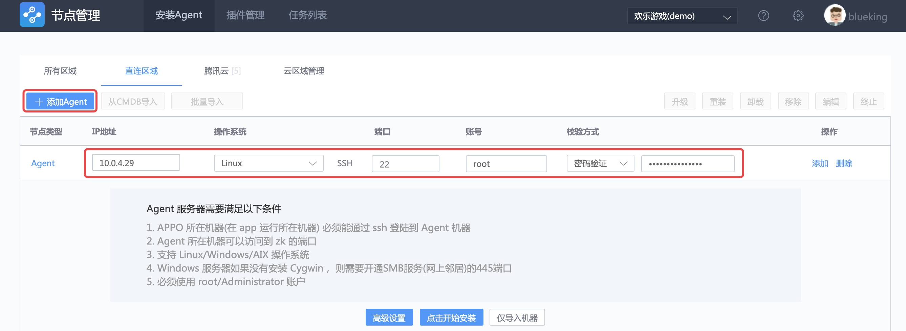
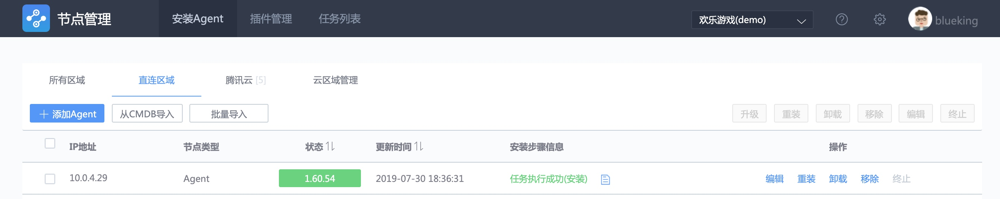
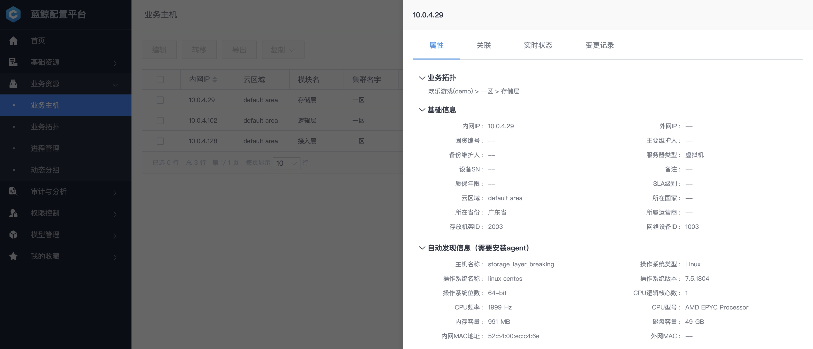
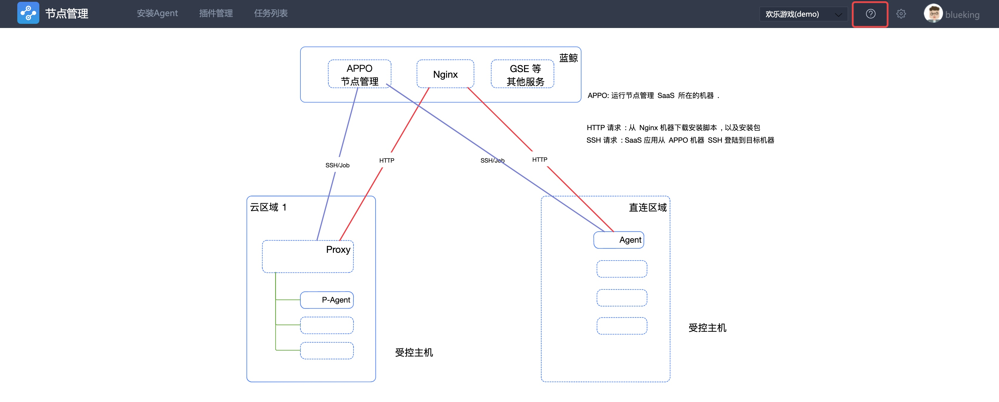
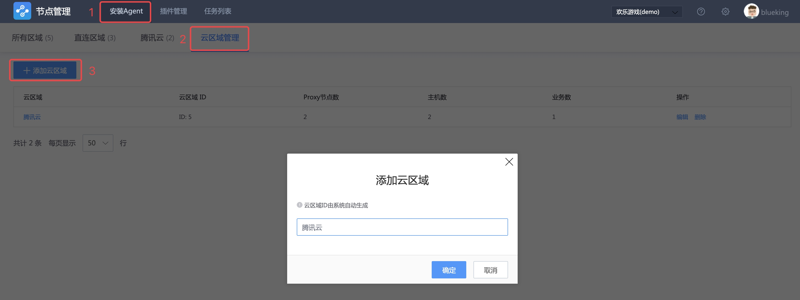
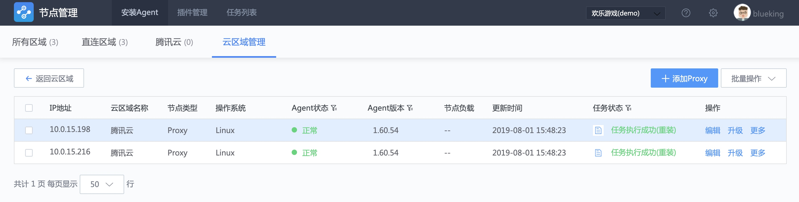
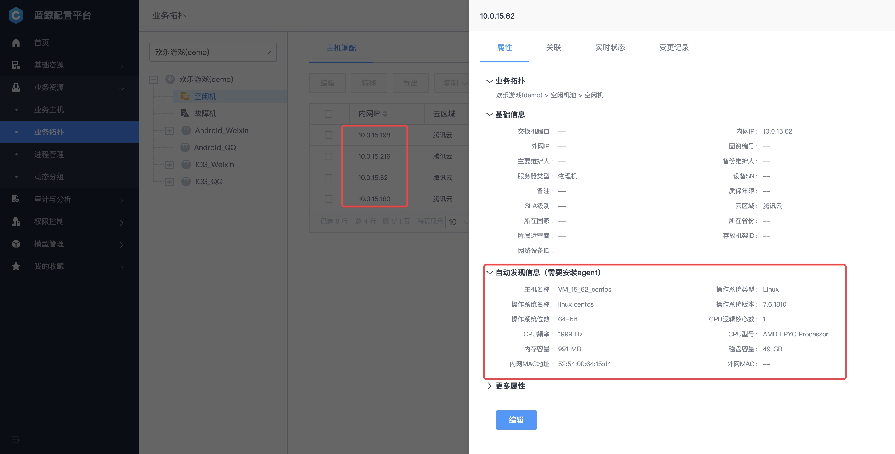

管控混合云架构下的基础设施
---

## 情景
随着云计算浪潮的推进，多云管控逐渐成为趋势，多云间网络无法互通。

接下来看下蓝鲸是如何管控多云主机。

## 前提条件

- [部署完蓝鲸](5.1/部署维护/README.md)

**术语解释**

 - **GSE Server** : [蓝鲸管控平台](5.1/管控平台/产品简介/README.md)的后台服务，由文件分发、命令执行、数据上报三个模块组成。
 - **GSE Proxy** : 跨云网络中，GSE Server 和跨云网络中被管控主机的代理，实现对跨云网络主机的管控。
 - **Agent** : 运行在被管控主机上的代理程序，实现文件分发、命令执行以及数据上报。
 - **VPC** : (Virtual Private Cloud)，私有网络，逻辑隔离的网络空间，每个私有网络内的服务资源内网互通，不同私有网络之间内网不通，但可通过新建**对等连接**来连通。
 - **云区域** : 标识 VPC 网络，蓝鲸多云管控的关键字段，通过 租户 ID( bk_supplier_id )、云区域、IP 三者唯一标识主机。
 - **直连网络** : 蓝鲸后台服务所在的网络，该网络下管控的主机与蓝鲸后台互通。

## 操作步骤

- 梳理网络拓扑]
- 管理直连网络区域的主机
- 管理跨云网络区域的主机

### 1. 梳理网络拓扑

以下是一个经典的多云管控网络拓扑图。

蓝鲸所在的网络为 `VPC 1` ，通过`直连方式`管理该网络区域的主机，通过带有外网的 `GSE Proxy` 来管理公有云的主机（网络为 `VPC 2` 和 `VPC 3`）。

> 上图是从管控角度绘制的网络拓扑图。

> 在跨云管控的场景下，在蓝鲸所在 VPC 1 网络下发安装 Agent 的行为，还需要蓝鲸后台的 [Nginx 模块](5.1/部署维护/基础包安装/环境准备/get_ready.md) 具备外网 IP，供 VPC 2 和 VPC 3 网络的 GSE Proxy 下载 Proxy 和 Agent 安装包。

### 2. 管理直连网络区域的主机
先介绍如何管控蓝鲸后台服务所在网络（也称直连网络）的主机。
#### 2.1 安装 Agent
打开 [节点管理](5.1/节点管理/README.md) ，选择 `直连区域`，按提示填写 `IP地址`、`操作系统`、`端口`、`账号`、`密码`。

点击`开始安装`，稍等片刻安装完成。

在`插件管理`页面可以查看该主机上运行的插件状态和版本号。

在配置平台的`主机详情页`，可以看到该台主机的`实时状态`。

在`主机详情页`的属性 TAB 页，可以看到`自动发现`的主机属性，源于运行在被管控主机上的`basereport`插件主动上报。

在`变更记录`TAB 页可以知道，节点管理在安装 Agent 的过程中会向配置平台导入主机。

#### 2.2 命令执行和分发文件测试

使用作业平台`执行脚本`和`分发文件`做测试。

media/blueking_execute_push_file.mp4

### 3. 管理跨云网络区域的主机
接下来介绍，如何管控跨云网络（例如 VPC 2 和 VPC 3）的主机。

#### 3.1 策略开通

跨云网络中，通过**GSE Proxy** 代理 GSE Server 与跨云网络中被管控主机的流量，实现对跨云网络主机的管控。

点击节点管理右侧的【 ？帮助】菜单，会显示节点管理安装 Agent、Proxy 的架构图，以及 GSE Proxy 与 GSE Server 通信相互开通的策略。

完成上述网络访问策略开通。

接下来，准备安装 GSE Proxy。

#### 3.2 安装 GSE Proxy

为了演示方便，将网络拓扑图 中的 VPC 2 命名为“腾讯云”，你也可以命名为“广州三区”或“上海三区”等。

现在添加**云区域**，如`腾讯云`。

选择菜单【安装 Agent】，点击【云区域管理】，然后【添加云区域】，如“腾讯云”。

填写 Proxy 的内网、外网 IP 地址，以及账号，点击【开始安装】。

完成 Proxy 的安装，在【云区域管理】列表中可以找到已经安装好的 Proxy。

完成 Proxy 的安装，接下来安装该网络下的 Agent。

#### 3.3 安装 Agent

选择菜单【安装 Agent】，点击【腾讯云】，【添加 P-Agent】，然后点击【开始安装】。

完成该网络下的 Agent 安装。

在【配置平台】中也可以找到对应的主机和主机属性。

#### 3.4 命令执行和分发文件测试

使用作业平台`执行脚本`和`分发文件`做测试。

media/bk_nodeman.mp4

## 扩展阅读
### 多级级联：管理隔离网络的主机

在部分企业网络环境中，存在 `VPC 1（蓝鲸所处网络）` 和 `VPC 3` 不互通，但需要管控 VPC 3 网络主机的场景，如下图：

这时候，需要企业网络环境中，存在一个 VPC 2 的网络， 通过申请网络策略，连通 VPC1 和 VPC 3 中的指定（最小策略，安全）服务器。

这时需要使用蓝鲸管控平台的**多级级联**功能， VPC 3 网络中的主机与 GSE Proxy 2 互通，GSE Proxy 2 通过 上联 GSE Proxy 1 与 蓝鲸 GSE Server 通信。

> `多级级联`功能尽请期待。
