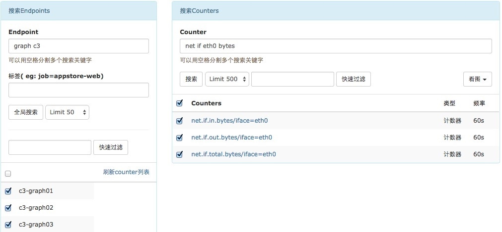

# Open-Falcon 集成蓝鲸 CMDB 业务拓扑树
> 感谢社区用户 [StephenWang](https://bk.tencent.com/s-mart/personal/10116/) 贡献该文档.

## 情景
`Open-Falcon` 是一款开源监控产品， 默认通过 `Endpoint`（一般为主机名） 查找服务器，体验不够友好。

集成蓝鲸配置平台的业务拓扑树，将首页左侧栏改造为服务树，通过选择业务模块快速选择机器，提高监控查看效率。

## 前提条件
- [主机纳管在蓝鲸配置平台中](5.1/bk_solutions/CD/CMDB/CMDB_management_hosts.md)
- 在蓝鲸开发者中心 [新建一个应用](5.1/开发指南/SaaS开发/新手入门/Windows.md)，用于调用 [CMDB 的 API](5.1/API文档/CC/README.md)
- 熟悉 `Python`、`JavaScript`

## 操作步骤
- 配置平台中建立业务拓扑
- 查询主机及拓扑，写入 Redis
- 封装后台接口
- Open-Falcon 前端调用
- 预览效果

### 1. 配置平台中建立业务拓扑
参照 [主机纳管在蓝鲸配置平台中](5.1/bk_solutions/CD/CMDB/CMDB_management_hosts.md)，根据应用的部署分层架构，建立业务拓扑如下：


### 2. 查询主机及拓扑，写入 Redis
- 定时调用配置平台`查询主机:search_host`接口
- 将结果转化为 `ztree` 的数据格式，并写入 Redis

```python
# -*- coding: utf-8 -*-
import requests
import redis

url = '/api/c/compapi/v2/cc/search_host/'
data = {
        "bk_app_code": "",  # 用于调用蓝鲸CMDB API的SaaS账号
        "bk_app_secret": "", # 用于调用蓝鲸CMDB API的SaaS Token
        "bk_username": "", # 拥有业务运维权限的蓝鲸账号
        "condition": [
            {
                "bk_obj_id": "host",
                "fields": []

            },
            {
                "bk_obj_id": "module",
                "fields": []

            },
            {
                "bk_obj_id": "set",
                "fields": []

            },
            {
                "bk_obj_id": "biz",
                "fields": [],
                "condition": [
                    {
                        "field": "bk_biz_id",
                        "operator": "$eq",
                        "value": 3
                    }
                ]
            }

        ]

    }

topo = []
result = requests.post(url=url, json=data).json()
for res in result['data']['info']:
    ip = res['host']['bk_host_innerip']
    for module in res['module']:
        topo2 = module['TopModuleName'].split('#')
        sett = topo2[1]
        modd = topo2[1] + '_' + topo2[2]
        if {'id': sett, 'pid': 0, 'name': sett} not in topo:
            topo.append({'id': sett, 'pid': 0, 'name': sett})
        if {'id': modd, 'pid': sett, 'name': modd} not in topo:
            topo.append({'id': modd, 'pid': sett, 'name': modd})
        if {'id': ip, 'pid': modd, 'name': ip} not in topo:
            topo.append({'id': ip, 'pid': modd, 'name': ip})

rdp = redis.ConnectionPool(host='',port=6379)
rdc = redis.StrictRedis(connection_pool=rdp)

topo = sorted(topo, key=lambda x: x['name'])
rdc.set('cmdb',str({'value':topo}))
```


### 3. 封装后台接口
- 用 `flask` 开发接口，用于 Openfalcon 前端调用
- 跨域访问处理 : 调用外部接口，需要解决跨域问题

```python
#-*-coding:utf-8 -*-
import flask
import redis
from flask import jsonify
from flask import request
from flask import make_response

server = flask.Flask(__name__)
@server.route('/topo_new_ztree/',methods=['post'])

def search_new_ztree():
    """
    :method: post
    :return:
    """
    try:
        rdp = redis.ConnectionPool(host='', port=6379)
        rdc = redis.StrictRedis(connection_pool=rdp)
        topo = eval(rdc.get('cmdb'))["value"]
        response = make_response(jsonify({'result': 'success', 'message': topo}))
    except Exception as e:
        response = make_response(jsonify({'message': {'msg': str(e)}, 'result': 'fail'}))
    finally:
        response.headers['Access-Control-Allow-Origin'] = '*'
        response.headers['Access-Control-Allow-Methods'] = 'POST'
        response.headers['Access-Control-Allow-Headers'] = 'x-requested-with,content-type'
        return response
```

### 4. 前端样式调整

修改 Open-Falcon 前端页面`dashboard/rrd/templates/index.html`

前端拓扑树选择 `ztree` 插件：支持模糊查询，勾选事件等，具体功能可查询 [官方 API](http://www.treejs.cn/v3/api.php "ztree")

- 调用上述的接口, `ztree` 加载返回结果
- 拓扑树中可以自定义勾选事件

```javascript
var post_url='/topo_new_ztree/';

function createTree(post_url){
  var zTree;
  var setting = {
    check: {
      enable: true
    },
    view: {
      dblClickExpand: true,
    },
    data: {
      simpleData: {
        enable: true,
        idKey: "id",
        pIdKey: "pid",
        rootPId: 0
      }
    },
    callback:{
      onCheck:onCheck
    }

  };
  function onCheck(){
    //自定义勾选事件
  };
  $.post(post_url,function(data){
    zTree = $.fn.zTree.init($("#tree"), setting, data.message);
  });
}
```

### 5. 预览效果 

可直接通过左侧的服务树选择资源，十分方便。


改造前，查找资源只能通过检索，十分不便，如下图：




> 注: CMDB 中的资源经常变动，建议使用事件驱动的[消息推送](5.1/配置平台/产品功能/ModelManagement.md)来监听资源变化，而不是周期获取。
