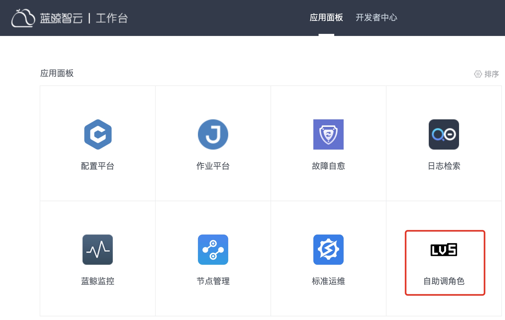
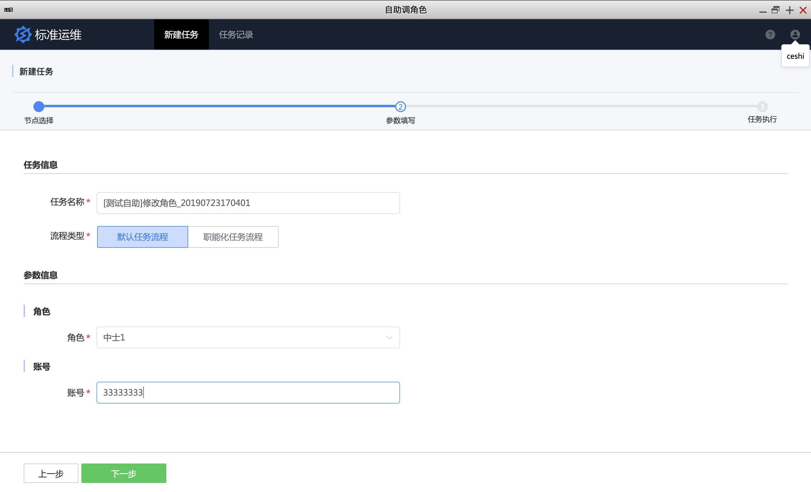

需求自助化:测试自助调整验收环境
---

# 情景
测试同学经常找运维同学调整测试环境的配置，比如调整不同的角色或代币（**本文以调整角色为例**）来验证功能是否符合预期，一来让运维时间碎片化，二来交付给需求方的时间不固定，需求方也不满意，影响整体效率。

需要一种让需求方自助操作的入口，简化输入，关注输出，解脱运维的同时提升需求方的满意度。

# 前提条件
- 准备一个`测试`角色，并在蓝鲸配置平台中将其添加到业务的`测试人员`角色中
- 准备调整角色的标准运维流程模板

# 操作步骤

- 新建标准运维流程模板
- 新建自助调角色轻应用
- 测试轻应用

## 1. 新建标准运维流程模板

### 1.1 新建流程模板  
调整用户角色的逻辑很简单，一般作业平台的一个作业即可满足，此处不展开介绍如何创建作业。

新建流程模板，如下。

由于轻应用重点之一是`简化输入`，所以尽可能方便需求方填写参数。此处有 2 个参数：`角色` 和 `账号`。

角色一般可以枚举，所以使用`下拉框`，简化输入。

账号这里是数字，使用`输入框`，同时加上正则，帮用户纠错。

保存任务流程，并执行任务，验证任务流程可调整角色。

### 1.2 给`测试`账号授权

选择流程模板，对`测试`账号 ceshi 赋予 `新建`、`执行`任务权限.

在`业务配置`中设置任务真正的执行者（比如执行作业平台的作业），因为测试没有运维权限。

## 2. 新建自助调角色轻应用

点击`轻应用`导航栏，按提示新建轻应用。

## 3. 测试轻应用 

使用测试账号 ceshi 登录蓝鲸，找到刚才创建的`自助调角色`SaaS。

点击`自助调角色`SaaS

执行任务

至此，测试同学自助调整测试环境的轻应用已配置完毕，后续测试同学直接打开`自助调角色`SaaS 即可完成需求。

此外，如产品和测试需要调整配置，DBA 需要 AWR 报告，测试需要添加白名单等等运维的日常需求，均可以通过轻应用方式解决，**简化输入，关注输出**，在解脱运维的同时，还能提升需求的满意度。
