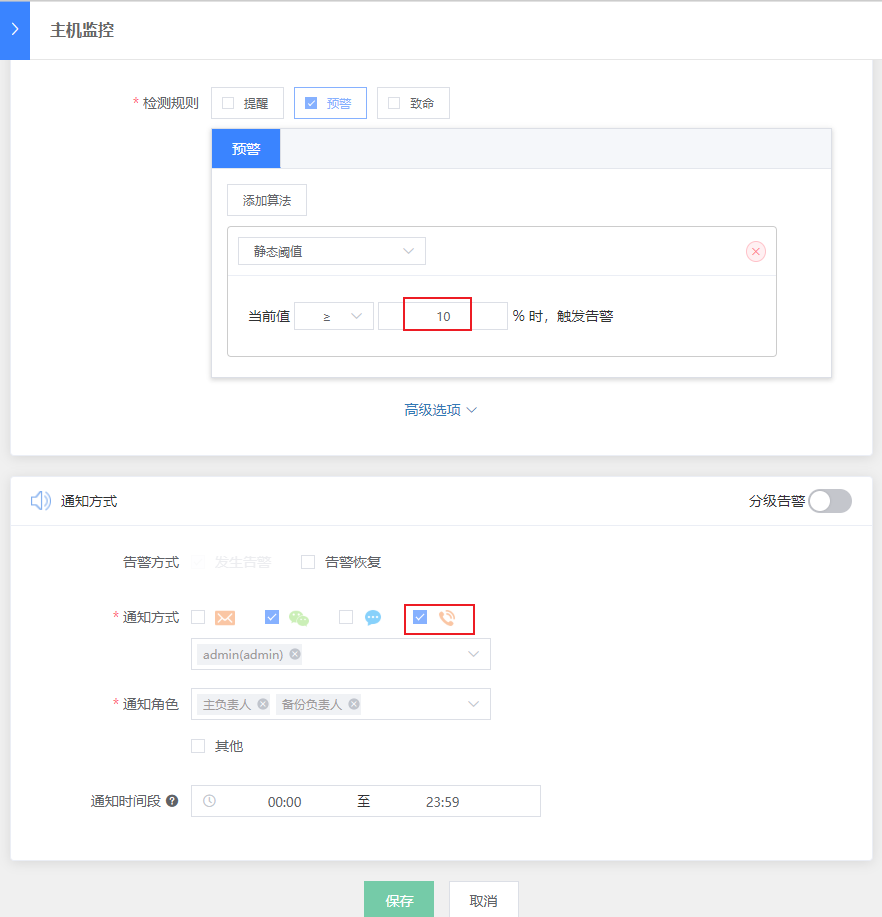

# 集成内部语音网关实现电话告警
---


> 特别感谢社区用户 [Kevin](https://bk.tencent.com/s-mart/personal/10966/) 提供该文档.

## 情景
故障处理是运维的几大职能之一，重要告警不能漏告，通过微信、邮件、短信等通知方式无法触达，所以需要使用电话告警。

蓝鲸监控默认已支持腾讯云的语音网关，实现电话告警通知，但如果公司已有第三方(非腾讯云)的电话告警服务，该如何接入呢？

## 前提条件

- 开通好企业内部语音网关
- 掌握 [蓝鲸 SaaS 开发](https://docs.bk.tencent.com/dev_saas/)，打开 [腾讯运维开发实战课](https://bk.tencent.com/s-mart/community/question/440) 马上学习
- 掌握 [蓝鲸 API 网关开发](https://docs.bk.tencent.com/esb/)


## 操作步骤

- 1. 梳理逻辑
- 2. 代码解读
- 3. 电话告警测试

### 1. 梳理逻辑

对企业内部语音网关封装一个接口，改造蓝鲸 ESB 中语音通知 API 即可。

以下为语音通知的调用逻辑图。


### 2. 代码解读

#### 2.1 封装企业内部语音网关接口

实现内部电话告警接口，并放到 send_voice_msg.py 同一层目录下。

本例中的接口：`ums_alarm.ums_tools.send_phone(user_phone_list, content)`

参数为电话电码列表、告警内容，返回值为调用结果(`True` / `False`)和接口的返回消息


#### 2.2 改造蓝鲸 ESB 中语音通知 API


在蓝鲸 PaaS 所在机器的消息通知代码目录下，修改 `send_voice_msg.py`

```plain
source /data/install/utils.fc
ssh $APPO_IP
cd /data/bkce/open_paas/esb/components/generic/templates/cmsi/
```
> 注：企业版请将 `bkce` 改成 `bkee`


##### 2.2.1 获取请求接口的数据

原有 `send_voice_msg.py` 文件已经实现了大部分内容，关键在于 Form 类中的 handle(self) 函数，这个函数已实现从请求接口的数据中获取`告警接收人列表data['user_list_information']`，另外只需要使用`data['auto_read_message']`获取告警信息即可。

```python
# 公共语音接口/api/c/compapi/cmsi/send_voice_msg/请求参数示例
{
    "bk_app_code": "esb_test",
    "bk_app_secret": "xxx",
    "bk_token": "xxx",
    "auto_read_message": "This is a test",
    "user_list_information": [{
        "username": "admin",
        "mobile_phone": "1234567890",
    }]
}
```


##### 2.2.2 调用企业内部语音告警接口

修改 `#TODO: can be updated` 之后的部分，全部注释掉。

使用上一步得到的告警信息 `data['auto_read_message']` 和上面接口中得到 `data['user_list_information']` ，根据实际情况组装后，以参数形式调用企业内部语音告警接口即可。

```python
    # TODO: can be updated
    # -----------------实现下面的代码-----------------
    # 取告警内容
    v_content = data['auto_read_message']
    # 获取用户手机列表
    user_phone_list = [user_list['mobile_phone'] for user_list in data['user_list_information']]
    # 调用接口，发送告警
    ret, msg = ums_tools.send_phone(user_phone_list, v_content.encode('utf-8'))
    if ret == True:
         result = {
            'result': True,
            'data': msg,
            'message': 'OK'
            }
    else:
        result = {
            'result': False,
            'data': msg,
            'message': 'Send voice error'
            }
    self.response.payload = result
```

完成代码，[点击下载](/CO/media/send_voice_msg.py.tgz)。

#### 2.3 重启 PaaS

蓝鲸中控机上重启 PaaS ，使代码生效

```plain
/data/install/bkcec stop paas
/data/install/bkcec start paas
```


### 3. 电话告警测试

 配置电话告警策略，触发告警，验证结果。

 

告警产生后，手机将收到语音告警电话。

 media/send_voice_msg.mp3

不漏掉任何一个重要的告警。
