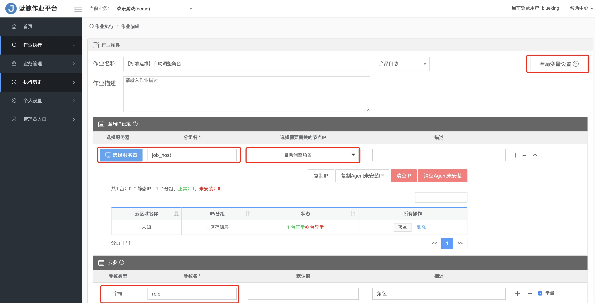
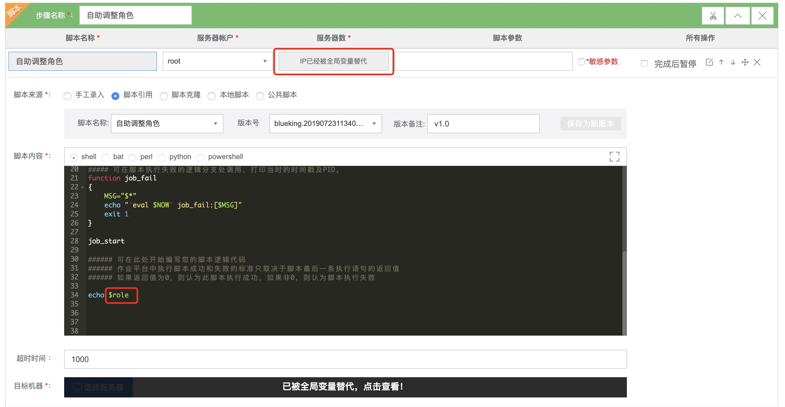

# 37 秒完成万台服务器的目录标准化

## 情景
对运行在上万台服务器上的业务服务做标准化的调整（还历史债务），经过多轮的灰度验证，计划对剩下数万台服务器批量操作。

## 前提条件
- 服务器已在 [CMDB 注册](5.1/bk_solutions/CD/CMDB/CMDB_management_hosts.md)
- 拥有服务器所在 CMDB 中业务的运维权限

## 操作步骤
- 新建作业
- 执行和查看执行结果

### 1. 新建作业
按照标准化的需求，我们需要将 `gsectl` 文件推送至 `/usr/local/gse_bkte/agent/bin/` 目录，为了确保万无一失，做 MD5 校验。

作业模板如下：

提示：为了阐述作业平台中的两个全局参数：`IP` 和 `云参`，我们通过 [需求自助化](5.1/bk_solutions/CD/Automation/ops_half_automation.md) 中用到的作业模板来介绍。

IP 这个参数，我们一般建议使用 [动态分组](5.1/配置平台/产品功能/BuzResource.md)，因为服务器会有故障替换的可能，IP 会变。

`云参`在脚本中可以直接引用。

### 2.执行作业及查看执行结果 

点击`执行作业`后，在 9946 台服务器上总耗时 37 秒。

其中分发 gsectl 文件耗时 13 秒。

MD5 校验耗时 24 秒。

