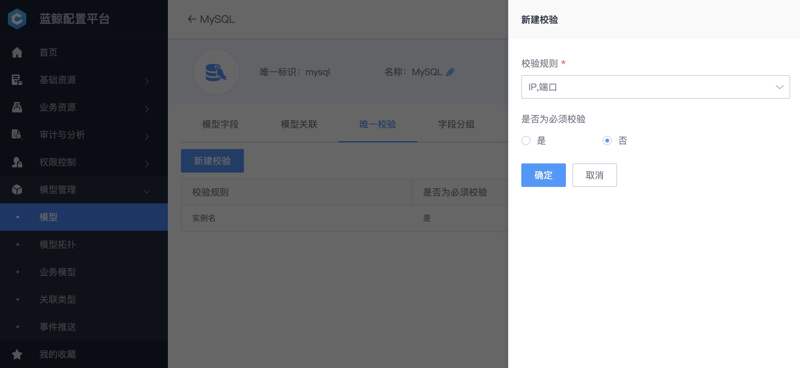
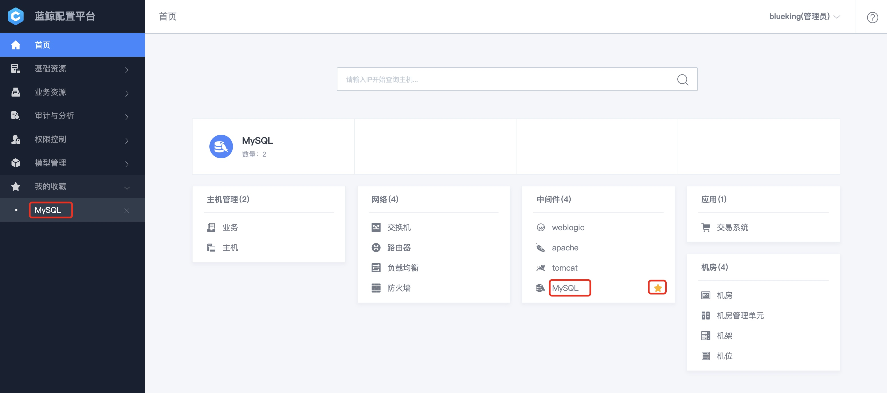
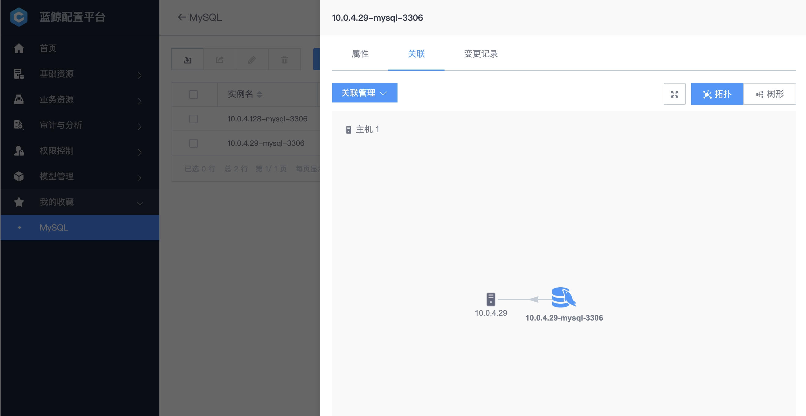

# 管理数据库/中间件实例：以 MySQL 为例

## 情景
应用使用的存储是 MySQL，为了便于 MySQL 的日常维护（如 SQL 变更），需要在 CMDB 中创建 MySQL CI 对象，录入 MySQL 实例。

> 蓝鲸 CMDB 拥有灵活的 CI 能力，掌握该教程后，可以管理数据库、中间件、硬件等 CI 对象

## 前提条件
在配置平台中 [新建好业务](5.1/配置平台/快速入门/case1.md)，并 定义拓扑及分配主机。

**术语解释**
 - **CI** : (Configuration Items)，资源对象，如 `MySQL`、主机、交易系统、交换机、路由器等
 - **CI 属性** : (Configuration Items Attribute)，资源对象的配置属性，如 MySQL CI 属性为实例名、IP、端口、存储引擎、数据库版本等
 - **CI 实例** : CI 的实例化，唯一识别一个资源对象，如 MySQL CI 实例为`gd_area_master_01`

## 操作步骤
- 梳理 : 梳理 MySQL CI 属性
- 建模 : 创建 MySQL CI 对象
- 实例化 : 添加 MySQL 实例

### 1. 梳理 MySQL CI 属性

根据消费 MySQL 的场景，梳理 MySQL 常见的 CI 属性。

<table>
   <tr>
      <td>字段分组</td>
      <td>字段中文名</td>
      <td>字段英文名</td>
      <td>字段类型</td>
      <td>录入方式</td>
      <td>是否唯一</td>
      <td>是否必填</td>
   </tr>
   <tr>
      <td rowspan=11>基本信息</td>
      <td>实例名</td>
      <td>bk_inst_name</td>
      <td>短字符</td>
      <td>自动</td>
      <td>是</td>
      <td>是</td>
   </tr>
   <tr>
      <td>IP地址</td>
      <td>ip_addr</td>
      <td>短字符</td>
      <td>自动</td>
      <td>是</td>
      <td>是</td>
   </tr>
   <tr>
      <td>端口</td>
      <td>port</td>
      <td>数字</td>
      <td>自动</td>
      <td>是</td>
      <td>是</td>
   </tr>
   <tr>
      <td>数据库版本</td>
      <td>version</td>
      <td>短字符</td>
      <td>自动</td>
      <td></td>
      <td></td>
   </tr>
   <tr>
      <td>安装路径</td>
      <td>install_dir</td>
      <td>长字符</td>
      <td>自动</td>
      <td></td>
      <td></td>
   </tr>
   <tr>
      <td>数据库文件路径</td>
      <td>dbfile_dir</td>
      <td>长字符</td>
      <td>自动</td>
      <td></td>
      <td></td>
   </tr>
   <tr>
      <td>是否开启binlog</td>
      <td>enable_binlog</td>
      <td>枚举</td>
      <td>自动</td>
      <td></td>
      <td></td>
   </tr>
   <tr>
      <td>是否开启慢查询日志</td>
      <td>enable_slowlog</td>
      <td>枚举</td>
      <td>自动</td>
      <td></td>
      <td></td>
   </tr>
   <tr>
      <td>字符集</td>
      <td>chart_set</td>
      <td>短字符</td>
      <td>自动</td>
      <td></td>
      <td></td>
   </tr>
   <tr>
      <td>存储引擎</td>
      <td>storage_engine</td>
      <td>短字符</td>
      <td>自动</td>
      <td></td>
      <td></td>
   </tr>
   <tr>
      <td>数据库大小</td>
      <td>db_size</td>
      <td>数字</td>
      <td>自动</td>
      <td></td>
      <td></td>
   </tr>
   <tr>
      <td rowspan=6>核心参数</td>
      <td>innodb缓存池大小</td>
      <td>innodb_buffer_pool_size</td>
      <td>数字</td>
      <td>自动</td>
      <td></td>
      <td></td>
   </tr>
   <tr>
      <td>innodb日志缓存大小</td>
      <td>innodb_log_buffer_size</td>
      <td>数字</td>
      <td>自动</td>
      <td></td>
      <td></td>
   </tr>
   <tr>
      <td>innodb日志磁盘写入策略</td>
      <td>innodb_flush_log_at_trx_commit</td>
      <td>短字符</td>
      <td>自动</td>
      <td></td>
      <td></td>
   </tr>
   <tr>
      <td>线程缓存大小</td>
      <td>thread_cache_size</td>
      <td>数字</td>
      <td>自动</td>
      <td></td>
      <td></td>
   </tr>
   <tr>
      <td>查询缓存大小</td>
      <td>query_cache_size</td>
      <td>数字</td>
      <td>自动</td>
      <td></td>
      <td></td>
   </tr>
   <tr>
      <td>最大连接数</td>
      <td>max_connections</td>
      <td>数字</td>
      <td>自动</td>
      <td></td>
      <td></td>
   </tr>
</table>

其中，CI 属性自动录入参考[自动发现 MySQL 实例](5.1/bk_solutions/CD/CMDB/CMDB_CI_auto_discovery_MySQL.md)。

通过`实例名`可以唯一标识一个 MySQL 实例，具体是`IP`和`端口`的组合。

### 2. 创建 MySQL CI 对象
第一步梳理完 MySQL CI 属性后，接下来开始建模：创建 MySQL CI。

#### 2.1 创建 CI
选择`模型管理`中选择`模型`，创建 MySQL 模型。

#### 2.2 新增 CI 属性
按照梳理 MySQL CI 属性 中梳理的结果来添加 CI 属性。

如果手工操作繁琐，也可以导入一个 MySQL 模型示例。

#### 2.3 设立 CI 关联

针对 MySQL 的管理，除了 CI 属性外，我们同时还关心 MySQL 运行在哪台主机上，所以需要在模型中新建一个“主机上运行 MySQL”的关联。

1 个主机可以运行多个 MySQL 实例，所以`源到目标的约束条件`为“ 1-N ”

#### 2.4 新增唯一校验

通过`实例名`可以唯一标识一个 MySQL 实例，具体是`IP`和`端口`的组合，所以将 IP 和端口作为一个组合校验。

### 3. 添加 MySQL 实例
完成 MySQL CI 的建模之后，接下来添加 MySQL 实例
#### 3.1 新增或导入 CI 实例
从首页进入 MySQL 实例列表页

点击`新建`按钮，按提示添加 MySQL 实例，也可以批量导入 MySQL 实例。

#### 3.2 创建 CI 实例的关联关系 

打开一个 MySQL 实例的详情页，点击`关联` TAB 中的`关联管理`，`关联`当前实例运行在哪台主机上。

再次点击`关联管理`，可预览 MySQL 实例与主机的关联关系。

如果参照本篇教程将`机架`、`交换机`、`机房管理单元`、`数据中心`等 IT 基础设施均录入 CMDB 中，将可以查询一个 MySQL 实例完整的关联关系。

