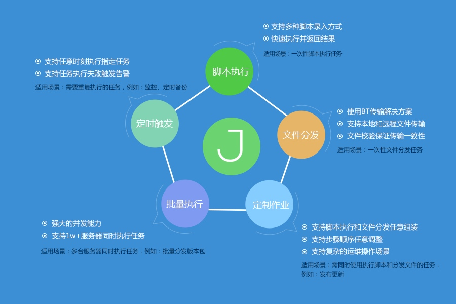

# 产品介绍

## 产品概述
作业平台（JOB）是一套基于蓝鲸智云管控平台 Agent 管道之上的基础操作平台，具备万级并发处理能力。除了支持脚本执行、文件拉取 / 分发、定时任务等一系列可实现的基础运维场景以外，还运用流程化的理念很好的将零碎的单个任务组装成一个作业流程。而每个任务都可做为一个原子节点，提供给其它系统和平台调度，实现调度自动化。

## 产品定位

除了批量执行的万级高并发性能优势，作业平台还支持复杂的运维操作场景，定制作业功能将一个操作流程制作成完整的作业任务，丰富的 API 开放接口使得作业任务原子化，提供给其它系统或平台进行调度，进一步扩大了业务使用场景。

## 功能概要

<table><tbody>
<tr><td>	特性	</td><td>	子特性	</td><td>	功能描述	</td></tr>
<tr><td rowspan="5">	作业执行	</td><td>	快速脚本执行	</td><td>	可通过手动编写、从已有的脚本克隆、从本地上传、从公共脚本选择四种方式导入脚本并批量执行。	</td></tr>
<tr><td>	快速分发文件	</td><td>	支持本地上传和服务器上选择两种方式，除了一对多，还可以多对多、多对一形式进行文件分发。	</td></tr>
<tr><td>	常用作业执行	</td><td>	查看已经保存的作业任务，可进行 “立即执行、定时启动、编辑、克隆、删除” 操作。	</td></tr>
<tr><td>	新建作业	</td><td>	将多个脚本执行或文件分发的节点结合在一个流程步骤内，形成一个新建的作业任务。	</td></tr>
<tr><td>	定时作业	</td><td>	对已创建的作业任务进行定时启停，可修改和删除。	</td></tr>
<tr><td>	业务管理	</td><td>	脚本管理	</td><td>	支持对作业下的脚本进行查询、新建、执行、编辑和删除。	</td></tr>

<tr><td>	执行历史	</td><td>	执行历史	</td><td>	对所有在作业平台执行过的脚本执行、文件分发、API  调用、定时任务等操作进行记录，方便查看详情。	</td></tr>

<tr><td rowspan="2">	个人设置	</td><td>	通知管理	</td><td>	针对作业执行成功、失败、等待执行等三类场景进行通知，确保完成整个作业执行流程。	</td></tr>
<tr><td>	个人设置	</td><td>	支持作业执行的一些默认设置、安全设置和作业迁移服务的迁入和迁出。	</td></tr>

<tr><td rowspan="3">	管理员入口	</td><td>	公共脚本	</td><td>	支持对公共脚本的查询、新建、执行、编辑和删除。	</td></tr>
<tr><td>	账户管理	</td><td>	对服务器上的账户和针对 SQL 执行功能的 DB 账户（仅企业版支持）进行管理如查询、添加、编辑和删除。	</td></tr>
<tr><td>	IP 白名单	</td><td>	支持 IP 白名单的查询、新建、编辑和删除。	</td></tr>

</tbody></table>
