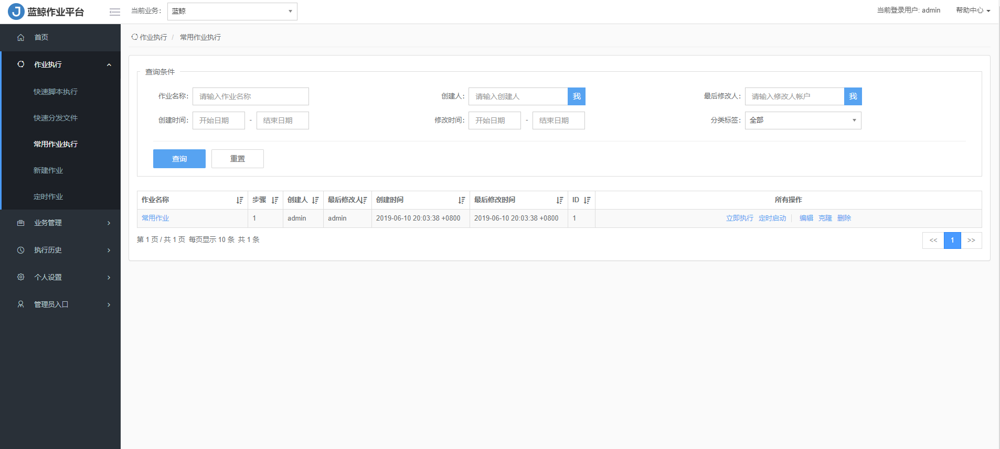
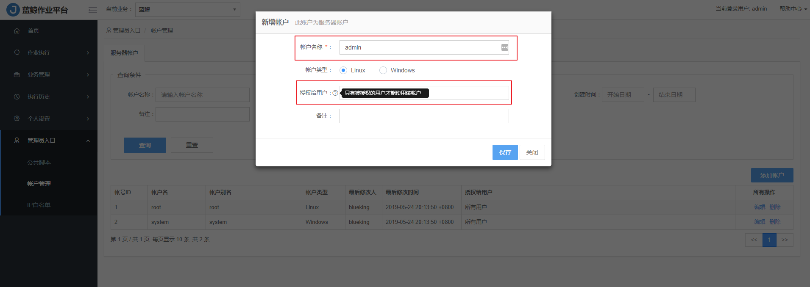

## 产品功能

除了批量执行的万级高并发性能优势，作业平台还支持复杂的运维操作场景，定制作业功能将一个操作流程制作成完整的作业任务，丰富的 API 开放接口使得作业任务原子化，提供给其它系统或平台进行调度，进一步扩大了业务使用场景。

### 作业平台

<table><tbody>
<tr><td>	特性	</td><td>	子特性	</td><td>	功能描述	</td></tr>
<tr><td rowspan="5" >	作业执行	</td><td>	快速脚本执行	</td><td>	可通过手动编写、从已有的脚本克隆、从本地上传、从公共脚本选择四种方式导入脚本并批量执行。	</td></tr>
<tr><td>	快速分发文件	</td><td>	支持本地上传和服务器上选择两种方式，除了一对多，还可以多对多、多对一形式进行文件分发。	</td></tr>
<tr><td>	常用作业执行	</td><td>	查看已经保存的作业任务，可进行 “立即执行、定时启动、编辑、克隆、删除” 操作。	</td></tr>
<tr><td>	新建作业	</td><td>	将多个脚本执行或文件分发的节点结合在一个流程步骤内，形成一个新建的作业任务。	</td></tr>
<tr><td>	定时作业	</td><td>	对已创建的作业任务进行定时启停，可修改和删除。	</td></tr>
<tr><td rowspan="2" >	业务管理	<tr><td>	脚本管理	</td><td>	支持对作业下的脚本进行查询、新建、执行、编辑和删除。	</td></tr>

<tr><td>	执行历史	</td><td>	执行历史	</td><td>	对所有在作业平台执行过的脚本执行、文件分发、API  调用、定时任务等操作进行记录，方便查看详情。	</td></tr>

<tr><td rowspan="2" >	个人设置	</td><td>	通知管理	</td><td>	针对作业执行成功、失败、等待执行等三类场景进行通知，确保完成整个作业执行流程。	</td></tr>
<tr><td>	个人设置	</td><td>	支持作业执行的一些默认设置、安全设置和作业迁移服务的迁入和迁出。	</td></tr>

<tr><td rowspan="3" >	管理员入口	</td><td>	公共脚本	</td><td>	支持对公共脚本的查询、新建、执行、编辑和删除。	</td></tr>
<tr><td>	账户管理	</td><td>	对服务器上的账户和针对 SQL 执行功能的 DB 账户（仅企业版支持）进行管理如查询、添加、编辑和删除。	</td></tr>
<tr><td>	IP 白名单	</td><td>	支持 IP 白名单的查询、新建、编辑和删除。	</td></tr>

</tbody></table>

### 业务总览 {#OverviewBusiness}

作业平台提供了作业总览视图，通过总览视图能够直观明了的查看当前 IT 环境中的业务主机数，常用作业数，近 30 天的任务数，定时任务数，历史任务执行情况，任务执行时长统计，最近任务执行记录等。IT 运维人员能够做到对于基础作业情况一目了然。

### 作业执行 {#JobExecution}

作业平台很好的解决了企业运维服务器集中化管理和调度的问题。除了支持批量脚本执行、文件拉取/分发、定时作业等基础运维场景以外，还运用流程化的理念很好的将零碎的单个任务组装成一个作业流程，实现调度自动化。

#### 快速脚本执行{#ScriptExecution}

可通过手动编写、从已有的脚本克隆、从本地上传、从公共脚本选择四种方式导入脚本并批量执行。

很大程度上，解决了需要手动在多台机器上执行统一脚本的缓慢繁琐。只要能够读取主机信息以及 Agent 的状态是正常的，那么均可一键执行脚本，作业更快速高效。

#### 快速分发文件{#DistributedFile}

支持本地上传和服务器上选择两种方式，除了一对多，还可以多对多、多对一形式进行文件分发至服务器上（Linux/Windows）。
传输文件更灵活、快速。作业平台的任务执行和文件传输都是基于 Agent 触发的，Agent 使用 BT（BitTorrent） 方案应对大文件传输，使得文件拉取和传输更加高速、效率。

#### 常用作业执行 {#JobExecution2}

常用作业的功能引入了流程编排的理念，将原子任务组装成一个复杂的运维场景，比如版本发布、变更、扩容，也可以把原子任务提供给上层 SaaS（如标准运维、故障自愈等）实现调度自动化。

用户在创建一个作业且保存后，在常用作业执行的作业列表里面可见，未保存执行过的作业则在执行历史的列表里面可见。支持 `立即执行、定时启动、编辑、克隆、删除` 操作。

#### 新建作业 {#NewJob}

流程式管理，一切皆 “作业” 。将多个脚本执行或文件分发的节点结合在一个流程步骤内，形成一个新建的作业任务。

万级并发，不再限于单台执行。让批量执行更高效。

#### 定时作业 {#TimingJob}

“秒级” 定时，任务执行 Timing 更精准。突破了传统 Linux 系统自带的分钟级定时任务，作业平台能够支持到以秒为最小时间粒度的定时任务计划。且每个定时任务执行过程都会被记录日志，让一切操作都可追溯。对已创建的作业任务进行定时启停，可修改和删除。

### 业务管理 {#WorkManagement}

业务管理可以作为企业统一的脚本仓库和 SQL 脚本仓库。
更清晰的 Web 化脚本管理。云化脚本管理模式，帮助运维团队协作管理更清晰，多个协作者可借助平台进行脚本共享使用。

#### 脚本管理 {#ScriptManagement}

支持在平台上直接新建、编辑和删除脚本。还支持从现有脚本克隆以及从本地上传脚本。支持快速查找新建好的脚本，规范管理生产上或者测试环境上的脚本。

#### 执行历史 {#ExecutionHistory}

所有类型的作业执行均有历史记录，记录着详细的作业信息，方便事后核查和审计。

对所有在作业平台执行过的脚本执行、文件分发、API 调用、定时任务等操作进行记录，点击每个作业任务的 【查看详情】，能够看到这条任务的具体执行结果情况。点击 【执行详情】 按钮，可以看到完整的在每个字对象上的执行结果和执行日志，非常清晰。

### 个人设置 {#PersonalSetting}

支持作业执行结果的通知方式管理和设置管理，提升了运维人员的问题反应效率和安全管理能力。

#### 通知管理 {#InformManagement}

针对作业执行成功、失败、等待执行等三类场景进行通知，告知运维人员该作业处于的状态。确保完成整个作业执行流程。

#### 个人设置 {#PersonalSetting2}

支持作业执行的一些默认设置、安全设置和作业迁移服务。默认设置可以简化作业在执行前的一些操作，如：作业的所处的业务、服务器使用的默认帐户等。

### 管理员入口{#AdministratorPortal}

支持管理员对公共脚本、账户管理和 IP 白名单的管理。

#### 公共脚本 {#CommonScript}

支持对公共脚本的管理。如：查询、新建、执行、编辑和删除。

#### 帐户管理 {#AccountManagement}

首先，每个用户对于哪些应用和该应用下的哪些对象有操作权限，可以通过蓝鲸配置平台统一定义。而配置平台与作业平台是原生集成的，两者的权限共享。对于没有权限的应用或者应用下的对象，用户没有权限操作。

其次，通过在服务器上或者数据库上为不同的蓝鲸平台用户创建不同权限的帐号，并把此帐号登记到作业平台，然后将此帐号分配给蓝鲸平台的用户。此后，蓝鲸平台用户执行任务的时候，只能执行分配的帐号具有的权限的相应任务。此功能目前只有企业版支持。

- 添加服务器本地帐号，并把它授权给蓝鲸平台帐号。

#### IP 白名单 {#IPlist}

支持 IP 白名单的管理。如：查询、新建、编辑和删除。

