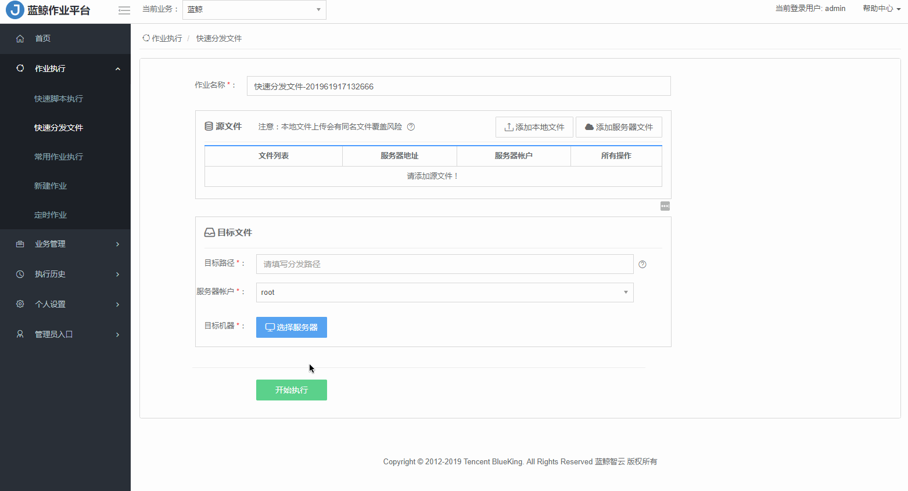
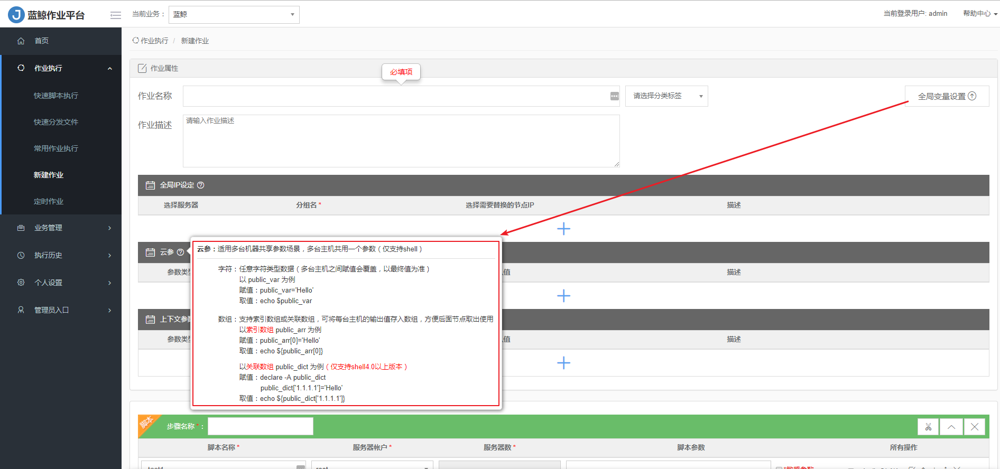

## 快速入门

### 快速脚本执行 {#QuickScriptExecution}

在蓝鲸作业平台上，在快速脚本执行功能栏上，快速的执行一个简单的脚本。

**步骤详情**

1、输入脚本名称，否则会使用系统默认名称如：快速执行脚本-201961220413791。

2、选择服务器账户： root 或者 system 。

3、选择状态 “Agent 正常” 的目标主机，1-n 台，否则会执行失败。

- 支持通过 IP 选择服务器、从配置平台选择服务器、手动添加服务器、从动态分组选择服务器。
- 列表默认全部模块类型的主机，勾选 【仅展示模块类型为 “数据库” 的主机】  ， 可快速选择“数据库” 类型的主机。

4、选择脚本来源，支持选择手工录入、脚本克隆、本地脚本、公共脚本 4 种方式。

5、写入脚本内容，脚本类型支持 Shell、Bat、Perl、Python、PowerShell。

6、输入脚本参数。

> **Note:**
> 勾选敏感参数以后，可以避免一些敏感的数据，比如密码暴露。目前页面上的敏感参数用 * 展示，后台 API 则会显示明文。

7、填写超时时间。
为了避免脚本或者服务器异常，导致脚本卡住，设置超时时间后，任务超时会自动终止。

8、点击【执行脚本】，若成功，节点状态反馈 “执行成功” ；若失败，节点状态反馈 “执行失败”，会提示 Agent 不正常的主机数和用户不存在的主机数。可查看完整日志。

### 快速分发文件{#QuickDistribution}

#### 从本地分发文件到服务器{#Local}

把 本地文件 `test.txt` 上传到 远程服务器的 `/tmp/` 目录。

**步骤详情**

1、输入脚本名称，否则会使用系统默认名称如：快速分发文件-2019612204221713。

2、添加本地文件，1-n 个。

>**Note:**
- 本地文件上传会有同名文件覆盖风险。
- 本地文件不能包含中文字符，且大小最大支持到 2 GB。
- 文件名中支持正则表达式写法以匹配多个文件，文件名前需加【REGEX】，如 /tmp/REGEX：abc[A-z,a-z，0-9，+，-,- ]{0,50}.tgc 。
- 如需分发文件目录，文件名请以 `/` 结束。

3、选择状态 `Agent正常` 的目标主机，1-n 台，否则会执行失败。

- 支持通过 IP 选择服务器、从配置平台选择服务器、手动添加服务器、从动态分组选择服务器。
- 列表默认全部模块类型的主机，勾选  【仅展示模块类型为 "数据库" 的主机】  ， 可快速选择 “数据库“ 类型的主机。

4、选择服务器账户：root 或者 system。

5、选择目标路径。

>**Note:**
- 如果该路径不存在，系统将自动创建。
- 文件传输目的地址的路径规则：Linux 服务器需要以 `/` 开头的绝对路径。例如：/data/xx 。Windows 服务器必须包含盘符开头，例如：D:\tmp\ 。

6、点击【开始执行】，若成功，节点状态反馈 `执行成功`，若失败，节点状态反馈 `执行失败`，会提示 Agent 不正常的主机数和用户不存在的主机数。可查看完整日志。

#### 从服务器分发文件到服务器 {#Server}

把 `A 服务器`的`test.txt`文件上传到 `B 服务器`的`/tmp/`目录。

**步骤详情**

1、输入脚本名称，否则会使用系统默认名称如：快速分发文件-2019612204221713 。

2、添加服务器文件，1-n 个

- 选择服务器地址，选择状态 `Agent 正常` 的目标主机，1-n 台，否则会执行失败。
  - 支持通过 IP 选择服务器、从配置平台选择服务器、手动添加服务器、从动态分组选择服务器。
  - 列表默认全部模块类型的主机，勾选 `仅展示模块类型为 “数据库” 的主机`， 可快速选择“数据库” 类型的主机。
- 选择服务器账户：root 或者 system。
- 填写文件列表，即服务器文件路径，保证文件路径正确和文件存在，否则会执行失败。
- 选择 `保存` 。

3、选择目标机器，选择状态 `Agent正常` 的目标主机，1-n 台，否则会执行失败。

  - 支持通过 IP 选择服务器、从配置平台选择服务器、手动添加服务器、从动态分组选择服务器。
  - 列表默认全部模块类型的主机，勾选 `仅展示模块类型为 “数据库” 的主机`， 可快速选择“数据库” 类型的主机。

4、选择服务器账户：root 或者 system。

5、选择目标路径。

>**Note:**
- 如果该路径不存在，系统将自动创建。
- 文件传输目的地址的路径规则：Linux 服务器需要以 `/` 开头的绝对路径。例如：/data/xx 。Windows 服务器必须包含盘符开头，例如：D:\tmp\ 。

6、点击【开始执行】，若成功，节点状态反馈 “执行成功” ；若失败，节点状态反馈 “执行失败”，会提示 Agent 不正常的主机数和用户不存在的主机数。可查看完整日志。

### 常用作业执行 {#JobExecution}
#### 创建作业 {#Create}

1、填写作业名称、选择分类标签、输入作业描述。

2、全局变量设置。

支持全局变量的配置，支持全局 IP 设定、云参、上下文传参等三种全局变量设置方式。

- 全局 IP 设定

  是指多个步骤节点之间执行主机相同的场景。

- 云参

  是指多台主机共享参数，多台主机下的多个脚本都可以调用同一参数。

- 上下文传参

  是指两个节点同一个目标机器的参数传递。

3、设置步骤：

- 因为系统默认步骤 1 是 【添加脚本】 ，如需指定步骤 1 为 【添加传输文件】或 【添加 SQL 脚本】，应先新建步骤 【添加传输文件】 或 【添加 SQL 脚本】，然后拖动移动至步骤 1。
- 点击 【+新增节点】 ，每个步骤支持多个节点并发。每个节点支持一对多、多对一、多不多的文件(本地文件或服务器文件)分发。
- 支持对当前步骤的所有节点的 【完成后暂停】、【任务编辑】、【节点上移】、【节点下移】、【拖放】、【删除】 操作。
  

- 【拖放】 功能可以跨同类型的步骤实现节点移动。
  

4、设置完成，点击`保存` 或者`去执行` ，成功则会反馈执行结果`执行成功` ，如有任一步骤 `执行失败` 执行结果会反馈 `执行失败` ，每个步骤可以查看执行详情。

