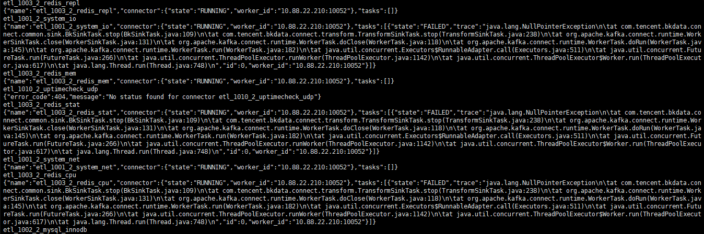
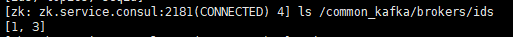
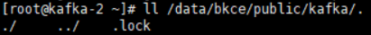
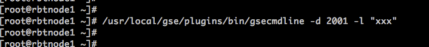
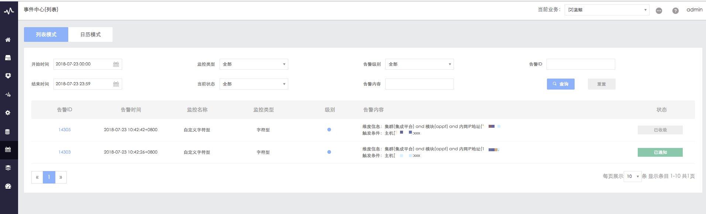

# 蓝鲸监控常见问题

> 蓝鲸监控问题，多见用户 cmdb 及快照正常，而监控无基础数据上报，或者点击数据上报报错误提示，或者提示正常但实际仍无数据
>

## 蓝鲸监控无数据上报

**此问题常见表象**

1. 启动入库任务失败【模块：data】接口结果返回超时
2. 进程端口下发失败: 0:x.x.x.x 进程协议错误，支持 TCP、UDP, 参数传递协议为, 请检查输入参数和 CMDB 配置
3. 基础性能接入失败：缺少[bk_biz_id]参数，解析 RT 信息失败：13
4. 模块：data 接口返回结果错误：参数错误 无 Linux 机器（机器多 IP，CMDB IP 匹配，）
5. 数据入库失败【模块：data】接口返回结果错误：All Servers failed to process request: [(‘kafka.service.consul’,9092,0)]
6. 模块：data 接口返回结果错误：调用接口失败 创建 tsdb 库失败（Dataapi 没升级好，把 saas 升级。）
7. 【模块：data】接口返回结果错误：组件请求第三方系统 DATA 接口 data_component 出错：状态码：404，错误消息：第三方系统不存在此接口（Dataapi 没升级好，确认下版本
8. 请求 agent 状态数据失败（job 接口，）
9. 查询失败，原因：【模块：data】接口返回结果错误：SQL 语法错误，请检查语法：06（进程资源无数据 bug，没入库）
10. \_exporter_url\_参数不能为空（自定义组件导入）
11. 系统信息可上报，组件信息不上报
12. 启动入库任务失败【模块：data】接口返回结果错误：添加总线任务失败，添加etl任务失败 6_ja_gse_proc_port（）
13. config_schema：必须提供\_exporter_url\_参数的配置
14. 基础性能接入失败：2：x.x.x.x 下发配置失败
15. 【模块：data】接口返回结果错误：调用接口失败 gse_push_file：该业务{0}下没有 IP

**可能原因**

1. nginx未更新安装，`install nginx 1`后解决
2. gse_agent在节点管理，重新安装
3. bk_monitor 在 supervisor 缺少 celery 和 beat 配置，重新安装 1.4.63 版本
4. bk_monitor 的服务使用错误使用 root 启动，停掉进程，删掉原启动对应 root 的文件，用 apps 用户启动
5. influxdb表结构为空，所有`system_*`的库，`show measurements`为空
6. `/data/bkce/bkdata/dataapi/bin/check_databus_status.sh`检查结果，`=====ETL=====`发现未更新的，结果类似`etl_1004_2_ja_gse_net`老的结构，
7. databus的`tsdb.cluster.properties`配置中`cluster.rest.port=__CONNECTOR_TSDB_PORT__`未替换，为空
8. `./kafka-console-consumer.sh --bootstrap-server kafka.service.consul:9092 --topic snapshot3|grep -P '"ip":".*?"' -o `出现`"ip":"__EXTERNAL_IP__"`
9. CMDB里面配置进程的时候需要配置网络协议

**排查方法**

- **检查进程是否正常**

若为 4.1.X 的版本，bk_monitor 有对应 celery 进行异步任务处理，需在 APPO 模块对应机器上，确认 bk_monitor 的进程是否包含`uwsgi`，`celery beat`，`celery worker`3部分，示例如下

```bash
[root@rbtnode1 /data/install]# ps -ef | grep bk_monitor
apps      1930     1  0 Aug09 ?        00:03:37 /data/bkce/paas_agent/apps/Envs/bk_monitor/bin/python /data/bkce/paas_agent/apps/Envs/bk_monitor/bin/supervisord -c /data/bkce/paas_agent/apps/projects/bk_monito//conf/supervisord.conf
apps      1958  1930  0 Aug09 ?        00:00:24 /data/bkce/paas_agent/apps/Envs/bk_monitor/bin/uwsgi --ini /data/bkce/paas_agent/apps/projects/bk_monitor/conf/bk_monitor.ini
apps      1959  1930  0 Aug09 ?        00:10:50 /data/bkce/paas_agent/apps/Envs/bk_monitor/bin/python /data/bkce/paas_agent/apps/projects/bk_monitor/code/bk_monitor/manage.py celery beat
apps      1960  1930  0 Aug09 ?        00:18:10 /data/bkce/paas_agent/apps/Envs/bk_monitor/bin/python /data/bkce/paas_agent/apps/projects/bk_monitor/code/bk_monitor/manage.py celery worker -n bk_monitor -l INFO --autoscale=8,1
root      5315 11297  0 18:02 pts/5    00:00:00 grep --color=auto bk_monitor
apps      7480  1958  0 16:17 ?        00:00:01 /data/bkce/paas_agent/apps/Envs/bk_monitor/bin/uwsgi --ini /data/bkce/paas_agent/apps/projects/bk_monitor/conf/bk_monitor.ini
apps      7481  1958  0 16:17 ?        00:00:01 /data/bkce/paas_agent/apps/Envs/bk_monitor/bin/uwsgi --ini /data/bkce/paas_agent/apps/projects/bk_monitor/conf/bk_monitor.ini
apps     10815  1958  0 16:17 ?        00:00:00 /data/bkce/paas_agent/apps/Envs/bk_monitor/bin/uwsgi --ini /data/bkce/paas_agent/apps/projects/bk_monitor/conf/bk_monitor.ini
apps     10816  1958  0 16:17 ?        00:00:00 /data/bkce/paas_agent/apps/Envs/bk_monitor/bin/uwsgi --ini /data/bkce/paas_agent/apps/projects/bk_monitor/conf/bk_monitor.ini
apps     22477  1960  0 18:00 ?        00:00:00 /data/bkce/paas_agent/apps/Envs/bk_monitor/bin/python /data/bkce/paas_agent/apps/projects/bk_monitor/code/bk_monitor/manage.py celery worker -n bk_monitor -l INFO --autoscale=8,1
apps     31585  1960  0 18:01 ?        00:00:00 /data/bkce/paas_agent/apps/Envs/bk_monitor/bin/python /data/bkce/paas_agent/apps/projects/bk_monitor/code/bk_monitor/manage.py celery worker -n bk_monitor -l INFO --autoscale=8,1
apps     31587  1960  0 18:01 ?        00:00:00 /data/bkce/paas_agent/apps/Envs/bk_monitor/bin/python /data/bkce/paas_agent/apps/projects/bk_monitor/code/bk_monitor/manage.py celery worker -n bk_monitor -l INFO --autoscale=8,1
apps     31588  1960  0 18:01 ?        00:00:00 /data/bkce/paas_agent/apps/Envs/bk_monitor/bin/python /data/bkce/paas_agent/apps/projects/bk_monitor/code/bk_monitor/manage.py celery worker -n bk_monitor -l INFO --autoscale=8,1

```

- **检查bkdata日志**

确认 databus 日志`/data/bkce/logs/bkdata/databus_etl.log`以及`/data/bkce/logs/bkdata/databus_tsdb.log`是否有 Exception 或者 Error 的错误，示例如下

  ```bash
grep -nE "Exception|Error" /data/bkce/logs/bkdata/databus_etl.log /data/bkce/logs/bkdata/databus_tsdb.log
199:org.apache.kafka.common.errors.wakeupException
12:Exception in thread "main" org.apache.kafka.common.config.configException: Invalid value for configuration rest.port: Not a number of type INT
  ```

- **检查 bkdata databus 任务**

确认在bkdata服务器上，`check_databus_status.sh`，不能出现有`Failed connect to databus.service.consul:10054; connection refused`或者`JSON object could be decoded`错误输出。正常的输出示例如下（若此处有错误，参考`initdata bkdata`失败的处理方法）

异常举例



```bash
[root@rbtnode1 /data/install]# /data/bkce/bkdata/dataapi/bin/check_databus_status.sh
===========TSDB===============
  % Total    % Received % Xferd  Average Speed   Time    Time     Time  Current
                                 Dload  Upload   Total   Spent    Left  Speed
100   773  100   773    0     0  14599      0 --:--:-- --:--:-- --:--:-- 14865
tsdb_2_system_cpu_summary
{"name":"tsdb_2_system_cpu_summary","connector":{"state":"RUNNING","worker_id":"10.X.X.X:10054"},"tasks":[{"state":"RUNNING","id":0,"worker_id":"10.X.X.X:10054"}]}

===========MYSQL===============
  % Total    % Received % Xferd  Average Speed   Time    Time     Time  Current
                                 Dload  Upload   Total   Spent    Left  Speed
100    27  100    27    0     0   1118      0 --:--:-- --:--:-- --:--:--  1125
jdbc_2_ja_gse_proc_port
{"name":"jdbc_2_ja_gse_proc_port","connector":{"state":"RUNNING","worker_id":"10.X.X.X:10051"},"tasks":[{"state":"RUNNING","id":0,"worker_id":"10.X.X.X:10051"}]}

===========ETL===============
  % Total    % Received % Xferd  Average Speed   Time    Time     Time  Current
                                 Dload  Upload   Total   Spent    Left  Speed
100  1040  100  1040    0     0   166k      0 --:--:-- --:--:-- --:--:--  169k
etl_1001_2_system_cpu_summary
{"name":"etl_1001_2_system_cpu_summary","connector":{"state":"RUNNING","worker_id":"10.X.X.X:10052"},"tasks":[{"state":"RUNNING","id":0,"worker_id":"10.X.X.X:10052"}]}
```

- **检查 kafka**

1. kafka 节点确认

若社区版为 3 台部署的，必须返回[1, 2, 3]才正常，示例如下
若 brokers ids 不为[1, 2, 3]，存在`/data/bkce/public/kafka/.lock`文件，有的话，删除此文件，再重新使用`./bkcec stop kafka`和`./bkcec start kafka`重启 kafka，重启完再次确认状态






```bash
[root@rbtnode1 /data/install]# /data/bkce/service/zk/bin/zkCli.sh -server zk.service.consul:2181 ls /common_kafka/brokers/ids
Connecting to zk.service.consul:2181
log4j:WARN No appenders could be found for logger (org.apache.zookeeper.ZooKeeper).
log4j:WARN Please initialize the log4j system properly.
log4j:WARN See http://logging.apache.org/log4j/1.2/faq.html#noconfig for more info.
WATCHER::

WatchedEvent state:SyncConnected type:None path:null
[1, 2, 3]
```

2. kafka 僵死

此种情况，确认上面第一点，若节点缺失，可以用`./bkcec stop kafka`停掉 kafka，再到各台机器上使用`jps -l`确认是否还存在`kafka.kafka`没有关闭掉的，这种就是僵死的，可以杀掉僵死进程`jps -l | grep kafka | xarge kill -9`，再重新在中控机上启动 kafka

2. kafka数据确认

```bash
# 正常可以显示数据，异常会卡住
[root@mongodb-1 kafka]# bash /data/bkce/service/kafka/bin/kafka-console-consumer.sh --bootstrap-server kafka.service.consul:9092 --topic connect-configs.etl --from-beginning | head
{"properties":{"group.id":"bk_data_etl","topics":"snapshot2","producer.records.in.msg":"100","tasks.max":"1","producer.topic.badmsg":"test_badmsg","producer.max.block.ms":"60000","connector.class":"com.tencent.bkdata.databus.transform.TransformSinkConnector","db.dataid":"1001","name":"etl_1001_2_snapshot","producer.acks":"1","rt.id":"2_snapshot","producer.bootstrap.servers":"","producer.request.timeout.ms":"60000","producer.retries":"5","producer.max.in.flight.requests.per.connection":"5"}}
{"properties":{"connector.class":"com.tencent.bkdata.databus.transform.TransformSinkConnector","producer.topic.badmsg":"test_badmsg","producer.request.timeout.ms":"60000","producer.bootstrap.servers":"","topics":"snapshot2","tasks.max":"1","producer.max.block.ms":"60000","group.id":"bk_data_etl","producer.retries":"5","db.dataid":"1001","producer.acks":"1","producer.records.in.msg":"100","task.class":"com.tencent.bkdata.connect.transform.TransformSinkTask","name":"etl_1001_2_snapshot","producer.max.in.flight.requests.per.connection":"5","rt.id":"2_snapshot"}}
{"tasks":1}

# 正常可以显示数据，异常会卡住
[root@localhost install]# bash /data/bkce/service/kafka/bin/kafka-topics.sh --zookeeper zk.service.consul:2181/common_kafka --describe --topic connect-configs.tsdb
Topic:connect-configs.tsdb      PartitionCount:1        ReplicationFactor:1     Configs:retention.ms=315360000000
        Topic: connect-configs.tsdb     Partition: 0    Leader: 3       Replicas: 3     Isr: 3

[root@localhost kafka]# grep configs.tsdb server.log* -H
server.log.2018-08-14-11:[2018-08-14 11:44:13,539] INFO [ReplicaFetcherManager on broker 3] Removed fetcher for partitions connect-configs.tsdb-0 (kafka.server.ReplicaFetcherManager)
server.log.2018-08-14-11:[2018-08-14 11:44:13,548] INFO Completed load of log connect-configs.tsdb-0 with 1 log segments and log end offset 0 in 1 ms (kafka.log.Log)
server.log.2018-08-14-11:[2018-08-14 11:44:13,582] INFO Created log for partition [connect-configs.tsdb,0] in /data/bkce/public/kafka with properties {compression.type -> producer, message.format.version -> 0.10.2-IV0, file.delete.delay.ms -> 60000, max.message.bytes -> 1000012, min.compaction.lag.ms -> 0, message.timestamp.type -> CreateTime, min.insync.replicas -> 1, segment.jitter.ms -> 0, preallocate -> false, min.cleanable.dirty.ratio -> 0.5, index.interval.bytes -> 4096, unclean.leader.election.enable -> true, retention.bytes -> -1, delete.retention.ms -> 86400000, cleanup.policy -> [delete], flush.ms -> 9223372036854775807, segment.ms -> 604800000, segment.bytes -> 1073741824, retention.ms -> 315360000000, message.timestamp.difference.max.ms -> 9223372036854775807, segment.index.bytes -> 10485760, flush.messages -> 9223372036854775807}. (kafka.log.LogManager)
server.log.2018-08-14-11:[2018-08-14 11:44:13,584] INFO Partition [connect-configs.tsdb,0] on broker 3: No checkpointed highwatermark is found for partition connect-configs.tsdb-0 (kafka.cluster.Partition)

$ [root@rbtnode1 install]# /data/bkce/service/kafka/bin/kafka-console-consumer.sh --bootstrap-server $LAN_IP:9092 --topic snapshot2
{"beat":{"address":["192.168.26.132","192.168.26.150","fe80::be16:6e1a:e42f:f329"],"hostname":"paas-1","name":"paas-1","version":"10.1.0"},"bizid":0,"cloudid":0,"data":{"city":"","country":"","cpu":{"cpuinfo":[{"cacheSize":20480,"coreId":"0","cores":1,"cpu":0,"family":"6","flags":["fpu","vme","de","pse","tsc","msr","pae","mce","cx8","apic","sep","mtrr","pge","mca","cmov","pat","pse36","clflush","dts","mmx","fxsr","sse","sse2","ss","ht","syscall","nx","rdtscp","lm","constant_tsc","arch_perfmon","pebs","bts","nopl","xtopology","tsc_reliable","nonstop_tsc","aperfmperf","eagerfpu","pni","pclmulqdq","vmx","ssse3","fma","cx16","

/data/bkce/service/kafka/bin/kafka-console-consumer.sh --bootstrap-server kafka.service.consul:9092 --topic snapshot2|grep -P '"ip":".*?"' -o

```

- **检查influxdb**

确认influxdb内的数据库和结构，正常返回如下

```bash
$ influx -host $INFLUXDB_HOST -port $INFLUXDB_PORT -execute 'show databases'
name: databases
name
----
_internal
system_2

$ influx -host $INFLUXDB_HOST -port $INFLUXDB_PORT -database system_2 -execute 'show measurements'
name: measurements
name
----
system_cpu_detail_2
system_cpu_summary_2
system_disk_2
system_env_2
system_inode_2
system_io_2
system_load_2
system_mem_2
system_net_2
system_netstat_2
system_proc_2
system_swap_2
```

- **检查cron任务**

```bash
# 确认是否存在update_cc_cache crontab任务
crontab -l | grep update_cc_cache
*/10 * * * * /data/bkce/bkdata/dataapi/bin/update_cc_cache.sh

# 手动运行update_cc_cache.sh
/data/bkce/bkdata/dataapi/bin/update_cc_cache.sh

# 检查crontab是否在运行，若没有运行，可采用service crond start或者/etc/init.d/cron start来启动
ps -ef | grep crond | grep -v grep
root     27979     1  0 7月26 ?       00:01:23 /usr/sbin/crond -n

# 检查crontab是否正常运行，确认crontab的日志
tail /var/log/cron
```

如果 CMDB 有快照数据，监控没有，或者部分没有时，检查下 bkdata 所在机器的 crontab 是否包含 update_cc_cache.sh 的定时任务：

如果没有，应该安装时漏执行，或者执行过`./bkcec clean cron`后忘记加回来。可在中控机执行 `./bkcec install cron` 重新安装上 cron 任务检查 bkdata 的 cron 任务

## 部分有监控数据，部分没有

若蓝鲸平台的监控 OK，而新增加的 Agent 监控没有，点击数据上报，提示 10-20 分钟会有新数据，实际一直没有数据，可能为 crontab 的 updata_cc_cache 未正常运行，导致 cache 未更新，新的机器未添加进来

- **检查 cron 任务**

```bash
# 确认是否存在update_cc_cache crontab任务
crontab -l | grep update_cc_cache
*/10 * * * * /data/bkce/bkdata/dataapi/bin/update_cc_cache.sh

# 检查crontab是否在运行，若没有运行，可采用service crond start或者/etc/init.d/cron start来启动
ps -ef | grep crond | grep -v grep
root     27979     1  0 7月26 ?       00:01:23 /usr/sbin/crond -n

# 检查crontab是否正常运行，确认crontab的日志
tail /var/log/cron
```

如果 CMDB 有快照数据，监控没有，或者部分没有时，检查下 bkdata 所在机器的 crontab 是否包含 update_cc_cache.sh 的定时任务：

如果没有，应该安装时漏执行，或者执行过`./bkcec clean cron`后忘记加回来。可在中控机执行 `./bkcec install cron` 重新安装上 cron 任务检查 bkdata 的 cron 任务

- **手动运行update_cc_cache.sh**

```bash
$ /data/bkce/bkdata/dataapi/bin/update_cc_cache.sh
```

- 确认无数据上报机器的时间和部署蓝鲸server机器的时间是否同步。
- 确认无数据的机器上是否有basereport进程采集器
    - 若无可尝试手动拉起  `/usr/local/gse/plugins/bin/start.sh  basereport`
    - 若采集器进程存在则查看采集器日志 `/var/log/gse/basereport` (日志为 error 级别，有进程无日志说明采集器进程正常)。


## 组件没有监控数据

- 到 cmdb 里面，主机管理->进程管理，搜索组件名称，类似搜索 nginx，然后把 common_nginx 改名为 nginx
- 到蓝鲸监控里面，勾选这个 nginx 对应的主机，批量采集上报

## 缺少操作系统类型

在 cc 上，确认所选主机操作系统类型是否为空

## 后台：Exited too quickly (process log may have detail)

**问题表象**：

```bash
[root@rbtnode1 ]# supervisorctl -c /data/bkce/etc/supervisor-bkdata-monitor.conf status common:scheduler
common:scheduler      FATAL     Exited too quickly (process log may have details)
```
**思路方法**：
- 确认有问题的进程名
```bash
supervisorctl  -c /data/bkee/etc/supervisor-bkdata-monitor.conf status all
```

- 找到有问题的进程名。例如上图中显示为：common:scheduler，其中common是group， scheduler是进程名
找到该进程的启动命令

```bash
vim /data/bkee/etc/supervisor-bkdata-monitor.conf

# 在[program:scheduler]需要找到一下配置

environment=C_FORCE_ROOT=true,DJANGO_CONF_MODULE=conf.worker.production.enterprise,DJANGO_SETTINGS_MODULE=settings,LOGGER_WITHOUT_CONSOLE=1
command=/data/bkee/.envs/monitor/bin/celery -A kernel.scheduler.celery_app worker -l info
```

- 手动执行以下命令
```bash
workon monitor
# export environment的配置，逗号改成空格。
export C_FORCE_ROOT=true DJANGO_CONF_MODULE=conf.worker.production.enterprise DJANGO_SETTINGS_MODULE=settings LOGGER_WITHOUT_CONSOLE=1
# 直接运行command的配置
/data/bkee/.envs/monitor/bin/celery -A kernel.scheduler.celery_app worker -l info
```
查看报错信息以确认具体错误日志

## 主机百分比指标超过 100

出现此问题，优先去对应机器上看下是否有 2 个 basereport 进程在运行


## exporter 采集下发时，模块 data 接口返回结果错误，但没有详细的错误信息


可能是 bk_bkdata_api.collector_exporter 表没有创建，可查看 dataapi 的 sys.log 查看更准确错误信息

```bash
source /data/install/utils.fc && mysql -h $MYSQL_IP0 -u $MYSQL_USER -p"$MYSQL_PASS" bk_bkdata_api
```

## 自定义字符型未收到告警问题排查

在蓝鲸监控配置好监控项


按配置时的页面提示，去到主机上执行命令


在机器上执行命令  /usr/local/gse/plugins/bin/gsecmdline -d 2001 -l "This service is offline."



正常情况下，在事件中心可以看到有告警产生，如下图所示



**排查方法**

1. 先检查下机器上的 agent 是否正常，数据是否有正确上报

2. 第一步正常的情况下，执行下面的步骤

	- 去到bkdata机器tailf一下日志

		```bash
		workon monitor  # （社区版5.1用 workon bkdata-monitor）
		tail -f ../../logs/bkdata/kernel.log | grep "gse_custom_out_str_"  
		```

	- 去到业务下任意一台机器，触发一条自定义字符告警

		```bash
		 /usr/local/gse/plugins/bin/gsecmdline -d 2001 -l "xxx"
		```

	- 回到bkdata机器，看下日志，正常会输出如下的日志

		

3. 如果第二步正常，可以看到日志输出

## 托管进程启动失败：fail to restart process

**问题表象**：在配置组件采集参数，完成配置下发和验证测试的过程中，出现如下错误提示

```
1. 测试不通过，[datadog]托管程序启动失败：fail to restart process
2. 存在执行失败的主机，需要将失败主机剔除方可进行下一步操作
```
**思路方法**：
- 进入下发机器
- 进入 datadog 安装目录，尝试启动 datadog server，查看是否有报错
  ```bash
  $ cd /usr/local/gse/external_plugins/datadog
  $ source ./env.sh
  $ ${datadog_python_path} ./datadog/datadog_httpserver.py ${datadog_conf_path}
  ```

- 常见问题

  - env.sh文件不存在，在页面点击“重试”即可
  - python 版本过低，安装 python2.7 版本，并指定正确的 python 程序路径
  - socket.error: [Errno 98] Address already in use
    ```bash
    ps -ef | grep datadog
    ```
   - 如果存在`/datadog/datadog/jar/jmxfetch-0.19.0-jar-with-dependencies.jar`的进程，则kill掉即可
