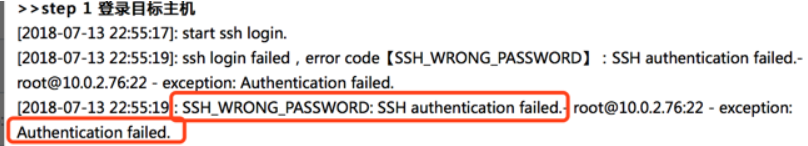
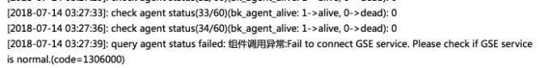

# 节点管理FAQ

## 部署的时候报Unknown column

<left></left>

- 原因: 因为升级数据初始化是根据3.0以上版本的DB结构做数据迁移的，低于3.0的agent版本原有的机器表中不存在对应的字段，所以会报错

- 解决办法：
	1. 先升级 agent安装到最新版本
	2. 重建数据库(drop database bk_nodeman; create database bk_nodeman)
	3. 重新部署节点管理

## 检测Agent状态和版本异常

**表象**：在step 6 检测Agent状态和版本过程一直报如下错误

```bash
[2018-08-23 11:11:18]: check agent status (21/60)(bk_agent_alive: 1->alive, 0->dead):0
[2018-08-23 11:11:19]: check agent status (22/60)(bk_agent_alive: 1->alive, 0->dead):0
[2018-08-23 11:11:21]: check agent status (23/60)(bk_agent_alive: 1->alive, 0->dead):0
[2018-08-23 11:15:20]: CELERY_TASK_TIMEOUT: install script running timeout(600s)，install failed，please connect us
```

**解决方法**：

此种问题，常见于云区域，请确认GSE和Agent的策略OK

## 安装Proxy报错

<left></left>

**解决方法**：

1. 修改一下 nginx 的配置，把外网ip绑定上
2. 登录到 nginx 的机器

```bash
vi /data/bkce/etc/nginx/miniweb.conf
server_name x.x.x.x（内网ip） x.x.x.x（外网ip）;
```

3. 退出到中控机,重启nginx：

```bash
./bkcec stop nginx
./bkcec start nginx
```

## Windows没有cygwin的无法连接

参考[Windows 开139，445端口](http://docs.bk.tencent.com/product_white_paper/bk_nodeman/smb.html)

## 原来使用 agent安装, 在部署节点管理后, 主机信息没有同步到节点管理

原因: 节点管理低于1.0.52的版本还没有数据迁移功能。数据迁移动作会在第一次安装节点管理SaaS时从agent-setup SaaS迁移过来。升级蓝鲸企业版时，由于节点管理的数据库已经存在，故没有进行迁移动作

解决办法：

- 先升级 agent安装到最新版本(1.0.52)
- 重建数据库`drop database bk_nodeman; create database bk_nodeman`
- 重新部署节点管理最新版本

## 节点管理中部署 agent 失败, 详情日志中报错: 组件调用异常: unkown component's error: the response is None(code=UNKOWN ERROR)

<left></left>

可能原因: bk_nodeman 没有添加到 paas 白名单

解决办法: 登陆中控机执行

```bash
source utils.fc
_add_app_token bk_nodeman $(app_token bk_nodeman)
```

## 注册主机到 CMDB 失败: 0行[[import_from]' 数据校验参数不通过

<left></left>

原因: CMDB 中主机属性配置信息错误

解决办法：

- 打开 CMDB, 进入 [后台配置] -> [模型管理]
- 在视图区域点击[主机], 点击 [模型配置] 标签页

在字段列表中找到 字段名 为 录入方式(import_from)的行, 并点击展开如下

<left></left>

编辑上图中 api 类型的枚举值为3 并保存. 然后回到节点管理重新安装

## 注册主机到 CMDB 失败: 0行"xxxxx"未赋值

<left></left>

原因: 在CMDB导入主机的字段中增加了一个自定义的必填字段

解决办法: 在 CMDB 的主机模型配置中, 将该字段去除必填属性

## 检查 Agent 状态报错: 组件调用异常exec redis_pipe_line_cmd failed

<left></left>

原因: gse_api 查询 redis状态失败

解决办法:
升级 gse 版本 或 重启 gse_api，gse_dba

## 检查 agent 状态超时

<left></left>

原因: 通过 esb 查询agent 状态, 太长时间获取不到 agent 状态信息. 可能原因如下

- agent 到 gse server之间网络不通. 检查端口策略
- proxy 到 server 之间网络不通, 检查端口策略
- 注册到 cmdb 的 ip 与从 gse 侧访问proxy或 agent 所使用的 ip 不一致
- gse_dba 异常, 尝试重启
- agent配置文件agent.conf中的 agentip 字段的值与注册到 CMDB 中的值不一致

## 安装windows 在第一步卡住

<left></left>

原因: 检测Windows系统版本需要通过SMB协议向待安装主机发送命令时可能阻塞

解决办法: 升级节点管理到最新版本或参考[Windows 开139，445端口](http://docs.bk.tencent.com/product_white_paper/bk_nodeman/smb.html)

## 启动进程失败

<left></left>

解决办法: 联系蓝鲸的同学

## 密码错误: Authentication failed

<left></left>

解决办法: 检查密码并修正后重试
Note

> windows 无 Cygwin 的环境中, 密码中不能包含@符号

## 检查 Agent 状态结果提示: failed to connect GSE service

<left></left>

若为 proxy

- 检查 proxy 到 gse 外网之间是否能正常通信(结合网络策略)
- 检查 gse 服务是否正常

若为 P-Agent

- 检查 P-Agent 到 proxy 之间网络是否通畅
- 检查所有 Proxy 是否正常

## GSE/appo到 Proxy 之间有 NAT, Proxy 到 GSE 可直连, Proxy 到 P-Agent 之间直连, 要怎么填写Proxy 的内外网IP

- 外网 IP 填写从 appo 登陆 Proxy 时所使用的 IP
- 内网 IP 填写P-Agent 能连上的 IP.

## 已知问题列表

- 若曾使用过`Agent安装`这个app的早期版本,安装节点管理后, 数据会自动迁移过来,但 Windows 机器的操作系统类型为 Linux,这是因为Agent安装 的历史版本问题, 需要进行手动修改
- 从 A 业务迁移主机到 B 业务时, 虽然提示成功, 但在当前区域下 Agent 状态异常, 因为在 CMDB 中, 主机还在旧的业务下, 查询主机状态时,指定的是当前业务, 因此异常
