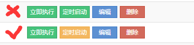
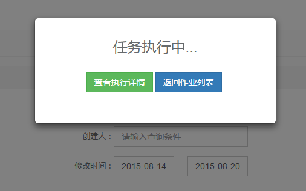

## 页面呈现

1.全局字体默认使用 “微软雅黑” ，字号 “14px” ，字体每增大一号加 2px

2.【必须】页面内容必须保证对齐（最少要有一条参考线），这样能保证页面整齐；

3.整站所有按钮的风格一致（圆角或直角），颜色按功能区分，尽量不要形同个颜色按钮放一起

4.整站不能出现横向滚动条

5.表格样式：默认左对齐，可根据表格内容适当调整，如下图最后一列操作列可居中对齐

  

6.异步加载时，尽量先显示页面的元素，然后再异步导入数据，如下图的下拉框在异步导入的时候有一段时间显示空白，不大友好

7.页面提示信息，弹窗风格一致，例如都使用bootstrap模态框

 

8.【必须】出现错误的时候，错误提示信息明确，不要出现源码，错误码等非有好提示

9.【必须】无数据时，页面必须有提示信息

10.【必须】页面所有 icon 必须加上 title 提示

11.字符串过长情况时的页面显示，是否要截断显示，并给出全文显示功能
