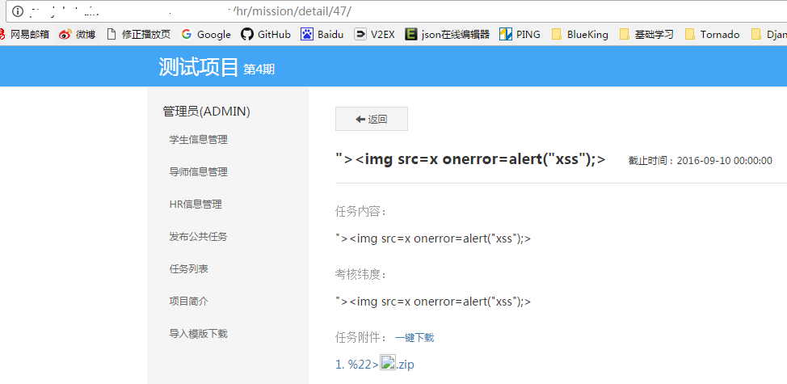
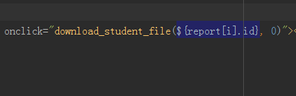

## 常见越权漏洞及解决方案

### 常见越权分类{#classification}

1.平行越权

场景 1：普通用户A可以访问到普通用户 B 的数据

场景 2：用户可以通过修改请求链接或参数，访问到其它本应无权访问的数据

2.上下越权

普通用户可以执行管理员的操作

### 场景1 ：对 get 请求中显式的 URL 更改进行越权 {#one}

对如图的 URL 格式，在没有严格判断的情况下，特别是后台采用 API 模式时，用户通过随意更改 /detail/ 后面的数字，可以绕过权限判断访问任意的页面。

#### 【解决】

对所有增、删、改、查的功能中，对用户暴露出的 API，都要进行严格的权限判断

对用户身份，需要操作的 id 需要做严格的校验，建议在 URL 中加入业务字段，根据业务字段判断用户是否有操作权限

#### 【测试】

将 URL 中的 id 更改为权限外的页面 id，检查是否能越权访问以及返回页面是否符合预期

### 场景2： 对 post 请求中的预置参数更改进行越权{#post}

一些固定的 post 参数，如 hidden 属性的 input，或 ajax 的 data 中在页面返回时就确定的信息，都是可能被修改的

如图，页面在后端渲染时确定了一个 report_id，用户点击按钮时就会拿这个 id 去下载相应的文件。如果在下载逻辑中没有进行权限控制，则可能被修改 id 来下载任意文件，造成越权。

#### 【解决】

同场景1，完善各个视图函数的权限控制。

#### 【测试】

使用 Postman 或其他 chrome 插件来模拟、修改 post 请求

使用 fiddler 抓取请求包，修改 post 请求中的参数

### 场景3： 非管理员用户访问管理界面 {three}

通常app中会设定一个管理员界面，方便进行一些配置工作。一般的做法是前端进行控制，管理界面的 url 不会暴露给非管理员用户，但是不排除非管理员通过各种手段获取到所有 url 并进行访问。

#### 【解决】

后台管理相关的操作，需要在后台对操作用户进行权限校验，避免非法用户的访问

#### 【测试】

用普通用户的帐号尝试访问管理员界面或者管理操作的 cgi
