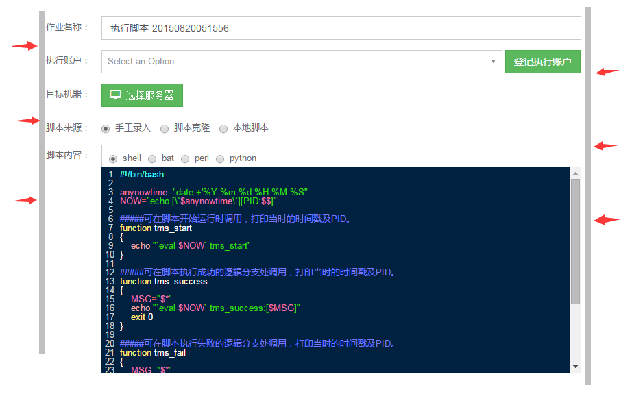

# 第二章 用户体验

## 1. 页面呈现

1. 全局字体默认使用 **微软雅黑**，字号 **14px**，字体每增大一号加 **2px**

2. 【必须】页面内容必须保证对齐（最少要有一条参考线），这样能保证页面整齐

    

3. 整站所有按钮的风格一致（圆角或直角），颜色按功能区分，尽量不要形同个颜色按钮放一起

    

4. 整站不能出现横向滚动条

5. 表格样式：默认左对齐，可根据表格内容适当调整，如下图最后一列操作列可居中对齐

    

6.  异步加载时，尽量先显示页面的元素，然后再异步导入数据，如下图的下拉框在异步导入的时候有一段时间显示空白，不大友好

    

    

7. 页面提示信息，弹窗风格一致，例如都使用 bootstrap 模态框

    

8.  【必须】出现错误的时候，错误提示信息明确，不要出现源码，错误码等非有好提示

9.  【必须】无数据时，页面必须有提示信息

10.  【必须】页面所有 icon 必须加上 title 提示

11.  字符串过长情况时的页面显示，是否要截断显示，并给出全文显示功能

12.  图标信息展示时，需要加上水印

## 2. WEB 控件

### 2.1 表单元素

对所有已知的表单元素类型，比如数字、电话号码、IP等必须做基本的校验（前后台均要校验）。

#### 2.1.1 文本框

1. 【必须】边界校验：字段长度

    所有字段都要做长度、大小限制(不管需求有没有给出明确要求，不管测试颗粒度，都要限制长度，不允许报数据库错误，都要测！！！)。

    最大长度限制可限定方法：1、不允许再输入；2、自动截断处理，并且给用户提示

2. 判空校验：是否可以为空

3. 【必须】特殊符号测试输入：

    - SQL 注入校验 `or 1<>'1　' or '1'='1' or '1'<>'2"|?><where a='xxx'`

    - 是否允许有下划线

    - 输入字符串前后空格必须处理，以及全部空格处理

    - 输入 单引号`>`

    - 输入特殊字符，特别是 &、单引号 ’、空格检查是否能保存

4. 【必须】特殊格式时输入内容是否合法（tel，ip，url，email）序号等校验

5. 多文本框空格，换行是否保存

#### 2.1.2 单选框

1. 默认是否有选中

2. 是否只能选中一个

3. 与接口交互传递的值是否正确

4. 选中后出现的效果是否符合预期（不同选择时的展示内容不同的情况）

#### 2.1.3  复选框

1. 多个复选框全不选和全选以及部分选择时传递的值是否正确

2. 当复选框太多时，是否提供全选、全不选和反选的功能

3. 选中后出现的效果是否符合预期（不同选择时的展示内容不同的情况）

#### 2.1.4.  下拉框

##### 1. 展示与使用

(1) 默认显示是否正确

例如有的显示全部，有的默认选中某一项，有的显示“请选择”

(2) 切换 item，下拉框显示项内容和排序是否正确，不同浏览器，下拉框显示是否有变形

(3) 下拉框弹出时，鼠标点击控件外区域/选项/下拉框，下拉框能否收回

##### 2. 数据正确性

(1) 下拉框数据被存储后，其他地方显示时，传递的数据正确性检查

比如下拉框选项按数字传递，而其他页面显示时应该显示对应的文字

(2) 组合筛选的情况，有级联操作的，只有选择了前一个数据后，才能进行下一个的选择

比如省市之间，只有选择了省份，才能继续选择市，否则市不可选

(3) 组合下拉框实现的筛选功能正确性检查

#### 2.1.5 时间框

1. 【必须】起、止时间选择检验（起始时间不能晚于结束时间，结束时间不能早于开始时间）

2. 时间框选择时间后，确定，检查传递的值是否正确，尤其检查是否包含当天，比如最近一个月，是否包含今天等

3. 时间框展示在不同浏览器下，不同分辨率是否正确

#### 2.1.6 左右选择框

1. 左侧数据源以及右侧选中数据的内容是否正确，前端展示是否符合预期

    左侧能否展开，展开后显示数据是否正确。首次进入是否展开，右侧数据是否默认展开

2. 数据添加或删除后，左侧数据置灰检查，右侧数据正确性检查

3. 两侧数据是否有个数提示，有的话，添加和删除后，个数提示是否正确

### 2.2 按钮

#### 2.2.1 按钮展示

1. 自然状态、鼠标悬浮和按钮按下状态下，按钮的状态

2. 【必须】邻近的按钮颜色要有区分

#### 2.2.2 操作响应

1. 按钮是否可点，是否有弹出框提示， 提示内容是否符合预期

2. 【必须】一些按钮只能点击一次的情况，点击一次后，是否变成 disable，是否仍能点击操作

3. 【必须】删除/移除等操作，要在前端给出二次确认的弹窗

4. 相关联的东西，是否需要限制移除“该类型下存在应用，无法移除”有到后台比较

5. 移除后，列表数据是否立即消失

### 2.3 列表

#### 2.3.1 前端展示

1. 列表记录顺序是否符合预期

2. 字段名称是否与表单一致

3. 列表数据为空时，显示是否正确

4. 列表表头帮助信息是否完整，比如 title 旁边是否有小问号支持

#### 2.3.2 功能

1. 列表翻页功能是否正确，翻页后，对页面数据做编辑，是否能保存成功，成功之后是否仍停留在当前页

2. 列表其他附加功能（比如：删除、新增，编辑，下载等）是否正常

3. 列表切换的功能检查

    比如在列表 1 和列表 2 在同一区域展示，展示 1 时不展示里 2.

    当在列表 1 编辑物料后，切换到列表 2，再切换回列表 1，检查编辑的物料是否生效

4.  带筛选条件的列表展示是否正确

    选择不同的选项，列表中展示筛选的结果，内容，默认排序等是否正确

    组合条件时，列表中内容是否符合预期

### 2.4 搜索

#### 2.4.1  输入框

1. 是否提供模糊查询、输入数值有种类限定时，是否考虑换成下拉框搜索

2. 考虑搜索结果：是否存在分页，分页是否正常；是否有序

3. 注意：分页是否仍保存查询条件，检查后面的记录是否符合条件

4. 【必须】输入不存在的字段值测试、包括特殊字符查询测试例如：' or '1'='1

#### 2.4.2 下拉框

1. 搜索结果是否有序

2. 分页时，是否保存搜索条

### 2.5  导航条

1. 导航是否直观，简单明了，直接反应系统的主要功能

2. 导航的链接跳转是否正确，tab 间的来回跳转，是否正确，传递的参数是否正确

3. 导航条之外的公共内容，在导航条不同 tab 内的展示应该保持一致，且功能正确性检查

4. 导航条各级之间有上下级关系时，进入下级页面，再返回，是否能正常返回上级页面

### 2.6 上传与下载（文件或图片）

#### 2.6.1 上传

1. 【必须】文件类型、大小是否有限制，如果有，要提前说明

2. 上传空文件， 超大文件，正在使用的文件等，是否能正确处理

3. 上传文件错误，提示语是否正确，是否明确出错原因

4. 文件名是否可以手工输入，输入不存在的文件名称返回是否符合预期，文件名称和后缀名是否有校验

5. 连续多次选择不同的文件，查看是否上传最后一次选择的文件

6. 【必须】Excel 文件类型时，检测文件内容正确与否，出错信息提示明确

    如：excel 列数不符合预期，内容类型不符合预期

#### 2.6.2 下载

1. 右键是否可以正常下载文件，保存到本地是否正常显示

2. 使用工具下载文件，是否可正常下载，保存到本地是否正常显示

3. 对于本机没有安装工具的文件是否能正常打开，能否给出正确提示

4. 对于直接在页面内打开的内容是否能正常显示

5. 后台设置了下载权限的文件，是否可以被正常下载

### 2.7 图表类

#### 2.7.1 树形图

1. 各层级用不同图标表示，最下层节点无加减号

2. 树形图展开和关闭是否正常

3. 树形图内容展示是否正确，无数据时显示是否符合预期，展开时内容刷新是否正常

4. 只有单层时和有多层时的显示情况是否正确

#### 2.7.2 曲线图

1. 图表的维度，时间轴等的展示是否符合预期，数据展示是否正确

2. 某一天无数据，其他天有数据时，图表展示是否正常

3. 鼠标悬浮到曲线上，能展示当前点的数据

4. 和时间框组合，选择不同的时间，折线图的数据是否自动变化，且显示正确

#### 2.7.3  圆环图

1. 图的百分比值是否显示正常，各项的颜色是否与提示一致

2. 图中心显示的数字长度检查，过长是不是能正常显示

3. 鼠标浮动到对应项上，是否有浮层提示对应的值，同时检查值是否显示正确

4. 选择不同的时间框，图形内容是否随时间变化，变化值是否正确

5. 无数据时显示是否符合预期

#### 2.7.4 柱状图

1. 数据为空时的显示是否正确，范围区分是否符合预期

2. 多个柱状差异比较大时的显示，比如一个数据是 1000，一个是 1，检查页面显示情况

3. 鼠标悬浮时，浮层的显示内容检查

4. 选择不同的时间框，图形内容是否随时间变化，变化值是否正确
