# 蓝鲸 Django 开发框结合 vue.js 框架项目


## 1. 在蓝鲸 Django 开发框架新建一个 vue.js 前端工程项目

安装 node.js

官方下载地址：

> https://nodejs.org/en/download/

根据自己的操作系统选择下载，演示机器为 Windows 系统，所有选择 Windows Installer 即可：


选择安装位置：

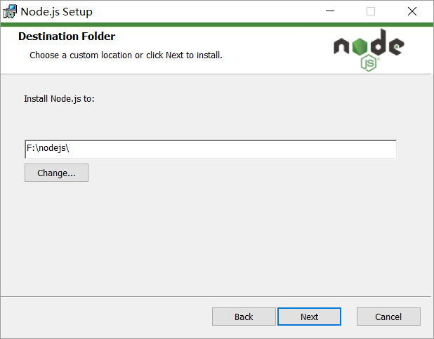

配置环境变量：


在 CMD 中验证，输入 `node -v` 查看版本号：


设置 node.js prefix（全局）和 cache（缓存）路径，新版的 node.js 集成了 npm 所以直接在命令行中使用 npm 来进行设置，设置缓存文件夹。

```bash
npm config set cache "F:\nodejs\node_cache"
```

设置全局模块存放路径。

```bash
npm config set prefix "F:\nodejs\node_global"
```

使用 npm 工具安装 vue。

```bash
npm install --global vue
```

安装全局 vue-cli 脚手架。

```bash
npm install --global vue-cli
```

安装完成后，使用 pycharm 打开蓝鲸 Django 开发框架在开发框架根目录下新建 vue 工程， 在项目根目录执行如下命令：

```bash
vue init webpack projectname
```

新建vue前端工程并初始化，执行初始化命令后一路回车即可。


初始化完成后在蓝鲸Django开发框架的目录下就生成了“vue_project”的前端工程目录。


进入新建的 vue 前端工程目录使用 npm install 安装 package.json 包中的相关依赖。

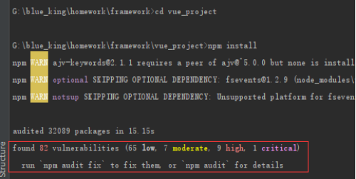

这里根据提示分别执行：

```bash
npm audit fix

npm audit fix --force

npm audit
```

关于 npm audit 的介绍可以参考官方文档：

>https://docs.npmjs.com/cli/audit

至此，准备工作完成， 尝试运行 vue 前端工程

```bash
npm run dev
```

访问 `http://localhost:8080` 查看。

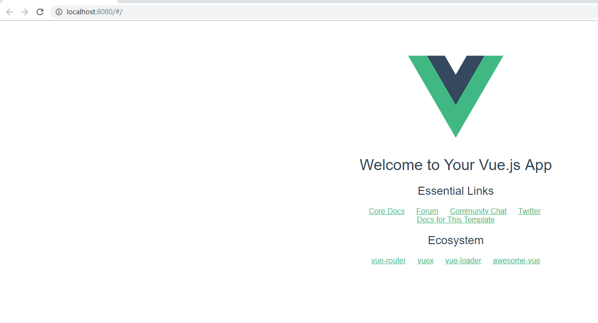

从上图中看到访问的url中有“#”如果觉得这种 url 比较丑，可以将 router 目录下的 index.js 的 mode 属性修改为 ‘history’ 模式。


至于为什么这样修改，可以参考 vue-router 的官方文档:

> https://router.vuejs.org/zh/guide/essentials/history-mode.html

修改后再重新访问

> http://localhost:8080

发现‘#’已经没有了


## 2. 在蓝鲸 Django 开发框架设计 API 接口

以一个考试管理系统为例，开始我们的教程

安装 Django REST framework

```bash
pip install djangorestframework==3.0.0
```

在 config/default.py 的 INSTALLED_APPS 中加上 `rest_framework`

```python
INSTALLED_APPS += (
    'home_application',
    'mako_application',
    'rest_framework',
)
```

新建项目 app，在 Django 项目根目录执行：

```bash
python manage startapp appname
```
> 注：appname 为新建 app 名字，请自行设置。

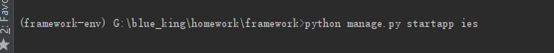

命令执行后，项目目录中会增加 app 目录。

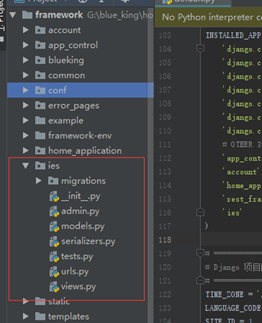

在 INSTALLED_APPS 添加自己新建的 app

```python
INSTALLED_APPS += (
    'home_application',
    'mako_application',
    'rest_framework',
    'ies',
)
```

编写 models.py 的数据模型代码 api 接口的功能是 GET 请求时查询所有的考生信息 POST请 求时新增考生信息，所以需要设计一个考生信息的数据模型。


编写 models.py 模型后在新建的 app 目录下新建 serializers.py 文件编写序列。


有了 models.py 模型和 serializers.py 序列化器就可以在视图层 views.py 中使用它们了编写 api 视图层代码。

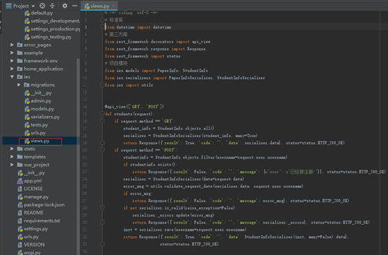

这里的 api 为了做一个简单的演示没有做用户鉴权的处理，rest_framework 提供了对 api 视图做用户权限认证的某块具体用法可以参考：

> https://q1mi.github.io/Django-REST-framework-documentation/tutorial/4-authentication-and-permissions_zh/

视图层写好后需要配置 url 路由
首先在 app 目录下新建 urls.py,并配置该 api 视图的路由  


然后在项目根目录的 urls.py 配置 app 的路由。


测试一下 api 是否可以正常工作,打开浏览器访问刚刚配置的 api 的 url 地址：

> http://{ domain_url }:8000/ies/students/


在 GET 请求时展示模型中所有学生信息记录，现在数据库中没有记录，所以返回的 data 是个空的列表。那么我们再使用 POST 请求测试一下增加学生信息的功能是否正常在网页下方的 content 空白框中输入 json 格式的学生信息

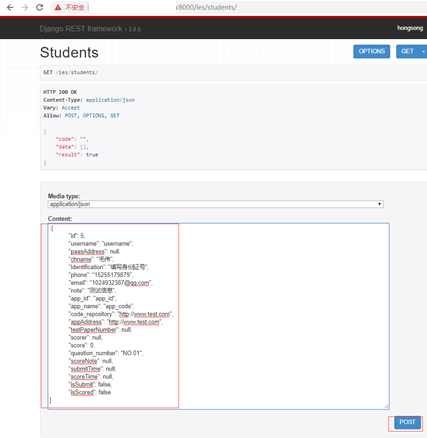

点击POST按钮，发送post请求.

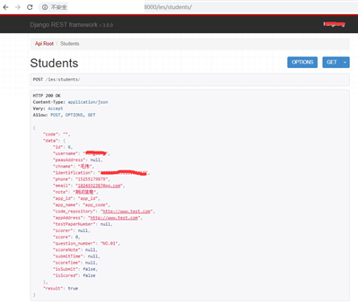

Http 返回的是 200 OK 而且返回展示出刚刚 POST 成功的 json 格式数据。


## 3. 开发 VUE 单页应用并调用 Django 后台 API

这里介绍一下之前新建的 vue 工程项目在浏览器打开 vue 默认首页面 HelloWorld 的加载流程。


进入这个 HelloWorld 首页面的过程是 index.html->main.js->App.vue。

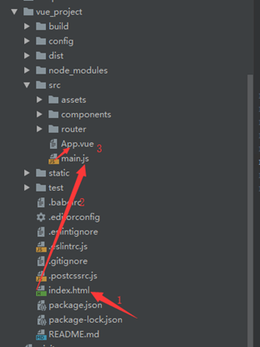

这里的 main.js 像是 index.html 和 App.vue 的一个桥梁为什么这么说，因为 main.js 文件给 index.html 中的 id=”app” 的 div 节点 new 了一个 Vue 实例，该实例中有一个名叫 “App” 的组件，该组件通过 vue-router 将 HelloWorld.vue 中的模板注入到 App.vue 的模板中所以 App.vue 是作为一个所有组件的入口组件的作用，最终在访问浏览器时才能展现出这个欢迎界面，下面看一下其中的代码。

index.html


main.js

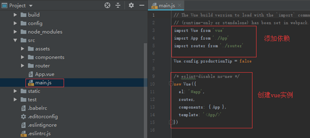

App.vue


要实现通过router-view在App.vue中注入HelloWorld.vue的模板还需要给它配置路由。


HelloWolrd组件代码

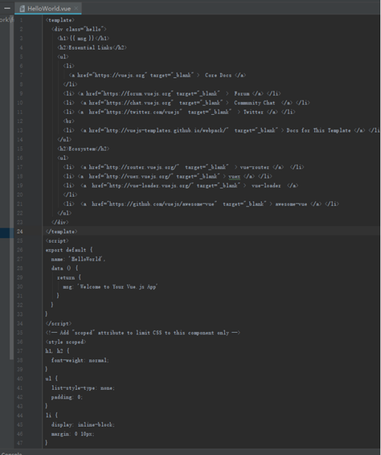

如果这个过程完全搞懂了那么就可以开始开发自己的 vue 组件，然后在 App.vue 入口组件中使用自己开发的组件来完成单页应用的开发。蓝鲸 magicbox 也提供了一套非常好用的 vue 组件库利用蓝鲸的 vue 组件库非常的方便，可以省去很多的开发前端的时间。

蓝鲸magicbox地址：
> https://magicbox.bk.tencent.com/


这个实战项目把 vu e前端页面分为三个部分，分别是“导航栏 Header.vue 组件“、“中间切换组件(包括 SubmitInfo.vue 和 ScoreManage.vue)”、“底部栏 Footer.vue 组件”。直接使用的蓝鲸 magicbox 上面的组件来构建的，所以就不展示前端 vue 组件的代码。


这里默认你们已经构建好了自己的组件，介绍一下如何在 App.vue 入口组件中调用这些构建好的子组件来拼接 vue 单页应用。对于 Header.vue 和 Footer.vue 组件是无需动态切换的是作为固定组件放在 App.vue 父组件中的，所以无需为这两个子组件配置路由。那么如何使用 Header.vue 和 Footer.vue 组件，请看下图：


打开浏览器访问 http://localhost:8080 查看效果。


没有问题，成功的引用了 Header.vue 和 Footer.vue 两个组件，接下来介绍如何通过 Header.vue 导航栏组件来切换页面的中间部分实现一个简单的可切换中间页面的单页应用。

首先需要给在中间页面切换的组件配置路由使得在切换时 App.vue 可以通过 router 路由来切换它们。


配置好路由后就可以使用<router-view></router-view>来切换页面了
在 Header.vue 导航栏配置按钮对应的跳转组件。


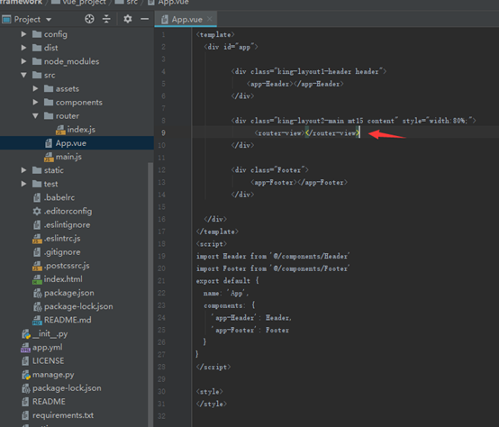

这样就配置完成了,通过浏览器测试一下是否可以切换。


现在通过前后端分离开发,构建了 api 接口和 vue 前端界面，下一步需要在 vue 中通过 axios 发送异步请求调用后端 api 完成前后端交互。

需要学习 axios 的更多用法可以去看官方文档:

> https://www.npmjs.com/package/axios

安装 axios 。

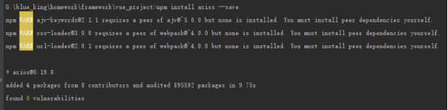

安装完成后需要在main.js中全局引用。


在组件中使用 axios 请求后端 api 接口。


axios 写好后在浏览器中测试看能否正常请求 api。


然而这个 axios 异步请求并没有成功,从错误信息可以看到是发生了跨域问题，下面我就讲一下 vue 在本地开发时跨域问题的解决方案，有两种解决方案:

第一种方案：在后端解决，在 django 开发框架中安装 django-cors-middleware 中间件，但是如果部署到线上是不允许后台可以跨域的，所以这种方案必须配置在本地开发环境的配置文件中。

```bash
pip install django-cors-middleware
```

在 config/default.py 配置文件中添加 APP,不添加的话无法生效。

```python
INSTALLED_APPS += (
    'home_application',
    'mako_application',
    'rest_framework',
    'corsheaders',
    'ies',
)
```

在 config/default.py 中添加中间件。

```python
MIDDLEWARE_CLASSES = (
    ...
    'corsheaders.middleware.CorsMiddleware',
    'django.middleware.common.CommonMiddleware',
    ...
)
```

最后在 config/default.py 最下方添加：

```python
#在本地开发环境下开启跨域允许  
if RUN_MODE == 'DEVELOP':  
    # 跨域增加忽略  
    CORS_ALLOW_CREDENTIALS = True
    CORS_ORIGIN_ALLOW_ALL = True
    CORS_ORIGIN_WHITELIST = ()

    CORS_ALLOW_METHODS = (
        'DELETE',
        'GET',
        'OPTIONS',
        'PATCH',
        'POST',
        'PUT',
        'VIEW',
    )

    CORS_ALLOW_HEADERS = (
        'accept',
        'accept-encoding',
        'authorization',
        'content-type',
        'dnt',
        'origin',
        'user-agent',
        'x-csrftoken',
        'x-requested-with',
    )
```

第二种方案：在 vue 前端工程中配置在 config/index.js 里配置proxyTable内容，使用 proxy 代理。


配置好后再次测试。


还是没有请求成功，但是跨域的问题是解决了，又出现了一个 403 问题。这个问题是 Django 有个验证 csrftoken 的中间件，每次 post 请求必须带上这个 csrftoken 才能通过验证,而且在POST之前至少要有一次GET请求才能获得 cookies，这个 GET请求自己写。

由于蓝鲸开发框架在本地访问的域名是 http://{domain_url}}:8080，那么要使得 vue 前端可以获得后端返回的 cookies 中的 csrftoken，vue 前端工程本地访问域名也要和 Django 的本地访问域名保持一致。修改 build 目录下的 webpack.dev.conf.js 文件中的 HOST 参数。

```js
const HOST = '{domain_url}'
```


然后在 main.js 中给 axios 的请求头注入 csrftoken
这里也有两种注入 csrftoken 的配置方案

第一种方案：

main.js 代码：
```js
import Vue from 'vue'  
import App from './App'  
import router from './router'  
import axios from 'axios'  
axios.defaults.withCredentials = true  
Vue.prototype.$axios = axios  
Vue.config.productionTip = false  
new Vue({  
el: '#app',  
router,  
components: { App },  
created () {  
this.$axios.interceptors.request.use((config) => {  
1config.headers['X-Requested-With'] = 'XMLHttpRequest'  
let regex = /csrftoken=([^;.]*).*$/  
config.headers['X-CSRFToken'] = document.cookie.match(regex) === null ? null : document.cookie.match(regex)[1]  
return config  
})  
},  
template: '<App/>'  
})  
```


第二种方案：

main.js 代码

```js
import Vue from 'vue'  
import App from './App'  
import router from './router'  
import axios from 'axios'  

const instance = axios.create({  
headers: {'X-Requested-With': 'XMLHttpRequest'},  
xsrfCookieName: 'csrftoken',  	xsrfHeaderName: 'X-CSRFToken',  
withCredentials: true  
})  

Vue.config.productionTip = false  
Vue.prototype.$axios = instance  

/* eslint-disable no-new */  
new Vue({  
el: '#app',  
router,  
components: { App },  
template: '<App/>'  
})
```


再次测试打开前端进行 axios 异步请求看能否请求成功
在调试工具中可以看到请求成功了，说明配置已经生效，已经解决 403 问题。

## 4. 打包开发完成后 Vue 前端工程整合到蓝鲸开发框架中后部署 PaaS 平台

打包前需要修改一些配置，大多数人第一次开发 vue 前端项目的人在写 axios 请求的时候都是直接把 url 这个参数写成固定的字符串形式如下图所示：

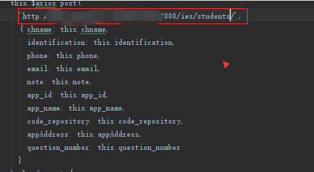

这样的写法很明显是不能直接打包的，如果直接打包部署上线所有的请求就会出现失败因为根本找不到这个本地开发的时候所设置的域名。将请求 url 修改成线上环境的域名,如果是在 axios 的请求中一个一个手动去改的话也比较麻烦,而且还存在后端开发环境域名变更的情况下又得在每个请求 url 中修改地址。那么可以直接把 url 中的域名这一部分抽离出来使用全局变量代替然后在配置文件中根据环境不同给全局变量赋不同的值，如何解决这个问题呢？

解决办法：利用蓝鲸 Django 开发框架的配置文件中的全局变量 SITE_URL 来解决


通过 Django 模板语法把 SITE_URL 的值赋给 window.API_ROOT


在 axios 请求中使用 window.API_ROOT

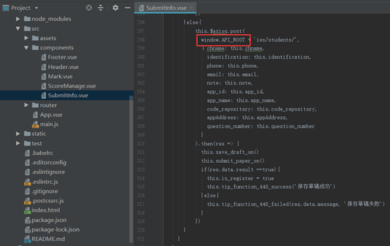

按照同样的方法修改Header.vue中的路由。

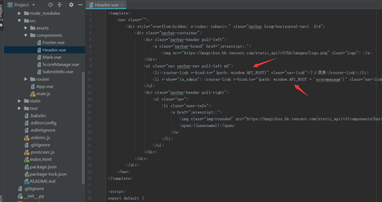

同时修改 router目录下的index.js。


执行打包命令：

```bash
npm run build
```

打包后会生成一个 dist 文件夹这里面就是我们需要整合到蓝鲸 Django 开发框架上的静态文件和 vue 应用入口文件 index.html。

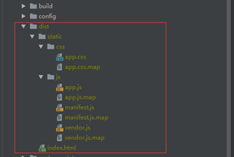

将打包生成的静态文件放到 Django 开发框架的 static 的相应文件夹下。


将index.html放在templates/home_application/目录下。

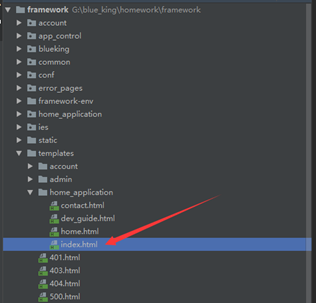

配置home_application/index.html的访问路由。


在 views.py 中编写 index 视图函数。


这样直接访问 Django 项目就会返回这个 vue 单页应用入口文件。

到这基本已经配置完成将代码提交到 gitlab 然后使用蓝鲸 paas 平台进行部署
部署成功后打开 app 访问，并没有成功打开应用，显示的是一个空白页。


那么打开开发者工具看一下出了什么问题。


是打包生成的静态文件全都引用失败了出现了 404，那这个问题怎么解决呢？


从配置文件中看到现在打包静态文件是使用绝对路径的模式下图中是打包后的结果 js，css 文件也是直接使用绝对路径的方式。


由于在蓝鲸平台部署应用后每个应用的访问地址都是在蓝鲸平台的域名上然后加上在创建应用时设置的 app_code 等相关后缀来识别每一个应用。所以在使用绝对路径模式时静态文件路径是不会自动加上这些相应的后缀的所以会出现静态文件404问题。这个问题有两个解决方案。

第一种方案:利用Django模板或者mako模板语法在静态文件上加上一个STATIC_URL变量如下图所示：


这样在页面经过模板引擎渲染后就会得到正确的静态资源 url，再次部署到蓝鲸paas平台并访问可以看到如下图所示问题解决了。


第二种方案：修改打包静态文件的路径绝对路径方式为相对路径的方式。

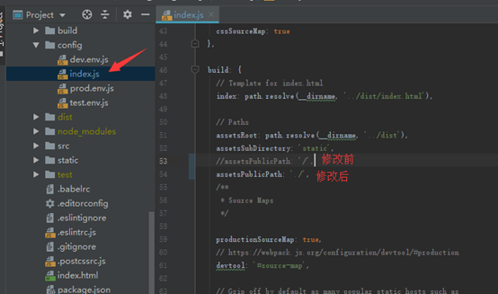

修改后再次进行打包打包完成后静态文件都变成了相对路径的方式引用，如图所示：


再次部署并访问如下图所示同样也可以正常访问。


