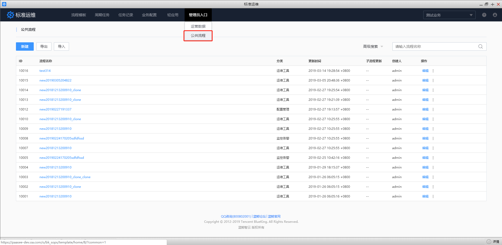

# 管理员入口 

## 运营数据 

包含流程统计、任务统计、标准插件统计、轻应用统计 4 个维度的运营数据分析。

## 公共流程 

公共流程是标准运维方便用户在不同业务中共用同一套流程模板的功能。通过超级管理员角色新建公共流程，达到多业务共享公共流程模板的目的。

公共流程包含两个入口：

- 管理员角色对公共流程进行新建、导入、导出模板及流程的编辑、克隆、删除等操作的管理员入口。该入口只对管理员开放。

- 管理员角色对公共流程分配业务权限给其他角色，能够对公共流程进行新建任务、查看执行历史等操作的入口。

