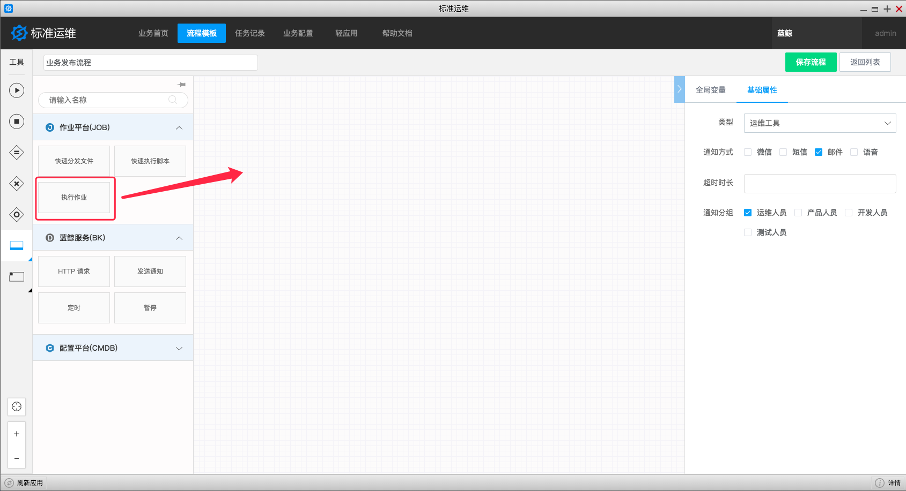
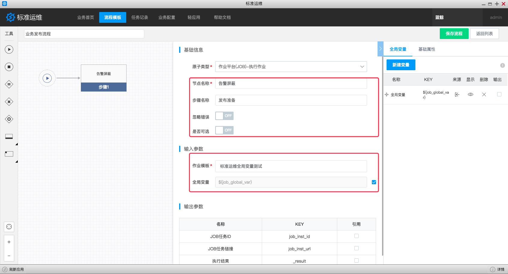
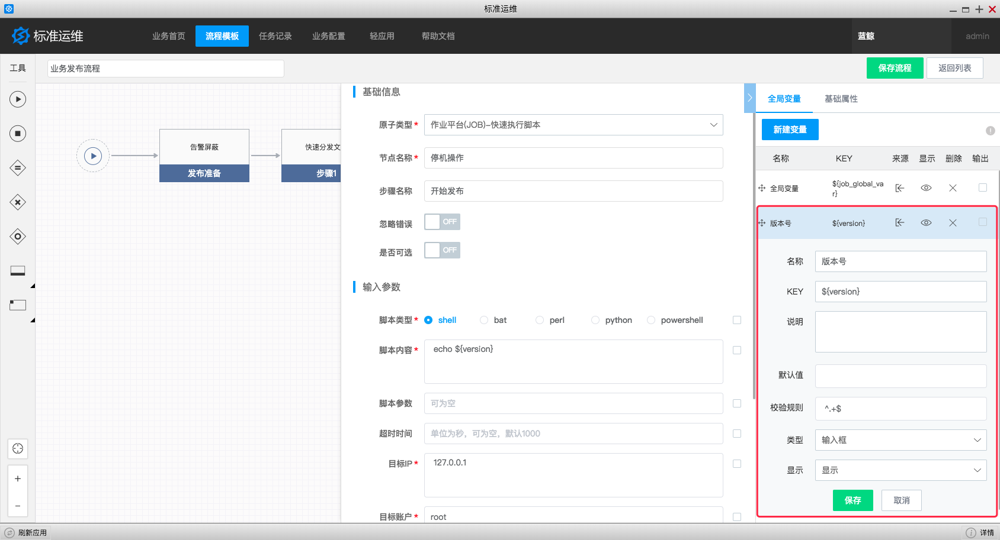
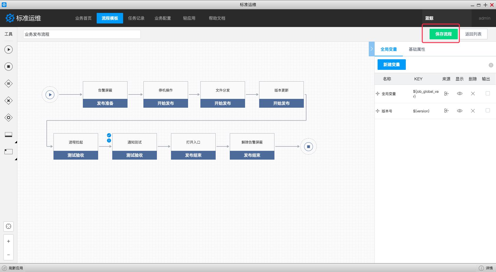
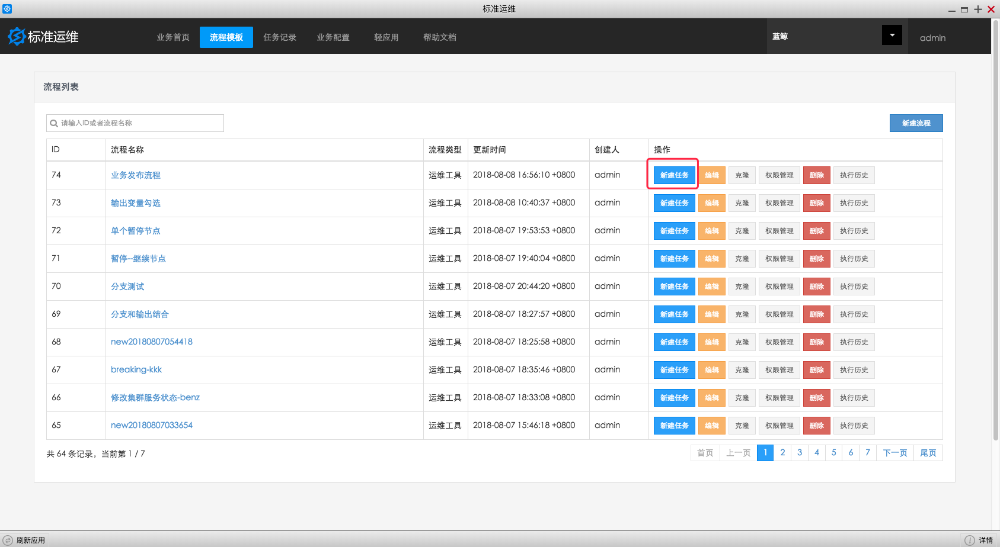
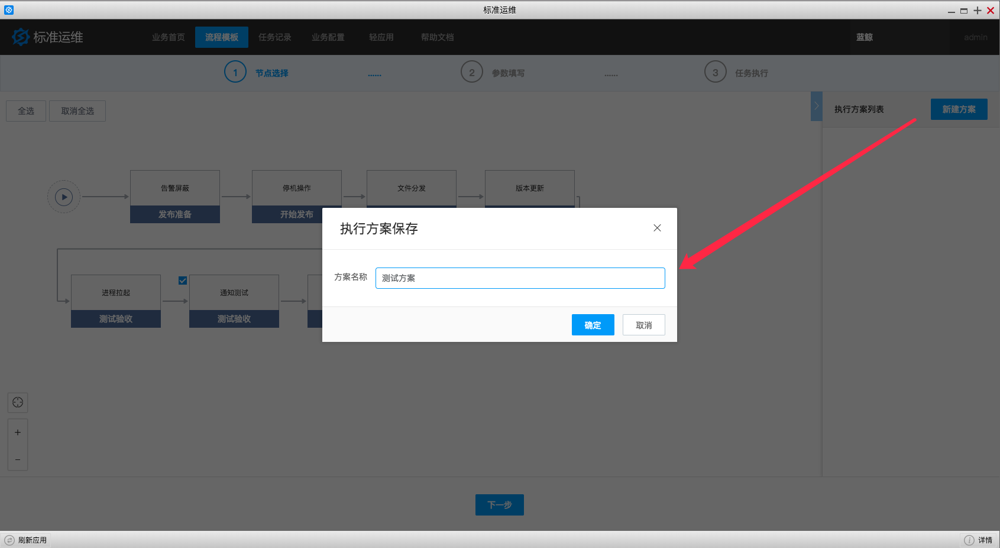
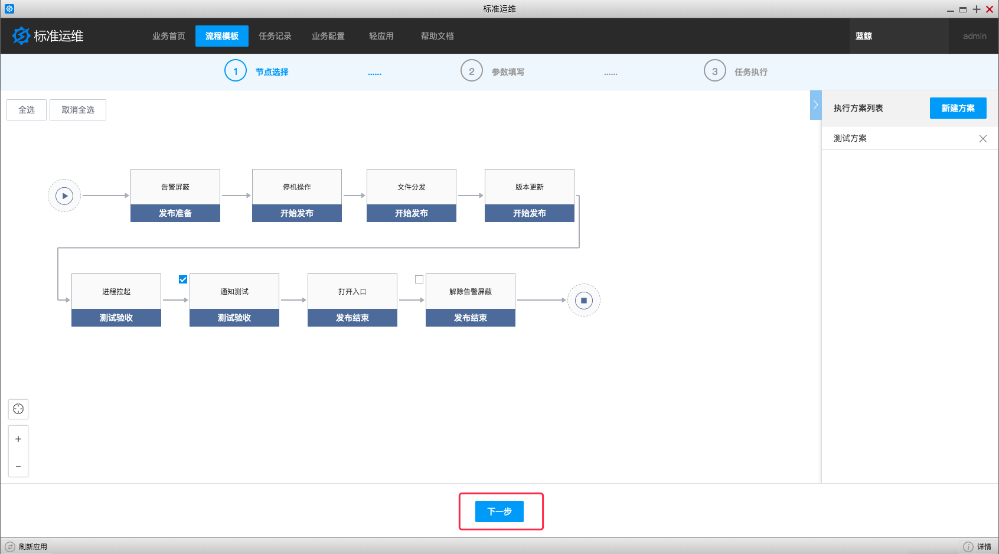

## 场景案例 {#Case}

随着业务的不断发展，企业应用系统也变得越来越复杂，不同应用厂商，其背后研发团队间的技术栈，如所使用的开发语言、开发框架、操作系统、数据库等技术组合，以及发布变更、故障处理等运维操作场景和操作流程，都是不同的。应用架构的差异性和复杂性，也给 CI/CD 应用在包交付模式和灵活的编排上提出更多的挑战。

另外研发与运维团队职责不同以及环境差异化，经常导致研发人员在对配置或环境进行修改之后，不会及时告知运维人员；而运维人员发布应用时，由于对运行环境和应用的内部细节缺乏了解，难以正确选择运行环境和控制发布流程，往往会遇到各种各样的问题，沟通成本非常高。

同时，业务需要更频繁的发布，如果仅仅依靠运维人员的手工部署，一方面效率低、易出错，另外也无法满足不断增加的应用系统和部署环境。所以，开发人员对自助发布的需求越来越强烈，希望能够通过自助平台实现一键发布。

依托蓝鲸体系化设计，可以实现流程编排和应用自动发布的标准运维应运而生。
以下图为例，通过标准运维对应用发布流程进行分解，分解后的每个步骤可以包含多个原子，依次进行代码拉取，备份，以及分发文件等操作。我们可以根据固化的发布流程来创建任务，每个任务都是一次真正的业务场景作业，任务可以被暂停、被强制终止。通过标准运维的助力，实现更可靠的发布，提高部署频率，与业务目标保持紧密一致。

标准运维适配场景有：

- 运维场景：发布、变更、开区、扩缩容等执行类操作

- 其他场景：监控告警、配置管理、开发工具、企业IT、办公应用、其它

本节介绍运维常见场景之一：业务发布操作。

### 业务发布操作 {#release}

进入新建流程页面，名称改为 "业务发布流程"，选择流程模板的类型为 "运维工具"，如果有接入 ESB 消息通道，请选择任务节点失败和完成时通知方式和通知人员分组。

点击标准插件节点工具，拖拽标准插件到流程画布中。

点击标准插件打开参数配置页，填写参数。

- 修改节点名称为该节点的用途说明，修改步骤名称为该节点的分组标签；
- 根据需要配置该标准插件是否需要忽略错误或可选；
- 勾选 "添加为变量" 添加到全局变量中，便于执行任务时动态修改；

自定义一个变量，命名为 "发布版本号"。

拖拽 JOB 标准插件到流程中，点击标准插件，打开参数配置页，配置停机作业，同时将发布版本变量  ${version} 引用到 JOB 作业参数中。

重复拖拽需要的标准插件并填写参数，点击保存，可以保存流程模板。

通过配置好的流程模板新建任务。

选择可选节点，可以调整本次任务实际执行的标准插件节点，如果想重复使用节点执行方案，可以点击新建方案，保存本可选节点次配置。

点击 "下一步" 到 "参数填写" 页面。

预览调整后的任务流程，确认符合预期。

填写任务参数，如任务名称、版本号等参数，点击 "新建" 生成任务实例，并跳转到 "任务执行" 页面。

点击开始执行按钮，可以启动任务。

失败的节点会阻塞任务流程，可以单击查看执行详情，了解异常信息内容。

失败的节点可以重试，点击 "重试" 可以重新填写该标准插件节点参数并执行。

等待任务执行完成。

