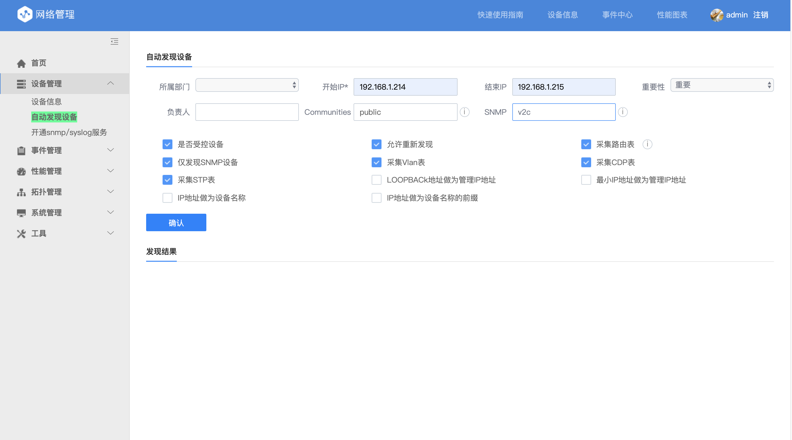
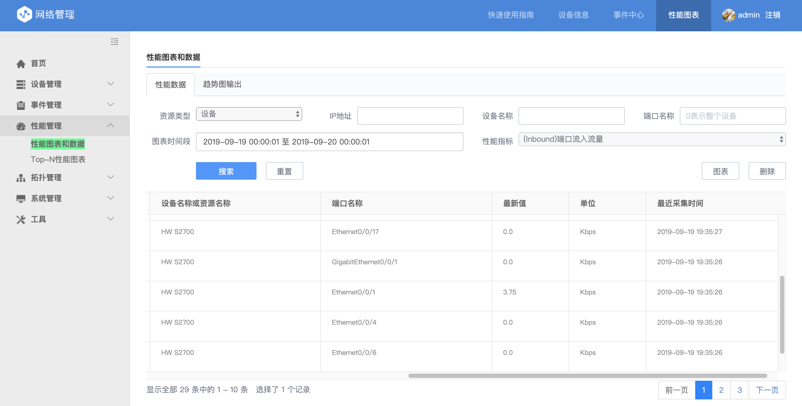
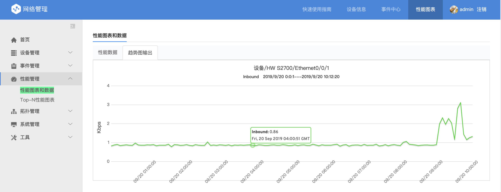
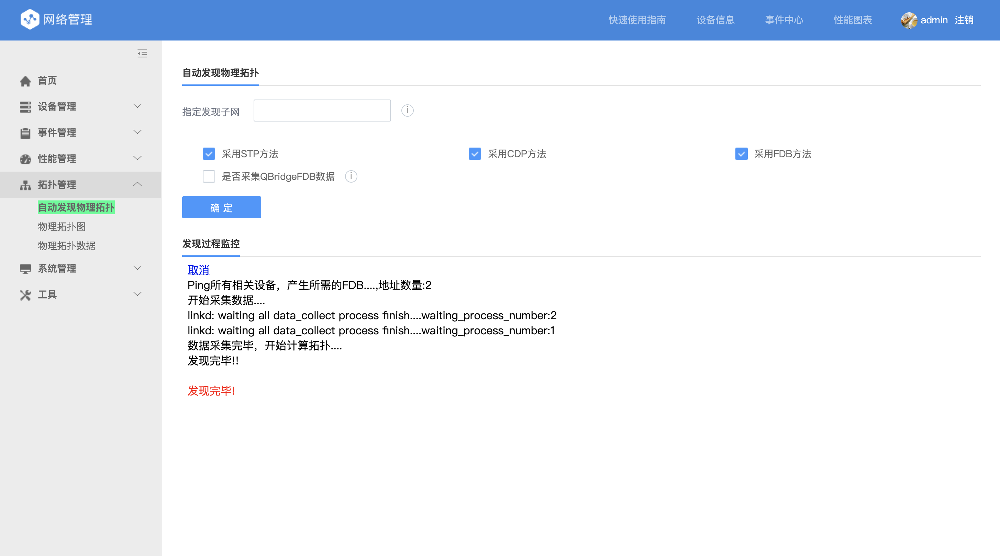
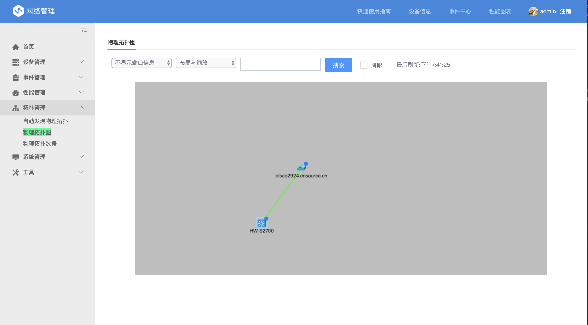

# 设备发现

在安装完网络设备管理后，如相关网络设备已配置 SNMP，可直接通过 **设备管理-自动发现设备** 功能进行设备的自动发现和入库。

主要填写的配置内容为：开始 IP、结束 IP、Communities 和 SNMP 版本。

点击确认按钮后，网管即对网段进行 ICMP 扫描，扫描结果也会实施显示在下方信息栏

# 性能管理&事件管理

在设备发现完成后，网管平台自动对已发现的设备进行性能采集和事件接收。
进入 **性能管理-性能图表和数据**
可直接观察到最新的采集数据。

选择性能指标后，点击图表，即可观察设备的性能的图形化数据

同理，TOPN 展示

# 拓扑

进入 **拓扑管理-自动发现物理拓扑** 点击确认，后台自动发现拓扑信息。

进入 **拓扑管理-物理拓扑图** 即可观察发现的拓扑图形

