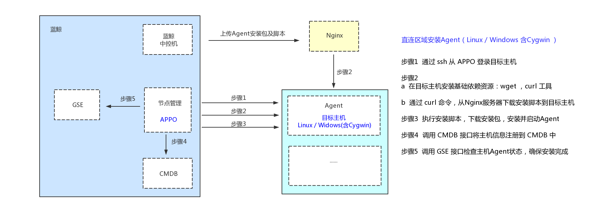

## 产品架构图

### 相关说明

除了节点管理，安装 Agent 还需依赖 Nginx，GSE，JOB，CMDB 等。

- **GSE**：管控平台，作业下发，Agent 管控通道。

- **JOB**：作业平台，一旦 Agent 安装成功并状态正常，后续的安装，卸载，移除等操作，都通过作业平台进行。

- **CMDB**：配置平台，通过在节点管理的云区域管理功能写入用户的业务主机信息等。

- **Nginx**：异步框架的网页服务器，也可以用作反向代理、负载平衡器和 HTTP 缓存。本篇中，Nginx ``miniweb/download`` 目录下，存放了安装 Agent 所需的安装脚本及安装包。

- **HTTP 请求**：从 Nginx 服务器下载安装脚本和安装包的请求。

- **SSH 请求**：APPO 机器 ``SSH`` 登录到业务机器( Linux/AIX )的请求。

### 原理图

用户的业务主机和蓝鲸系统所在的局域网或相同或不同，安装 Agent 程序的情况因此分为两种：

#### 直连区域安装 Agent

当安装 Agent 的目标主机（操作系统可以为：Linux/Windows/Windows(Cygwin)/AIX）与蓝鲸系统中的 GSE Server，在同一局域网内（非跨云），受控主机能通过局域网建立与 GSE Server 的 TCP/UDP 链接，这种情况下，选择直连区域安装 Agent 。

主机的操作系统不同，后台的实现原理不同：

1、操作系统为：Linux / Windows（含 Cygwin）

2、操作系统为：Windows (无 Cygwin)

3、操作系统为：AIX

>**Note**：仅节点管理企业版支持 AIX 操作系统。

#### 非直连方式区域安装 Agent

当安装 Agent 的受控主机与 GSE Server 不在同一局域网，或网络上无法直连，需要通过 Proxy 建立网络联系时，这种情况下，需要先安装好 Proxy（数量为 1-2 台） , 然后执行安装 P-Agent 。

1、Proxy 的安装原理：

2、P-Agent 的安装原理：

