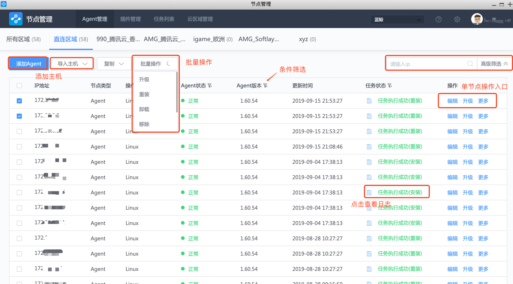

## 产品功能

目前，节点管理支持的功能有：安装 Agent、插件管理和任务管理。

## Agent 管理

Agent 是能够自主活动的软件或者硬件系统，是业务主机与蓝鲸建立连接的程序。

### 多样支持

- 支持目标主机在直连区域（非跨云）和非直连区域（跨云）的 Agent 安装。
- 支持 Linux/Windows/Windows(Cygwin)/AIX 操作系统的主机。
- 支持逐个添加、CMDB 导入和批量导入三种方式添加主机。

### 操作简单

在安装过程中，输入必要的主机信息就可以快速安装 Agent。安装步骤详情查看便于了解安装原理、便于排查安装问题。

**GSE 接口每分钟定时获取一次 Agent 状态，查看定时任务详情前往 [GSE 定时任务](../附录/Agent_Status.md)**

