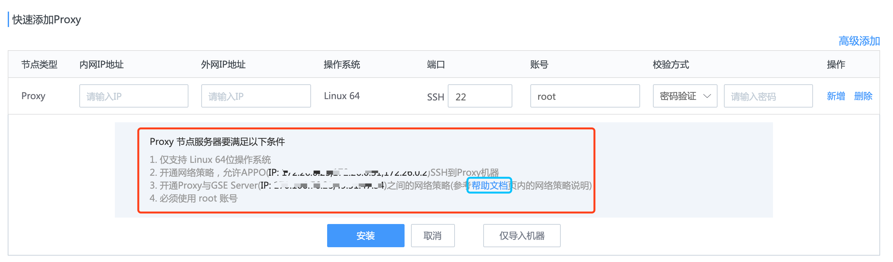

# 添加 Proxy

创建云区域成功后，会进入到该云区域管理页面，新创建的云区域下，没有任何节点，因此，会看到如下的空列表

到这个页面，管理云区域的第一个步骤已完成，接下来只要完成第二个步骤，创建一台可用的 Proxy 即可。

> Note
>
> 若此时进入到 Agent 管理页面，将能这个新建的云区域标签, (若标签过多，可以在云区域管理下的列表中进行隐藏)

## 快速添加 Proxy

通常 Proxy，会有内网 IP 和外网 IP：

1. 外网 IP 用于与 GSE Server 建立连接和通信。

2. 内网 IP 可用用于与受控的这个云区域内的其他 Agent 节点(我们称为 P-Agent)通信。

   在简单网络情况，可用选择快速安装。

> Note
>
> 外网，内网只是一个简单的区域网络的概念，在某些企业中，可能都是多个内网 IP, 没有外网 IP 的情况。
>
> 这里指的外网，通常是说与 GSE Server 的内网 IP 不在同一局域网，但是可以与 GSE Server 连接的 IP。

​		

点击右上角的 `+ 添加 Proxy` 按钮，进入快速 Proxy 添加页面，如图所示

GSE Proxy节点共有至少 4 个服务(gse_agent, gse_transit, gse_opts, gse_btsvr) , 这些服务都需要与 GSE Server 通信，为了保证服务可用，需要开通这些 [网络策略](../附录/network_policy.md)

点击【安装】后，进入安装状态，界面信息与安装直连区域的 Agent 一致，不再详述

> Note: Proxy 节点的 4 个基础服务
>
> - **gse_transit：** 扮演 `gse_data` 角色，如转发数据等。
> - **gse_agent：** 扮演 `gse_task` 角色，如任务下发等。
> - **gse_opts：** 扮演 `gse_ops` 角色，如告警汇总及转发等。
> - **gse_btsvr：** 扮演 `gse_btsvr` 角色，文件分发。
>
> 除以上内容外，在安装过程中，还会：
>
> - 在 `Proxy` 节点上安装 `Python`，及用于远程管理 `Windows` 的 python 包 `impacket。`
> - `Linux、Window、AIX` 的 Agent 安装包下载到 `Proxy` 机器上的 `/tmp/byproxy`目录下。

## 高级添加 Proxy

高级添加 Proxy 用于 Proxy 位于一个特殊的网络下时，比如有主机处于多张独立的网络中或者 NAT 网络中。可以使用这种模式

在快速添加 Proxy 的页面右侧可以找到高级添加按钮，进入到高级添加 Proxy 页面，如下：

与高级添加 Agent 页面类型，多了一个级联 IP。

级联 IP 通常是内网 IP，被云区域内的其他受控主机连接。

同样需要开通这些 [网络策略](../附录/network_policy.md)
