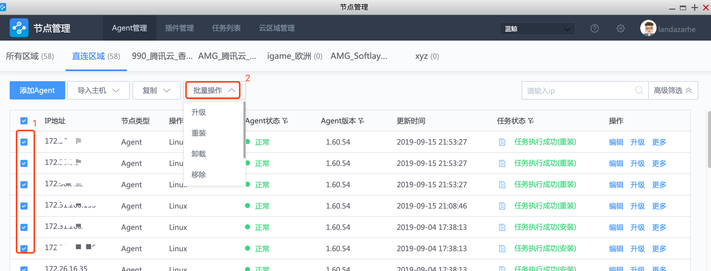

# 高级安装

在快速安装页面，输入框所在行的右上角有一个【高级添加】按钮。适用于复杂的 NAT 网络环境下安装 Agent。需要填写信息：登录 IP、通信 IP、数据 IP、操作系统及端口和账号密码。

在高级安装中，

1.  登陆 IP，可能是防火墙的上 IP， 需要与企业内的网络管理员确认。

2.  通信 IP 必须填写主机物理网卡上的 IP，通常是内网 IP。需要与 GSE Server 建立了链接，因此需要开通网络策略。

## 操作

- 单台主机操作：
  - 编辑。可以对当前主机信息进行编辑。如端口号，账号密码等。
  - 重装：对当前主机进行重装。
  - 卸载：卸载当前主机上的 Agent。卸载后，状态变为灰色。但不会从节点管理中消失，也不会从 CMDB 中消失。
  - 移除：先进行卸载，然后从节点管理中移除，主机只能在 CMDB 中找到。
  - 终止：可终止以上的重装，卸载，移除 3 种操作。

- 批量操作

  - 选中多台主机时，可以进行批量操作。如重装，卸载，移除，编辑，终止操作。入口如下

    
