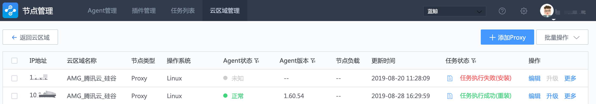

## 管理云区域

1. 云区域可以删除，重命名，也可以隐藏(对当前用户)， 点击顶部导航中【云区域管理】可以看到所有云区域列表，如图：

   

   `隐藏/显示`： 鼠标移动到云区域名称的后面，会有一个眼睛的图标，点击可以设计这个云区域在 Agent 管理页面隐藏或显示情况

   `编辑`： 重命名云区域。但不引起 云区域 ID 的变化。

   `删除`：当切仅当该云区域下没有任何节点时。

2. 点击云区域名称，进入云区域下的 Proxy 管理子页面。如图所示

   

   该页面功能设计与管理 Agent 相似。不再赘述

3. 注意事项

   > Note
   >
   > 1. 至少需要有一台 Proxy 节点的 Agent 状态为正常时，才能在该云区域下安装 P-Agent