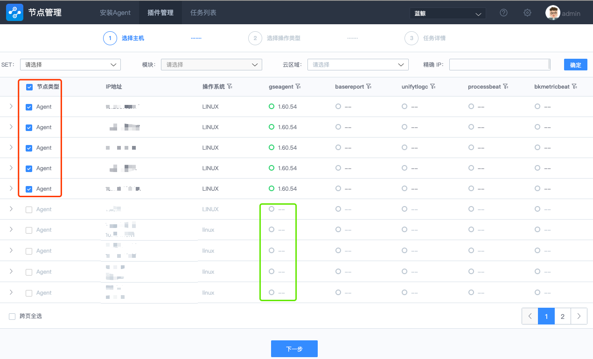
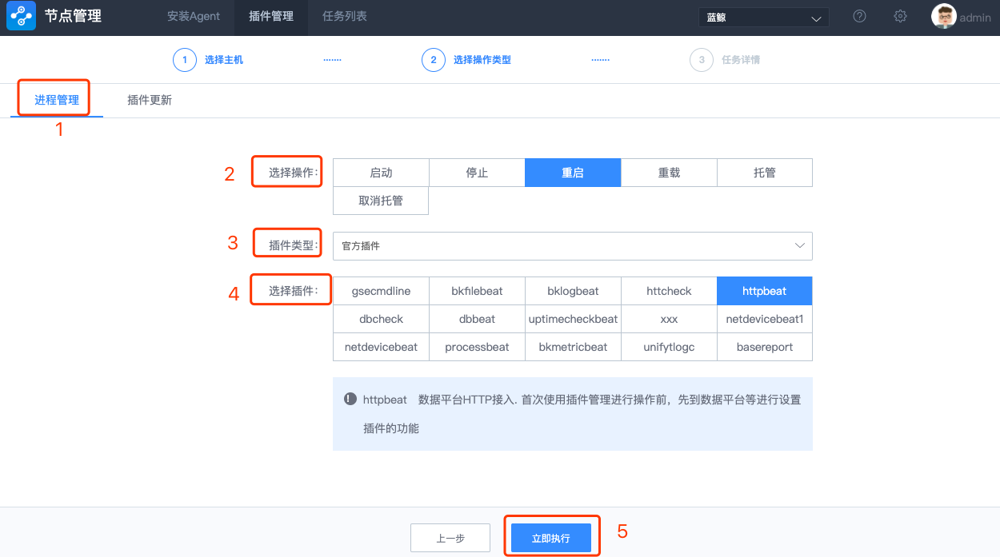

## 进程管理

### 操作流程

**选择目标主机 -> 选择操作类型 ->查看任务详情**

1. 选择要操作的目标主机列表

     > **Note:**
     >
     > 1. GSE Agent 状态不正常的主机不能被选择。
     > 2. 主机列表过多时，可以根据表头上方的查询条件，来缩小或锁定要操作的目标主机列表。

2. 选择功能及插件(进程管理)，点击立即执行。

   

3. 查看任务详情。

