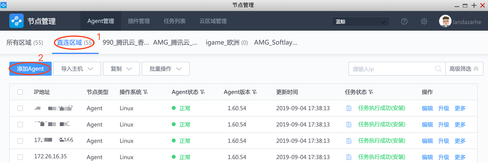
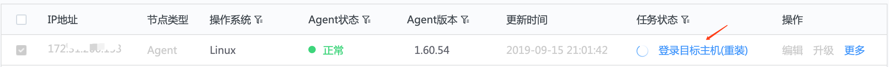
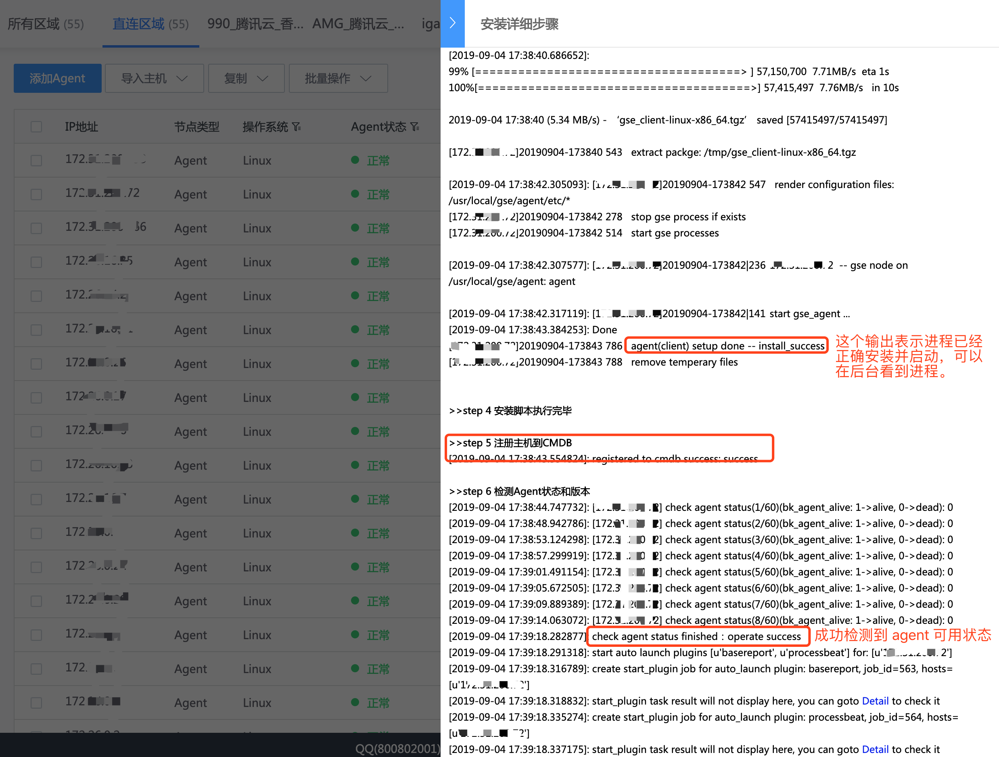

## 快速安装

   单 IP 主机安装在直连区域，通常使用快速安装

1. 选择`直连区域`标签页，点击 【+添加 agent】 按钮，输入 IP，选择操作系统，输入端口号，输入账号，选择校验方式及密码等信息。

   

   

   执行安装前，检查主机信息及网络策略是否与页内提示的要求一致。

   点击【安装】，进入安装过程。

   > Note:
   >
   > 1. 输入框可以同时输入多个 IP, 适用于 端口，密码，操作系统相同的主机，可以快速添加
   > 2. 任务执行过程中，主机处于选中不可编辑状态。在此状态下，可以对正在执行中的任务进行终止。

2. 点击主机对应的任务状态列文字或图表，可以查看安装步骤详情。

   

   

   检查状态成功后，在列表页可以看到 agent 状态列已经正常。

   