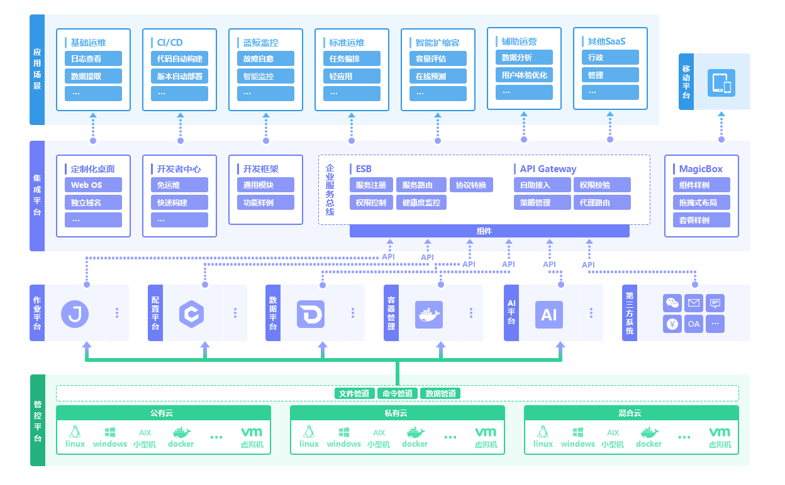

# 品牌简介

腾讯蓝鲸智云，简称蓝鲸，是腾讯互动娱乐事业群（Interactive Entertainment Group，简称 IEG）自研自用的一套用于构建企业研发运营一体化体系的 PaaS 开发框架，提供了 aPaaS（DevOps 流水线、运行环境托管、前后台框架）和 iPaaS（持续集成、CMDB、作业平台、容器管理、数据平台、AI 等原子平台）等模块，帮助企业技术人员快速构建基础运营 PaaS。

