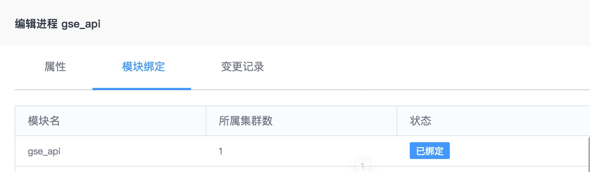
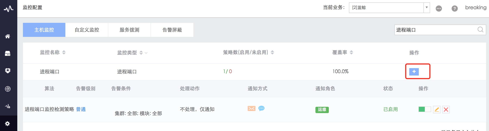
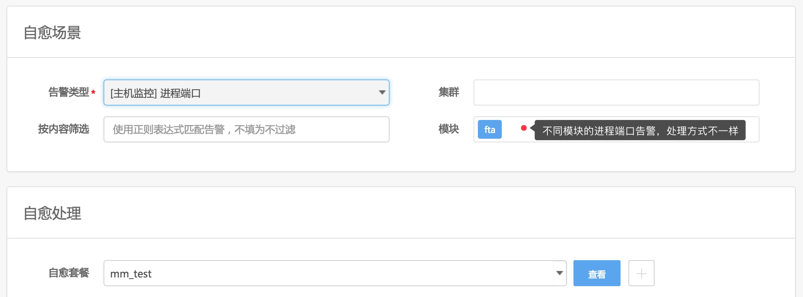
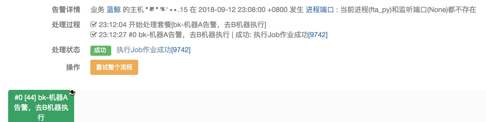

## 进程和端口(当前方案)

当前方案：CMDB 注册进程 →  监控下发采集配置 → 设定策略  → 产生告警 → 故障自愈

### 1. 在 CMDB 注册进程

图 1. 注册进程

并将进程绑定至所属模块

图 2. 进程绑定模块

### 2. 监控下发采集器配置
当前版本，仍然需要手动将 CMDB 中添加在模块上的进程名及端口下发至主机上，对应采集器 processbeat 会做告警检测。

图 3. 下发采集器配置

### 3. 设定策略
在监控配置页，找到进程端口，设置策略。

图 4. 设定策略

### 4. 产生告警

图 5. 告警产生

### 5. 故障自愈
在[故障自愈](http://docs.bk.tencent.com/product_white_paper/fta/)中接入自愈，告警类型选择 进程端口，模块选择该进程所属模块（不同进程的处理方式不一样）

图 6. 接入自愈

产生告警后，故障自愈执行处理套餐，完成告警的自动化处理。

图 7. 自愈详情
